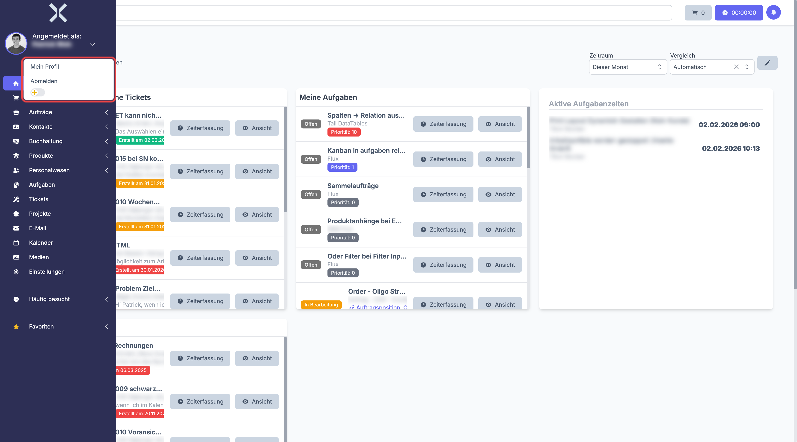

# Anmeldung und Abmeldung

## Anmeldung

Öffnen Sie die Nuxbe-Anwendung in Ihrem Browser. Auf der Anmeldeseite stehen Ihnen zwei Wege zur Verfügung:

### Anmeldung mit E-Mail und Passwort

1. Geben Sie Ihre **E-Mail-Adresse** ein.
2. Geben Sie Ihr **Passwort** ein.
3. Optional: Setzen Sie das Häkchen bei **Angemeldet bleiben**, um Ihre Sitzung über das Schließen des Browsers hinaus zu erhalten.
4. Klicken Sie auf **Anmelden**.

### Anmeldung per Magic Link

Wenn Sie kein Passwort eingeben möchten, können Sie sich per Magic Link anmelden:

1. Geben Sie Ihre **E-Mail-Adresse** ein.
2. Klicken Sie auf **Magic Link senden**.
3. Prüfen Sie Ihr E-Mail-Postfach. Sie erhalten einen Link, mit dem Sie sich ohne Passwort direkt anmelden können.

> **Hinweis:** Der Magic Link ist aus Sicherheitsgründen nur 15 Minuten gültig. Fordern Sie bei Bedarf einen neuen an.

## Passwort zurücksetzen

Falls Sie Ihr Passwort vergessen haben:

1. Klicken Sie auf der Anmeldeseite auf **Passwort zurücksetzen**.
2. Geben Sie Ihre E-Mail-Adresse ein.
3. Klicken Sie auf **Link senden**.
4. Öffnen Sie die E-Mail und klicken Sie auf den enthaltenen Link.
5. Vergeben Sie ein neues Passwort und bestätigen Sie es.
6. Sie werden anschließend zur Anmeldeseite weitergeleitet.

## Abmeldung

1. Klicken Sie oben links in der Sidebar auf Ihren Benutzernamen unterhalb von **Angemeldet als:**.

   

2. Klicken Sie auf **Abmelden**.

Sie werden zur Anmeldeseite weitergeleitet. Ihre Sitzung wird dabei vollständig beendet.

## Weiterführende Themen

- [Navigation](2-navigation.md) - So finden Sie sich in Nuxbe zurecht
- [Mein Profil](4-mein-profil.md) - Passwort und persönliche Daten ändern
