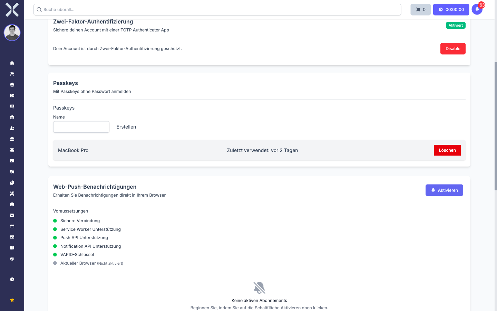
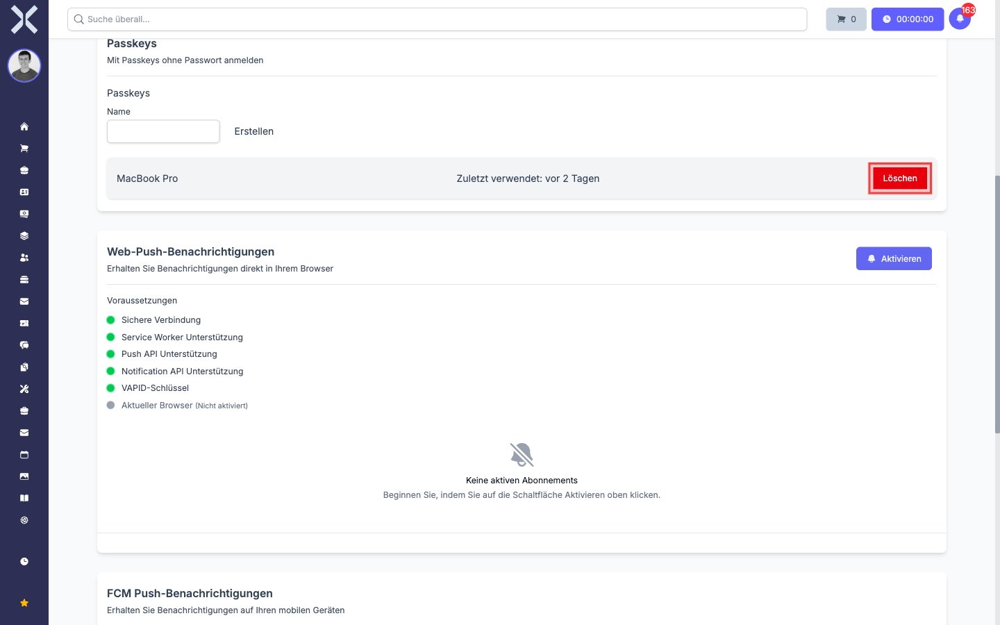
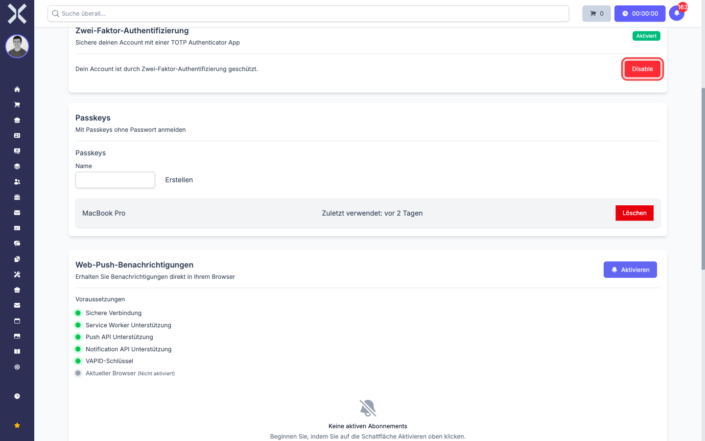

# Zwei-Faktor-Authentifizierung verwalten

Auf dieser Seite finden Sie alles, was Sie nach der Erst-Einrichtung noch ändern können: einen weiteren Passkey hinzufügen, einen alten löschen, die Authenticator-App deaktivieren, oder den Notfall klären, wenn Sie das Gerät verloren haben.

## Status im Profil sehen

Alle Einstellungen rund um 2FA finden Sie auf Ihrer Profilseite:

1. Klicken Sie oben links in der Sidebar auf Ihren Benutzernamen unterhalb von **Angemeldet als:**.
2. Klicken Sie auf **Mein Profil**.
3. Scrollen Sie nach unten zu den Bereichen **Zwei-Faktor-Authentifizierung** und **Passkeys**.

   

Im 2FA-Bereich oben rechts sehen Sie ein Status-Badge:

- **Aktiviert** (grün) -- die Authenticator-App ist eingerichtet.
- **Deaktiviert** (grau) -- es ist keine Authenticator-App eingerichtet.

Im Passkey-Bereich darunter sehen Sie eine Liste aller Passkeys, die Sie für diesen Account angelegt haben, jeweils mit Namen und dem Datum der letzten Verwendung.

## Einen weiteren Passkey hinzufügen

Mehrere Passkeys sind nicht überflüssig -- sie sind eine **Versicherung**. Wenn Sie pro Gerät einen eigenen Passkey haben, können Sie sich auch dann noch anmelden, wenn ein Gerät verloren geht.

Vorgehen siehe [Passkey einrichten](8-zwei-faktor-einrichten.md#passkey-einrichten). Sie können den Vorgang beliebig oft wiederholen -- pro Klick auf **Erstellen** kommt ein weiterer Passkey in die Liste.

> **Empfehlung:** Mindestens **zwei Passkeys** pflegen -- z. B. einen am Arbeits-Notebook und einen im Cloud-Passwort-Manager (1Password, Apple Passwörter, Bitwarden). So bleibt der Login möglich, wenn das Notebook ausfällt.

## Einen Passkey löschen

Wenn Sie ein Gerät abgeben, ein Notebook entsorgen, oder einen Passkey nicht mehr nutzen wollen:

1. Gehen Sie auf **Mein Profil** und scrollen Sie zum Bereich **Passkeys**.
2. Suchen Sie in der Liste den entsprechenden Eintrag (am Namen, den Sie beim Erstellen vergeben haben).
3. Klicken Sie ganz rechts auf die rote Schaltfläche **Löschen**.

   

4. Der Passkey verschwindet sofort aus der Liste. Beim nächsten Login mit diesem Gerät wird der Login-Versuch fehlschlagen, und Sie müssen entweder einen anderen Passkey oder Mail/Passwort/TOTP nutzen.

> **Hinweis:** Das Löschen entfernt den Passkey nur **bei Nuxbe**. Auf dem Gerät bzw. im Passwort-Manager bleibt der Datensatz oft noch sichtbar -- er funktioniert dort nur nicht mehr für die Anmeldung an Nuxbe. Wenn Sie auch lokal aufräumen möchten, löschen Sie den Eintrag zusätzlich in den Passwort-Einstellungen Ihres Browsers oder Tresors.

## Die Authenticator-App (TOTP) deaktivieren

Wenn 2FA bei Ihnen **nicht erzwungen** ist, können Sie die Authenticator-App jederzeit wieder ausschalten:

1. Gehen Sie auf **Mein Profil** und scrollen Sie zum Bereich **Zwei-Faktor-Authentifizierung**.
2. Klicken Sie auf die rote Schaltfläche **Disable** (in einigen Versionen: **Deaktivieren**).

   

3. Der geheime Schlüssel wird auf dem Server gelöscht. Das Status-Badge wechselt auf **Deaktiviert**, und beim nächsten Login wird kein Code mehr verlangt.

Die App auf Ihrem Smartphone weiß davon nichts -- sie zeigt weiterhin Codes für den (jetzt nicht mehr benutzten) Schlüssel. Sie können den Eintrag in der App entfernen.

> **Hinweis:** Wenn Sie 2FA nur **neu einrichten** möchten (etwa weil Sie Ihre Authenticator-App gewechselt haben), deaktivieren Sie zuerst, und richten Sie dann wie gewohnt neu ein. Der neue Schlüssel hat dann nichts mit dem alten zu tun.

> **Achtung:** Wenn Ihr Administrator 2FA für Sie verpflichtend gemacht hat, sehen Sie die Schaltfläche **Disable** nicht oder sie ist gesperrt. In dem Fall müssen Sie 2FA aktiviert lassen, oder den Administrator bitten, Sie aus der Pflicht zu entlassen.

## Die Authenticator-App neu einrichten

Authenticator-App-Wechsel? Smartphone neu? Vorgehen:

1. Falls Sie noch Zugriff auf die alte App haben: deaktivieren Sie wie oben beschrieben. Dann führen Sie die Einrichtung von vorn durch (siehe [TOTP einrichten](8-zwei-faktor-einrichten.md#totp-einrichten-mit-authenticator-app)) -- mit der neuen App.
2. Falls Sie keinen Zugriff mehr auf die alte App haben: lesen Sie [Was tun bei Verlust](#was-tun-bei-verlust) weiter unten.

## Was tun bei Verlust

Es gibt **keinen Self-Service-Wiederherstellungs-Code** in Nuxbe. Wenn Sie den zweiten Faktor verloren haben, sind Sie auf Ihren Administrator angewiesen.

### Was Sie selbst nicht beheben können

- Sie kommen nicht mehr in Ihren Account, weil das Smartphone weg ist und kein Passkey eingerichtet war.
- Die Authenticator-App ist gelöscht, und der Backup-Code im Cloud-Tresor existiert nicht.
- Der einzige Passkey ist auf einem nicht mehr funktionsfähigen Gerät -- und es gibt keinen zweiten.

### Was Sie tun

1. **Wenden Sie sich an Ihren Administrator** -- per Telefon, Chat oder über einen anderen Kollegen, der Sie schriftlich bei der IT melden kann. Schicken Sie Ihre Anfrage **nicht** an die Mail-Adresse, mit der Sie sich bei Nuxbe anmelden, falls Sie auf diesen Posteingang ohnehin nicht mehr kommen.
2. Erklären Sie, was passiert ist (Smartphone verloren / zurückgesetzt / Passkey-Gerät defekt). Der Administrator setzt Ihren zweiten Faktor zurück -- siehe [Sicherheitseinstellungen](../14-einstellungen/57-sicherheitseinstellungen.md#zwei-faktor-eines-anwenders-zurücksetzen) für die Admin-Sicht.
3. Nach dem Reset können Sie sich wieder mit Mail und Passwort anmelden -- ohne zweiten Faktor.
4. Wenn 2FA bei Ihnen verpflichtend ist, werden Sie beim nächsten Login direkt zur erzwungenen Erst-Einrichtung geleitet (siehe [Erzwungene Erst-Einrichtung](8-zwei-faktor-einrichten.md#erzwungene-erst-einrichtung)). Richten Sie 2FA dann erneut ein -- am besten gleich mit Backup-Passkey.

### Vorbeugen für die Zukunft

- **Mindestens zwei Passkeys** pflegen: einen am Hauptgerät, einen im Cloud-Passwort-Manager.
- **Authenticator-App mit Cloud-Sicherung** verwenden -- 1Password, Bitwarden, Authy, Apple Passwörter und Google Authenticator (Letzteres muss aktiv aktiviert werden) bringen den Schlüssel automatisch auf ein neues Gerät.
- **Passwort-Manager mit Geräte-Übergreifender Synchronisation** -- der Tresor mit den TOTP-Schlüsseln und Passkeys liegt dann nicht nur auf einem Gerät.
- Wenn Sie mit einem **Hardware-Schlüssel** arbeiten (YubiKey, SoloKey): Legen Sie zwei Schlüssel an, einen an einem sicheren Ort hinterlegt.

## Wie geht es weiter?

- Wenn Sie 2FA komplett neu einrichten möchten -- z. B. nach einem Reset durch den Administrator -- gehen Sie zurück zu [Zwei-Faktor-Authentifizierung einrichten](8-zwei-faktor-einrichten.md).
- Wenn Sie die täglichen Login-Abläufe nochmal nachlesen möchten -- siehe [Anmelden mit Zwei-Faktor-Authentifizierung](9-anmelden-mit-zwei-faktor.md).
- Administratoren finden in [Sicherheitseinstellungen](../14-einstellungen/57-sicherheitseinstellungen.md) die globalen 2FA-Schalter und das Reset-Werkzeug für andere Anwender.
