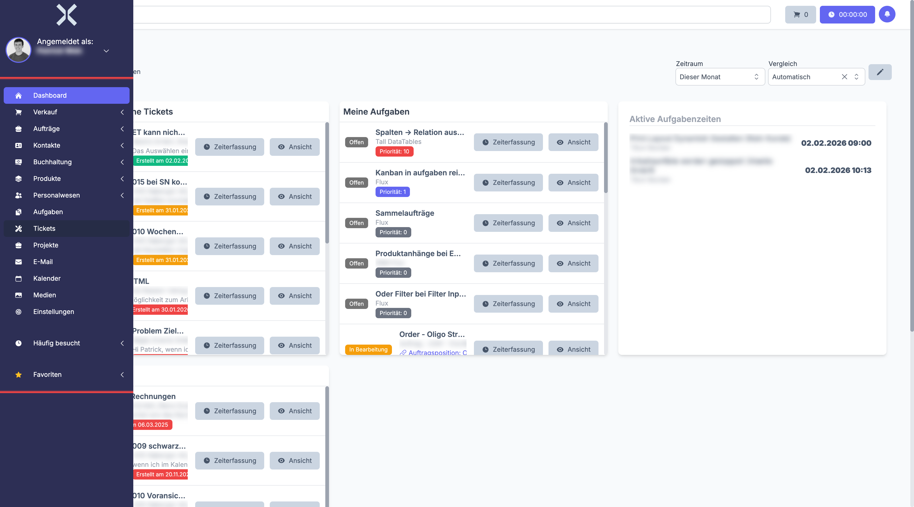
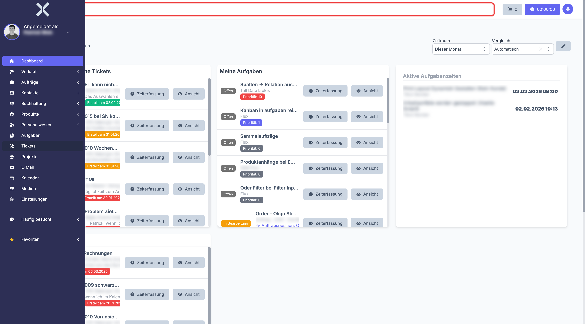
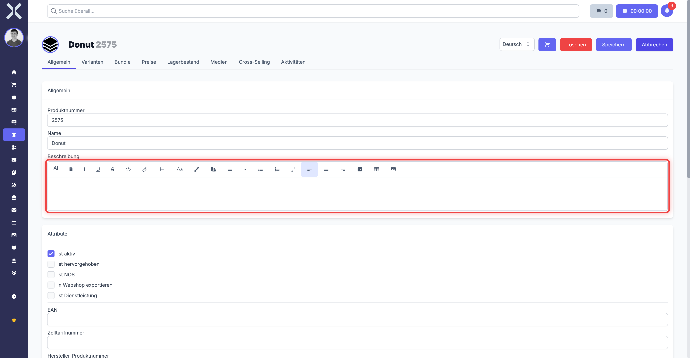

# Navigation

Die Benutzeroberfläche von Nuxbe besteht aus einer linken Sidebar, einer globalen Suchleiste und dem zentralen Inhaltsbereich. Auf mobilen Geräten wird die Sidebar durch ein Hamburger-Menü ersetzt.

## Sidebar

Die Sidebar befindet sich am linken Bildschirmrand. Im eingeklappten Zustand werden nur Icons angezeigt. Fahren Sie mit der Maus darüber, um die vollständigen Bezeichnungen zu sehen.

Die Sidebar enthält folgende Hauptbereiche:

- **Dashboard** - Startseite mit konfigurierbaren Widgets
- **Verkauf** - Leads und Vertriebspipeline
- **Aufträge** - Angebote, Aufträge, Rechnungen und weitere Auftragsarten
- **Kontakte** - Kunden, Lieferanten, Adressen und Kommunikation
- **Buchhaltung** - Transaktionen, Eingangsrechnungen, Mahnungen und Zahlungsläufe
- **Produkte** - Produktkatalog, Varianten und Seriennummern
- **Personalwesen** - Mitarbeiter, Arbeitszeiten, Anwesenheit und Abwesenheiten
- **Aufgaben** - Aufgabenverwaltung mit Zeiterfassung
- **Tickets** - Support-Ticketsystem
- **Projekte** - Projektverwaltung mit Aufgaben und Zeiterfassung
- **E-Mail** - Integrierter E-Mail-Client
- **Kalender** - Termine und Kalender
- **Medien** - Dateien und Medienverwaltung
- **Einstellungen** - Systemkonfiguration (je nach Berechtigung)

Einige Menüpunkte wie **Aufträge** oder **Buchhaltung** haben Untermenüs. Diese erkennen Sie am Pfeil-Icon rechts neben dem Namen. Klicken Sie auf den Menüpunkt, um die Untermenüs aufzuklappen.

> **Hinweis:** Welche Menüpunkte Ihnen angezeigt werden, hängt von Ihren Benutzerrechten ab. Nicht alle Bereiche sind für jeden Benutzer sichtbar.

## Häufig besuchte Seiten

Unterhalb der Hauptnavigation finden Sie den Bereich **Häufig besucht**. Nuxbe merkt sich automatisch die fünf Seiten, die Sie am häufigsten aufrufen, und zeigt diese für den schnellen Zugriff an. Klicken Sie auf den Bereich, um die Liste aufzuklappen.

## Favoriten

Im Bereich **Favoriten** können Sie Seiten manuell als Lesezeichen speichern:

1. Navigieren Sie zu der Seite, die Sie als Favorit speichern möchten.
2. Klicken Sie in der Sidebar auf das **+**-Symbol neben dem Bereich **Favoriten**.
3. Vergeben Sie optional einen benutzerdefinierten Namen.
4. Der Favorit erscheint ab sofort in Ihrer Favoritenliste.

Um einen Favoriten zu entfernen, klicken Sie auf das rote **Papierkorb**-Symbol neben dem Eintrag und bestätigen Sie die Löschung.

## Benutzermenü

Oben links in der Sidebar sehen Sie Ihren Benutzernamen unterhalb von **Angemeldet als:**. Klicken Sie darauf, um das Benutzermenü zu öffnen. Hier finden Sie:

- **Mein Profil** - Öffnet Ihre Profileinstellungen
- **Abmelden** - Meldet Sie vom System ab
- **Dark Mode** - Schaltet zwischen hellem und dunklem Design um

## Globale Suche

Am oberen Rand des Bildschirms befindet sich die globale Suchleiste **Suche überall...**.

Geben Sie einen Suchbegriff ein, um systemweit nach Datensätzen zu suchen. Die Suche durchsucht unter anderem:

- Kontakte und Adressen
- Aufträge und Rechnungen
- Produkte
- Tickets und Aufgaben
- Projekte
- und weitere Datensätze

Die Ergebnisse werden in Echtzeit gruppiert nach Kategorie angezeigt. Pro Kategorie sehen Sie bis zu fünf Treffer. Klicken Sie auf ein Ergebnis, um direkt zur Detailansicht zu navigieren.

## Richtext-Editor (Texteditor mit Formatierung)

An vielen Stellen in Nuxbe finden Sie Textfelder, die einen Richtext-Editor verwenden. Dieser Editor funktioniert ähnlich wie ein einfaches Textverarbeitungsprogramm und ermöglicht es Ihnen, Texte zu formatieren. Richtext-Editoren finden Sie unter anderem in:

- **Produktbeschreibungen** (siehe [Produktdetails](../6-produkte/3-produkt-detail.md))
- **E-Mail-Vorlagen** (siehe [E-Mail-Vorlagen](../14-einstellungen/25-email-vorlagen.md))
- **Ticket-Kommentaren** und anderen Textfeldern

### Werkzeugleiste

Die Werkzeugleiste befindet sich am oberen Rand des Textfelds und bietet folgende Formatierungsmöglichkeiten:

- **Fettschrift** -- Markieren Sie Text und klicken Sie auf das **F**-Symbol (oder drücken Sie Strg+B / Cmd+B)
- **Kursiv** -- Markieren Sie Text und klicken Sie auf das *K*-Symbol (oder drücken Sie Strg+I / Cmd+I)
- **Unterstrichen** -- Markieren Sie Text und klicken Sie auf das U-Symbol (oder drücken Sie Strg+U / Cmd+U)
- **Aufzählung** -- Erstellt eine Liste mit Punkten
- **Nummerierte Liste** -- Erstellt eine nummerierte Liste
- **Link einfügen** -- Fügt einen klickbaren Link ein. Markieren Sie zuerst den Text, der als Link angezeigt werden soll, klicken Sie auf das Link-Symbol und geben Sie die URL ein.
- **Überschriften** -- Erstellt Überschriften in verschiedenen Größen

### HTML-Quellansicht

Für fortgeschrittene Benutzer bieten die meisten Richtext-Editoren in Nuxbe eine HTML-Quellansicht. In dieser Ansicht sehen Sie den rohen HTML-Code hinter dem formatierten Text.

**So wechseln Sie in die HTML-Quellansicht:**

1. Suchen Sie in der Werkzeugleiste die Schaltfläche **Source**, **</>** oder ein ähnliches Quellcode-Symbol.
2. Klicken Sie darauf. Die Ansicht wechselt von der visuellen Darstellung zum HTML-Quellcode.
3. Sie sehen nun HTML-Tags wie `
`, `<strong>`, `<ul>` etc.
4. Nehmen Sie Ihre Änderungen direkt im Code vor.
5. Klicken Sie erneut auf **Source** / **</>**, um zurück zur visuellen Ansicht zu wechseln.

**Wann ist die HTML-Quellansicht nützlich?**

- **Formatierungsprobleme nach Copy & Paste:** Wenn Sie Text aus Word, E-Mails oder Webseiten einfügen, werden oft unsichtbare Formatierungen mitkopiert, die zu unerwünschten Ergebnissen führen. In der Quellansicht können Sie diese überflüssigen Formatierungen entfernen.
- **Spezielle Formatierungen:** Wenn Sie Tabellen oder andere Elemente einfügen möchten, die über die Werkzeugleiste nicht verfügbar sind.
- **Fehlersuche:** Wenn Text seltsam dargestellt wird, zeigt Ihnen die Quellansicht, was genau im Hintergrund passiert.

> **Warnung:** Verwenden Sie die HTML-Quellansicht nur, wenn Sie grundlegende HTML-Kenntnisse haben. Fehlerhafter HTML-Code (z. B. vergessene schließende Tags) kann dazu führen, dass die Darstellung in Dokumenten oder E-Mails fehlerhaft ist. Im Zweifelsfall bleiben Sie in der visuellen Ansicht und nutzen Sie die Werkzeugleiste für Formatierungen.

> **Tipp:** Wenn nach dem Einfügen von Text die Formatierung nicht stimmt, ist der einfachste Weg oft: Den gesamten Text markieren, alle Formatierungen entfernen (falls ein solcher Button vorhanden ist), und dann den Text in der visuellen Ansicht neu formatieren. Das ist sicherer als die manuelle Bearbeitung des HTML-Codes.

## Weiterführende Themen

- [Dashboard](3-dashboard.md) - Ihr persönliches Dashboard einrichten
- [Mein Profil](4-mein-profil.md) - Sprache und Benachrichtigungen konfigurieren
