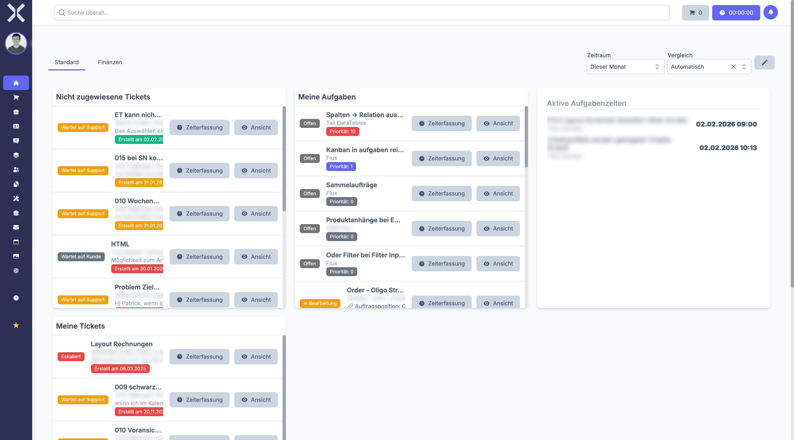

# Dashboard

Das Dashboard ist Ihre Startseite nach der Anmeldung. Es zeigt Ihnen eine personalisierte Übersicht mit konfigurierbaren Widgets, die Ihre aktuellen Aufgaben, Tickets, Zeiterfassungen und Geschäftskennzahlen zusammenfassen.

## Dashboard-Tabs

Am oberen Rand sehen Sie Tabs, mit denen Sie zwischen verschiedenen Widget-Zusammenstellungen wechseln können. So können Sie beispielsweise einen Tab für den täglichen Überblick und einen weiteren für Vertriebskennzahlen einrichten.

Im Bearbeitungsmodus können Sie:

- Neue Tabs anlegen
- Tabs umbenennen
- Tabs entfernen

## Zeitraum und Vergleich

Oben rechts können Sie den **Zeitraum** (z. B. „Dieser Monat", „Dieses Quartal") und einen **Vergleichszeitraum** auswählen. Diese Einstellungen wirken sich auf alle Widgets aus, die zeitbasierte Daten anzeigen, z. B. Umsatz- oder Auftragsstatistiken.

## Widgets

Nuxbe bietet eine große Auswahl an Widgets, die Sie frei auf Ihrem Dashboard platzieren können. Die verfügbaren Widgets gliedern sich in mehrere Kategorien:

### Aufgaben und Tickets

- **Meine Aufgaben** - Ihre offenen und in Bearbeitung befindlichen Aufgaben mit Prioritätsanzeige
- **Meine überfälligen Aufgaben** - Aufgaben, deren Fälligkeitsdatum überschritten ist
- **Nicht zugewiesene Tickets** - Offene Tickets ohne Bearbeiter, mit direkter Zeiterfassung
- **Meine Tickets** - Alle Ihnen zugewiesenen Tickets

### Zeiterfassung

- **Aktive Aufgabenzeiten** - Laufende Zeiterfassungen Ihrer Teammitglieder
- **Meine Arbeitszeiten** - Übersicht Ihrer eigenen erfassten Zeiten
- **Aktive Tagesarbeitszeiten** - Aktuelle Zeiterfassungen aller Mitarbeiter

### Umsatz und Finanzen

- **Gesamtumsatz** - Umsatz im gewählten Zeitraum
- **Anzahl Aufträge** - Auftragsvolumen
- **Durchschnittlicher Auftragswert** - Mittlerer Bestellwert
- **Umsatz nach Vertriebsmitarbeiter** - Aufschlüsselung nach Verantwortlichen
- **Umsatz nach Top-Kunden** - Ihre wichtigsten Kunden nach Umsatz
- **Umsatz-/Gewinn-/Einkaufschart** - Grafische Auswertung über den Zeitverlauf
- **Wiederkehrender Umsatz** - Prognose aus Abonnements

### Vertrieb / Leads

- **Meine Leads** - Ihre aktuellen Vertriebskontakte
- **Meine überfälligen Leads** - Leads mit überschrittenem Abschlussdatum
- **Erwarteter Umsatz nach Lead-Status** - Pipeline-Bewertung
- **Konversionsrate nach Herkunft** - Wie gut verschiedene Quellen konvertieren
- **Gewonnene/Verlorene Leads** - Verhältnis und Trend

### Sonstige

- **Kalender** - Anstehende Termine
- **Letzte Aktivitäten** - Systemweite Änderungen
- **Geburtstage** - Geburtstage von Mitarbeitern und Kontakten
- **Offene Lieferungen** - Ausstehende Lieferungen
- **Eingangsrechnungs-Freigabe** - Rechnungen, die auf Ihre Freigabe warten

## Dashboard bearbeiten

1. Klicken Sie auf das **Stift-Icon** oben rechts neben den Zeitraum-Filtern, um den Bearbeitungsmodus zu aktivieren.
2. Im Bearbeitungsmodus können Sie:
   - **Widgets hinzufügen** - Wählen Sie aus der Liste verfügbarer Widgets
   - **Widgets entfernen** - Entfernen Sie Widgets, die Sie nicht benötigen
   - **Widgets anordnen** - Verschieben Sie Widgets per Drag & Drop an die gewünschte Position
   - **Widget-Größe anpassen** - Ändern Sie die Breite und Höhe einzelner Widgets
3. Klicken Sie erneut auf das Stift-Icon, um den Bearbeitungsmodus zu verlassen. Ihre Änderungen werden automatisch gespeichert.

## Weiterführende Themen

- [Navigation](2-navigation.md) - Sidebar und Menüstruktur
- [Aufgaben](../8-aufgaben/0-index.md) - Aufgaben im Detail verwalten
- [Tickets](../9-tickets/0-index.md) - Ticketsystem nutzen
