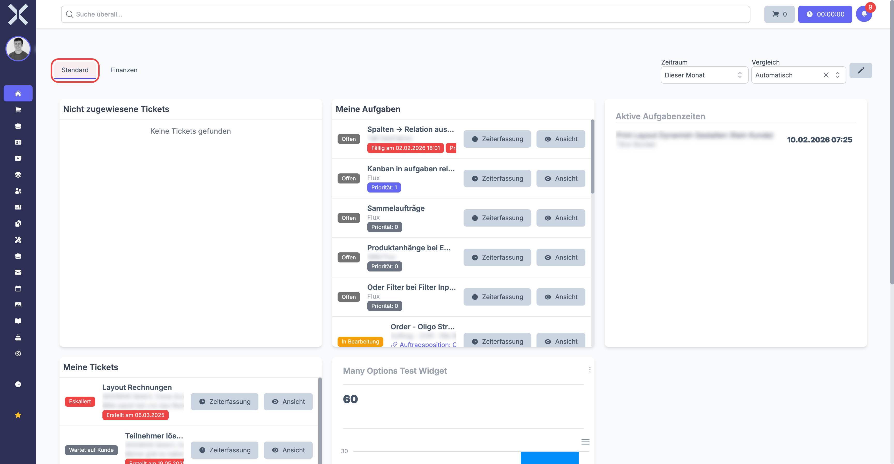
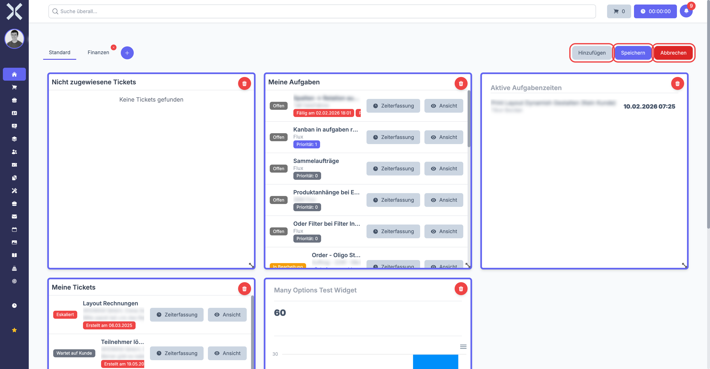
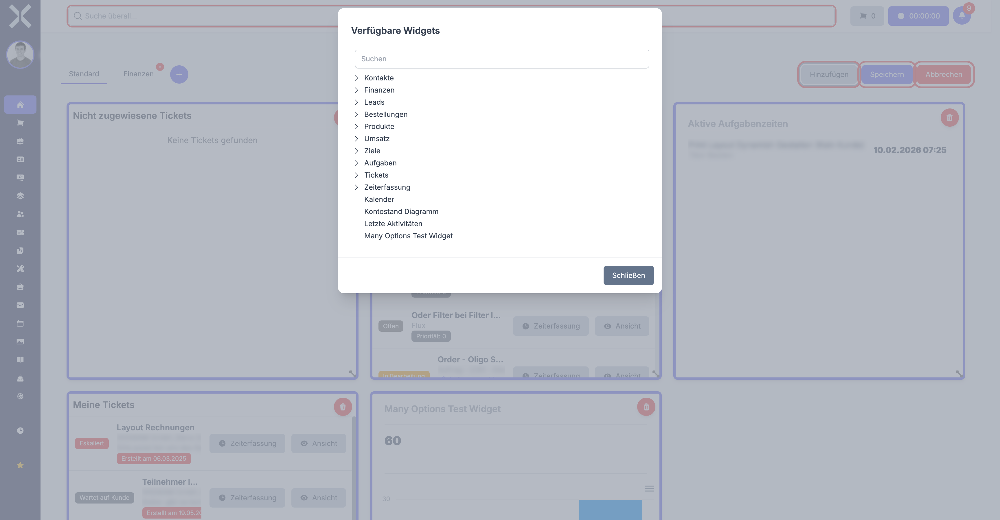

# Dashboard

Das Dashboard ist Ihre Startseite nach der Anmeldung. Es zeigt Ihnen eine personalisierte Übersicht mit konfigurierbaren Widgets, die Ihre aktuellen Aufgaben, Tickets, Zeiterfassungen und Geschäftskennzahlen zusammenfassen.

## Dashboard-Tabs

Am oberen Rand sehen Sie Tabs, mit denen Sie zwischen verschiedenen Widget-Zusammenstellungen wechseln können. So können Sie beispielsweise einen Tab für den täglichen Überblick und einen weiteren für Vertriebskennzahlen einrichten.

Im Bearbeitungsmodus können Sie:

- Neue Tabs anlegen
- Tabs umbenennen
- Tabs entfernen

## Zeitraum und Vergleich

Oben rechts können Sie den **Zeitraum** (z. B. „Dieser Monat", „Dieses Quartal") und einen **Vergleichszeitraum** auswählen. Diese Einstellungen wirken sich auf alle Widgets aus, die zeitbasierte Daten anzeigen, z. B. Umsatz- oder Auftragsstatistiken.

## Widgets

Nuxbe bietet eine große Auswahl an Widgets, die Sie frei auf Ihrem Dashboard platzieren können. Die verfügbaren Widgets gliedern sich in mehrere Kategorien:

### Aufgaben und Tickets

- **Meine Aufgaben** - Ihre offenen und in Bearbeitung befindlichen Aufgaben mit Prioritätsanzeige
- **Meine verantwortlichen Aufgaben** - Aufgaben, bei denen Sie als Verantwortlicher eingetragen sind
- **Meine überfälligen Aufgaben** - Aufgaben, deren Fälligkeitsdatum überschritten ist
- **Nicht zugewiesene Tickets** - Offene Tickets ohne Bearbeiter, mit direkter Zeiterfassung
- **Meine Tickets** - Alle Ihnen zugewiesenen Tickets

### Zeiterfassung

- **Aktive Aufgabenzeiten** - Laufende Zeiterfassungen Ihrer Teammitglieder
- **Meine Arbeitszeiten** - Übersicht Ihrer eigenen erfassten Zeiten
- **Aktive Tagesarbeitszeiten** - Aktuelle Zeiterfassungen aller Mitarbeiter

### Umsatz und Finanzen

- **Gesamtumsatz** - Umsatz im gewählten Zeitraum
- **Anzahl Aufträge** - Auftragsvolumen
- **Durchschnittlicher Auftragswert** - Mittlerer Bestellwert
- **Umsatz nach Vertriebsmitarbeiter** - Aufschlüsselung nach Verantwortlichen
- **Umsatz nach Top-Kunden** - Ihre wichtigsten Kunden nach Umsatz
- **Umsatz-/Gewinn-/Einkaufschart** - Grafische Auswertung über den Zeitverlauf
- **Wiederkehrender Umsatz** - Prognose aus Abonnements

### Vertrieb / Leads

- **Meine Leads** - Ihre aktuellen Vertriebskontakte
- **Meine überfälligen Leads** - Leads mit überschrittenem Abschlussdatum
- **Erwarteter Umsatz nach Lead-Status** - Pipeline-Bewertung
- **Konversionsrate nach Herkunft** - Wie gut verschiedene Quellen konvertieren
- **Gewonnene/Verlorene Leads** - Verhältnis und Trend

### Sonstige

- **Kalender** - Anstehende Termine
- **Letzte Aktivitäten** - Systemweite Änderungen
- **Geburtstage** - Geburtstage von Mitarbeitern und Kontakten
- **Offene Lieferungen** - Ausstehende Lieferungen
- **Eingangsrechnungs-Freigabe** - Rechnungen, die auf Ihre Freigabe warten

## Widget-Unterschiede verstehen

Einige Widgets haben ähnliche Namen, zeigen aber sehr unterschiedliche Daten an. In diesem Abschnitt wird erklärt, was genau jedes Widget anzeigt und worin die Unterschiede bestehen.

### Aufgaben-Widgets: Zugewiesen vs. Verantwortlich vs. Überfällig

In Nuxbe hat jede Aufgabe zwei wichtige Rollen, die mit Benutzern verknüpft werden können:

1. **Zugewiesener Benutzer** -- Das ist die Person, die die Aufgabe **aktiv bearbeitet**. Diese Person erledigt die eigentliche Arbeit.
2. **Verantwortlicher Benutzer** -- Das ist die Person, die die Aufgabe **beaufsichtigt oder besitzt**. Diese Person muss nicht selbst an der Aufgabe arbeiten, ist aber dafür verantwortlich, dass sie erledigt wird.

Die drei Aufgaben-Widgets zeigen jeweils unterschiedliche Daten an:

| Widget | Was wird angezeigt? | Für wen ist es gedacht? |
|--------|---------------------|------------------------|
| **Meine Aufgaben** | Alle offenen Aufgaben, bei denen **Sie** als zugewiesener Benutzer eingetragen sind | Für jeden Mitarbeiter, der seine eigene Arbeitsliste sehen will |
| **Meine verantwortlichen Aufgaben** | Alle offenen Aufgaben, bei denen **Sie** als Verantwortlicher eingetragen sind | Für Teamleiter und Projektleiter, die den Überblick über ihre Aufgaben behalten wollen |
| **Meine überfälligen Aufgaben** | Alle Aufgaben, die Ihnen **zugewiesen** sind und deren **Fälligkeitsdatum bereits überschritten** ist | Für jeden Mitarbeiter -- diese Aufgaben brauchen sofortige Aufmerksamkeit |

> **Tipp:** Wenn Sie sowohl Aufgaben bearbeiten als auch welche beaufsichtigen, empfiehlt es sich, sowohl das Widget "Meine Aufgaben" als auch "Meine verantwortlichen Aufgaben" auf dem Dashboard zu platzieren. So behalten Sie den vollständigen Überblick.

> **Beispiel:** Ihr Teamleiter erstellt eine Aufgabe "Angebot für Kunde Müller erstellen". Er trägt sich selbst als **Verantwortlichen** ein und weist die Aufgabe **Ihnen** zu. Dann erscheint die Aufgabe bei Ihnen im Widget "Meine Aufgaben" und bei Ihrem Teamleiter im Widget "Meine verantwortlichen Aufgaben".

### Ticket-Widgets: Meine Tickets vs. Nicht zugewiesene Tickets

| Widget | Was wird angezeigt? | Für wen ist es gedacht? |
|--------|---------------------|------------------------|
| **Meine Tickets** | Alle Tickets, bei denen **Sie** als Bearbeiter eingetragen sind | Für Supportmitarbeiter, die ihre zugewiesenen Tickets abarbeiten |
| **Nicht zugewiesene Tickets** | Alle offenen Tickets, die **noch keinem Bearbeiter** zugewiesen sind | Für Teamleiter und Supportmitarbeiter, die neue Anfragen aufnehmen sollen |

> **Wichtig:** Das Widget "Nicht zugewiesene Tickets" ist besonders nützlich für Teamleiter und Supportkoordinatoren. Es zeigt alle Tickets, die noch niemand bearbeitet. Wenn Sie ein solches Ticket sehen, das in Ihren Zuständigkeitsbereich fällt, können Sie es sich direkt zuweisen.

> **Tipp:** Platzieren Sie das Widget "Nicht zugewiesene Tickets" gut sichtbar auf Ihrem Dashboard, damit keine Kundenanfrage übersehen wird. Ein Ticket ohne Bearbeiter bedeutet, dass sich noch niemand darum kümmert.

### Zeiterfassungs-Widgets: Arbeitszeiten vs. Aufgabenzeiten vs. Tagesarbeitszeiten

Diese drei Widgets sehen auf den ersten Blick ähnlich aus, zeigen aber ganz unterschiedliche Informationen:

| Widget | Was wird angezeigt? | Für wen ist es gedacht? |
|--------|---------------------|------------------------|
| **Meine Arbeitszeiten** | Ihre **eigenen** erfassten Arbeitszeiten im gewählten Zeitraum (Stunden pro Tag, Gesamtstunden etc.) | Für jeden Mitarbeiter zur Kontrolle der eigenen Zeiterfassung |
| **Aktive Aufgabenzeiten** | Alle **gerade laufenden** Zeiterfassungen im Team -- zeigt, wer gerade an welcher Aufgabe arbeitet | Für Teamleiter, um zu sehen, wer gerade woran arbeitet |
| **Aktive Tagesarbeitszeiten** | Die **Tagesanwesenheit** aller Mitarbeiter -- wer hat heute gestartet, wer ist gerade aktiv, wer hat schon Feierabend | Für Teamleiter und Personalabteilung zur Anwesenheitsübersicht |

> **Wichtig:** "Aktive Aufgabenzeiten" zeigt nur die Zeiterfassungen, die **gerade laufen** (der Timer läuft noch). Sobald eine Zeiterfassung gestoppt wird, verschwindet sie aus diesem Widget.

> **Hinweis:** "Aktive Tagesarbeitszeiten" ist keine Aufgaben-Zeiterfassung, sondern die allgemeine Arbeitszeit (Kommen/Gehen). Es zeigt, ob ein Mitarbeiter heute grundsätzlich arbeitet, nicht an welcher spezifischen Aufgabe.

## Dashboard bearbeiten

Um Ihr Dashboard anzupassen, wechseln Sie in den Bearbeitungsmodus. In diesem Modus können Sie Widgets hinzufügen, entfernen, verschieben und in der Größe anpassen.

### Bearbeitungsmodus aktivieren und beenden

1. Klicken Sie auf das **Stift-Icon** (Bearbeiten-Symbol) oben rechts neben den Zeitraum-Filtern.
2. Das Dashboard wechselt in den Bearbeitungsmodus -- Sie erkennen dies daran, dass ein Raster-Overlay sichtbar wird und die Widgets Griffe zum Verschieben und Vergrößern/Verkleinern erhalten.

   
3. Nehmen Sie alle gewünschten Änderungen vor (siehe unten).
4. Klicken Sie **erneut auf das Stift-Icon**, um den Bearbeitungsmodus zu verlassen.
5. Ihre Änderungen werden **automatisch gespeichert** -- es gibt keinen separaten "Speichern"-Button.

### Widget hinzufügen -- Schritt für Schritt

1. Aktivieren Sie den **Bearbeitungsmodus** (Stift-Icon oben rechts).
2. Klicken Sie auf die Schaltfläche **Widget hinzufügen** (oder das **+**-Icon), die im Bearbeitungsmodus erscheint.
3. Es öffnet sich ein Dialog, der alle verfügbaren Widgets auflistet, gruppiert nach Kategorien (Aufgaben, Zeiterfassung, Umsatz etc.).

   
4. Klicken Sie auf das gewünschte Widget, um es zu Ihrem Dashboard hinzuzufügen.
5. Das neue Widget erscheint am unteren Rand Ihres Dashboards.
6. **Verschieben Sie das Widget** an die gewünschte Position, indem Sie es mit gedrückter Maustaste an der Titelleiste greifen und an die gewünschte Stelle ziehen.
7. **Passen Sie die Größe an**, indem Sie an den Ecken oder Kanten des Widgets ziehen. Ziehen Sie nach rechts, um es breiter zu machen, oder nach unten, um es höher zu machen.
8. Klicken Sie erneut auf das **Stift-Icon**, um den Bearbeitungsmodus zu verlassen.

> **Hinweis:** Sie können dasselbe Widget nur einmal pro Tab hinzufügen. Wenn ein Widget bereits auf dem aktuellen Tab platziert ist, wird es im Auswahldialog nicht mehr angezeigt.

> **Tipp:** Beginnen Sie mit den Widgets, die Sie am häufigsten brauchen, und platzieren Sie diese ganz oben. So sehen Sie die wichtigsten Informationen sofort, wenn Sie das Dashboard öffnen, ohne scrollen zu müssen.

### Widget entfernen

1. Aktivieren Sie den **Bearbeitungsmodus** (Stift-Icon oben rechts).
2. Suchen Sie das Widget, das Sie entfernen möchten.
3. Klicken Sie auf das **X**-Symbol (Schließen-Icon) in der oberen rechten Ecke des Widgets.
4. Das Widget wird sofort entfernt.
5. Verlassen Sie den Bearbeitungsmodus über das Stift-Icon.

> **Hinweis:** Das Entfernen eines Widgets löscht keine Daten. Sie können jedes Widget jederzeit wieder hinzufügen. Die zugrunde liegenden Aufgaben, Tickets oder Zeiterfassungen bleiben vollständig erhalten.

### Widgets anordnen und Größe anpassen

- **Verschieben:** Greifen Sie das Widget an seiner Titelleiste und ziehen Sie es an die gewünschte Position. Andere Widgets weichen automatisch aus, um Platz zu machen.
- **Größe ändern:** Ziehen Sie an den Ecken oder Kanten des Widgets. Das Dashboard verwendet ein Rastersystem, sodass Widgets in definierten Schritten größer oder kleiner werden.
- **Breite:** Widgets können die volle Bildschirmbreite einnehmen oder schmaler sein. Schmale Widgets eignen sich für einfache Kennzahlen (z. B. Gesamtumsatz), breite für Tabellen und Charts.
- **Höhe:** Manche Widgets (z. B. Listen oder Tabellen) profitieren von mehr Höhe, damit mehr Einträge ohne Scrollen sichtbar sind.

> **Tipp:** Ordnen Sie Ihre Widgets so an, dass die wichtigsten oben stehen und zusammengehörige Informationen nebeneinander liegen. Zum Beispiel: "Meine Aufgaben" neben "Meine überfälligen Aufgaben", oder "Gesamtumsatz" neben "Anzahl Aufträge".

## Dashboard-Tabs verwalten

Tabs ermöglichen es Ihnen, mehrere unabhängige Dashboard-Ansichten zu erstellen. Jeder Tab hat sein eigenes Widget-Layout. So können Sie zum Beispiel einen Tab für den täglichen Arbeitsüberblick und einen separaten Tab für Vertriebskennzahlen einrichten.

### Neuen Tab anlegen

1. Klicken Sie auf das **+**-Icon rechts neben den vorhandenen Tab-Reitern am oberen Rand des Dashboards.
2. Geben Sie einen aussagekräftigen **Namen** für den Tab ein (z. B. "Vertrieb", "Support", "Meine Arbeit", "Teamübersicht").
3. Bestätigen Sie die Eingabe.
4. Der neue Tab wird erstellt und automatisch geöffnet.
5. Der Tab ist zunächst leer -- fügen Sie nun die gewünschten Widgets hinzu (siehe Abschnitt oben).

### Tab umbenennen

1. Machen Sie einen **Doppelklick** auf den Tab-Namen oder klicken Sie mit der **rechten Maustaste** darauf.
2. Der Name wird editierbar.
3. Geben Sie den neuen Namen ein.
4. Bestätigen Sie die Änderung.

### Tab löschen

1. Klicken Sie mit der **rechten Maustaste** auf den Tab, den Sie löschen möchten.
2. Wählen Sie **Löschen** aus dem Kontextmenü.
3. Bestätigen Sie die Löschung im Bestätigungsdialog.

> **Wichtig:** Beim Löschen eines Tabs werden alle Widgets auf diesem Tab unwiderruflich entfernt. Die zugrunde liegenden Daten (Aufgaben, Tickets etc.) bleiben natürlich erhalten, nur das Widget-Layout geht verloren. Überlegen Sie genau, bevor Sie einen Tab löschen.

### Tab-Reihenfolge ändern

Sie können die Reihenfolge der Tabs per **Drag & Drop** ändern. Greifen Sie einen Tab-Reiter mit gedrückter Maustaste und ziehen Sie ihn an die gewünschte Position.

### Empfehlungen für Tab-Aufteilung

Je nach Ihrer Rolle im Unternehmen empfehlen wir folgende Tab-Aufteilung:

| Tab-Name | Empfohlene Widgets | Geeignet für |
|----------|-------------------|--------------|
| **Meine Arbeit** | Meine Aufgaben, Meine Tickets, Meine Arbeitszeiten, Meine überfälligen Aufgaben | Alle Mitarbeiter |
| **Teamübersicht** | Aktive Aufgabenzeiten, Aktive Tagesarbeitszeiten, Nicht zugewiesene Tickets | Teamleiter |
| **Vertrieb** | Meine Leads, Gesamtumsatz, Umsatz nach Top-Kunden, Erwarteter Umsatz nach Lead-Status | Vertriebsmitarbeiter |
| **Management** | Gesamtumsatz, Anzahl Aufträge, Umsatz-/Gewinn-/Einkaufschart, Wiederkehrender Umsatz | Geschäftsführung |

> **Tipp:** Jeder Benutzer hat seine eigenen persönlichen Tabs und Widget-Layouts. Ihre Änderungen betreffen nur Ihr eigenes Dashboard und sind für andere Benutzer nicht sichtbar.

## Weiterführende Themen

- [Navigation](2-navigation.md) - Sidebar und Menüstruktur
- [Aufgaben](../8-aufgaben/0-index.md) - Aufgaben im Detail verwalten
- [Tickets](../9-tickets/0-index.md) - Ticketsystem nutzen
