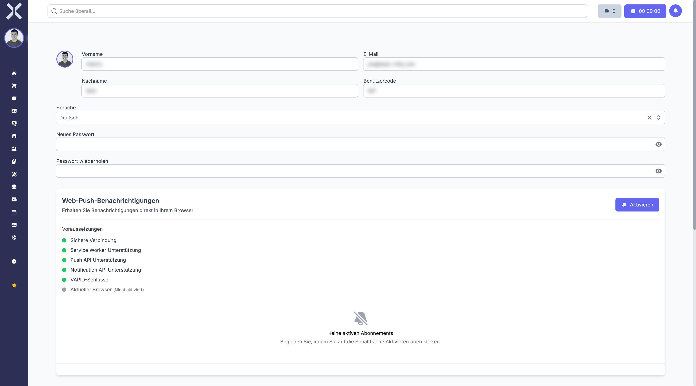

# Mein Profil

Auf der Profilseite verwalten Sie Ihre persönlichen Daten, die Anzeigesprache, Ihr Passwort und Ihre Benachrichtigungseinstellungen.

## Profil öffnen

1. Klicken Sie oben links in der Sidebar auf Ihren Benutzernamen unterhalb von **Angemeldet als:**.
2. Klicken Sie auf **Mein Profil**.

## Avatar

Klicken Sie auf Ihr Profilbild (oder den Platzhalter), um ein neues Avatar-Bild hochzuladen. Es werden gängige Bildformate akzeptiert (JPG, PNG etc.).

## Persönliche Daten

Auf der Profilseite können Sie folgende Felder bearbeiten:

- **Vorname** - Ihr Vorname
- **Nachname** - Ihr Nachname
- **E-Mail** - Ihre E-Mail-Adresse für die Anmeldung und Benachrichtigungen
- **Benutzercode** - Ihr eindeutiger Benutzercode im System

Klicken Sie nach Ihren Änderungen auf **Speichern**.

## Sprache

Über das Dropdown-Feld **Sprache** stellen Sie die Anzeigesprache der Benutzeroberfläche um. Nach dem Wechsel wird die gesamte Oberfläche in der gewählten Sprache angezeigt.

## Passwort ändern

1. Geben Sie unter **Neues Passwort** ein neues Passwort ein.
2. Bestätigen Sie es im Feld **Passwort wiederholen**.
3. Klicken Sie auf **Speichern**.

Lassen Sie die Passwort-Felder leer, wenn Sie Ihr Passwort nicht ändern möchten.

## Benachrichtigungseinstellungen

Nuxbe kann Sie über verschiedene Kanäle benachrichtigen. Für jeden Benachrichtigungstyp (z. B. Ticket zugewiesen, Aufgabe aktualisiert, Abwesenheitsantrag) können Sie einzeln festlegen, über welche Kanäle Sie informiert werden möchten:

- **Datenbank** - Benachrichtigung innerhalb der Anwendung (Glockensymbol)
- **E-Mail** - Benachrichtigung per E-Mail
- **Broadcast** - Echtzeit-Benachrichtigung über Websockets
- **Push** - Browser-Push-Benachrichtigungen (Web Push)
- **Mobil** - Push-Benachrichtigungen auf Mobilgeräten (FCM)

Jeder Benachrichtigungstyp wird als Zeile angezeigt, und Sie können per Häkchen festlegen, welche Kanäle aktiv sein sollen. Nicht verfügbare Kanäle werden ausgegraut dargestellt.

## Web-Push-Benachrichtigungen

Im Abschnitt **Web-Push-Benachrichtigungen** können Sie Browser-Benachrichtigungen aktivieren. Damit erhalten Sie Benachrichtigungen direkt in Ihrem Browser, auch wenn Sie gerade nicht aktiv in Nuxbe arbeiten.

### Voraussetzungen

Unter **Voraussetzungen** sehen Sie, ob Ihr Browser alle technischen Anforderungen erfüllt:

- Sichere Verbindung (HTTPS)
- Service Worker Unterstützung
- Push API Unterstützung
- Notification API Unterstützung
- VAPID-Schlüssel konfiguriert
- Aktueller Browser

### Aktivieren und Verwalten

1. Klicken Sie auf **Aktivieren**, wenn alle Voraussetzungen erfüllt sind. Ihr Browser wird Sie um Erlaubnis für Benachrichtigungen bitten.
2. Nach der Aktivierung können Sie eine **Test-Benachrichtigung** senden, um zu prüfen, ob alles funktioniert.
3. Unter **Aktive Abonnements** sehen Sie alle Browser, in denen Push-Benachrichtigungen aktiv sind (z. B. Chrome, Firefox, Safari). Jedes Abonnement kann einzeln gelöscht werden.

### Mobilgeräte (FCM)

Falls Sie die mobile App nutzen, werden Ihre registrierten Geräte unter **Mobilgeräte** aufgelistet. Hier sehen Sie Geräte-ID, Name, Plattform und Registrierungsdatum. Auch hier können Sie Test-Benachrichtigungen senden oder einzelne Geräte entfernen.

## Weiterführende Themen

- [Anmeldung](1-anmeldung.md) - Passwort zurücksetzen
- [Navigation](2-navigation.md) - Dark Mode und Benutzermenü
