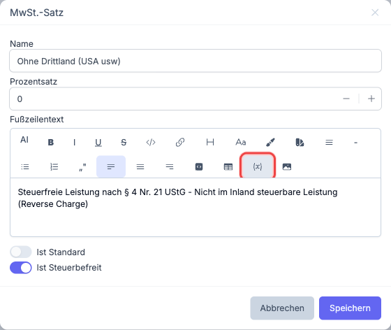
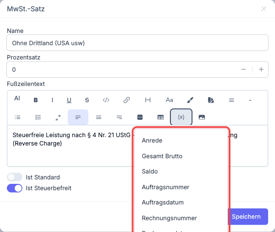

# Editor-Variablen

An verschiedenen Stellen in Nuxbe können Sie in Textfeldern dynamische Variablen einfügen. Diese Variablen werden beim Erstellen eines Dokuments (z. B. einer Rechnung oder Mahnung) automatisch durch die tatsächlichen Werte ersetzt. So können Sie Vorlagentexte erstellen, die sich bei der Ausgabe dynamisch an den jeweiligen Vorgang anpassen.

## Variablen einfügen

Textfelder, die Editor-Variablen unterstützen, erkennen Sie an der Schaltfläche mit dem Variablen-Symbol in der Editor-Werkzeugleiste.



1. Setzen Sie den Cursor an die Stelle im Text, an der die Variable eingefügt werden soll.
2. Klicken Sie auf die **Variablen-Schaltfläche** in der Werkzeugleiste.
3. Ein Dropdown zeigt alle verfügbaren Variablen für dieses Textfeld an.

   

4. Klicken Sie auf die gewünschte Variable.
5. Die Variable wird als hervorgehobenes Element im Text angezeigt.

## Verfügbare Variablen

Welche Variablen zur Auswahl stehen, hängt davon ab, in welchem Bereich Sie den Text bearbeiten. Im Dropdown werden immer genau die Variablen angezeigt, die im jeweiligen Kontext zur Verfügung stehen. Allgemeine Variablen wie das aktuelle Datum oder der angemeldete Benutzer sind in allen Textfeldern verfügbar.

> **Hinweis:** Die Variablen werden erst beim Erzeugen des Dokuments durch die echten Werte ersetzt. Im Editor selbst sehen Sie den Namen der Variable, nicht den tatsächlichen Wert. Wenn für eine Variable kein Wert vorhanden ist (z. B. noch keine Rechnungsnummer vergeben), bleibt die Stelle im fertigen Dokument leer.

## Wo Editor-Variablen verfügbar sind

Editor-Variablen stehen in folgenden Textfeldern zur Verfügung:

| Bereich | Textfeld | Beschreibung |
|---|---|---|
| [Auftragsarten](../14-einstellungen/11-auftragsarten.md) | **Kopfzeile**, **Fußzeile** | Texte, die auf allen Dokumenten dieser Auftragsart erscheinen |
| [MwSt.-Sätze](../14-einstellungen/20-mwst-saetze.md) | **Fußzeilentext** | Text, der auf Dokumenten mit diesem Steuersatz angezeigt wird |
| [Mahntexte](../14-einstellungen/23-mahntexte.md) | **Mahntext** | Text für Mahnschreiben der jeweiligen Mahnstufe |
| [Abonnement-Einstellungen](../14-einstellungen/14-abo-einstellungen.md) | **Kündigungstext** | Text für Kündigungsbestätigungen |
| [E-Mail-Vorlagen](../14-einstellungen/25-email-vorlagen.md) | **HTML-Inhalt** | Inhalt automatisch versendeter E-Mails |
| Auftrag | **Kopftext**, **Fußtext** | Individuelle Texte pro Auftrag, die auf dem Dokument erscheinen |

## Beispiel

Ein **Fußzeilentext** für einen steuerfreien MwSt.-Satz (0 %) könnte folgendermaßen aussehen:

```
Steuerfreie innergemeinschaftliche Lieferung gemäß § 4 Nr. 1b i. V. m. § 6a UStG.
USt-IdNr. des Leistungsempfängers: [USt-IdNr. des Kontakts]
```

Dabei steht `[USt-IdNr. des Kontakts]` im Editor als hervorgehobene Variable. Beim Erzeugen der Rechnung wird sie automatisch durch die USt-IdNr. des jeweiligen Kunden ersetzt.

## Weiterführende Themen

- [Auftragsarten](../14-einstellungen/11-auftragsarten.md) - Kopf- und Fußzeilen für Dokumenttypen
- [MwSt.-Sätze](../14-einstellungen/20-mwst-saetze.md) - Fußzeilentexte für Steuersätze
- [Mahntexte](../14-einstellungen/23-mahntexte.md) - Texte für Mahnschreiben
- [E-Mail-Vorlagen](../14-einstellungen/25-email-vorlagen.md) - Vorlagen für automatische E-Mails
