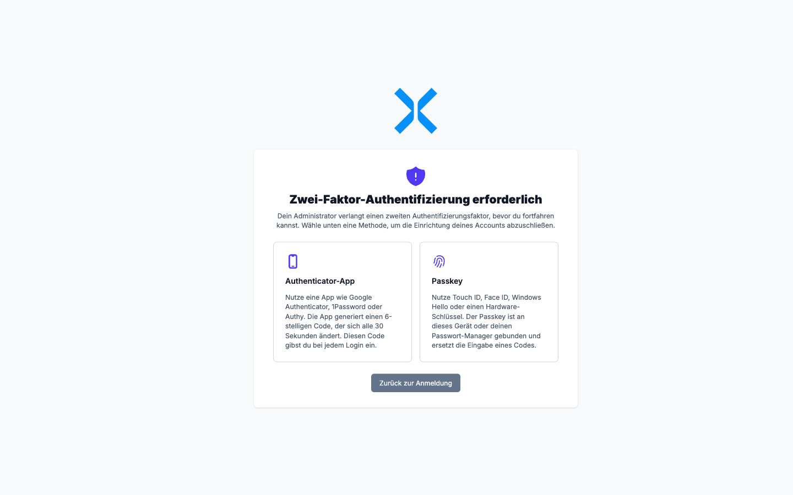

# Zwei-Faktor-Authentifizierung -- Grundlagen

Die Zwei-Faktor-Authentifizierung (kurz **2FA**) ist ein zweiter Sicherheits-Schritt beim Anmelden. Selbst wenn jemand Ihr Passwort kennt, kommt diese Person ohne den zweiten Faktor nicht in Ihren Account hinein.

Diese Seite erklärt, **was 2FA überhaupt ist**, **welche zwei Methoden** Nuxbe unterstützt und **was Sie vorbereiten** müssen, bevor Sie loslegen. Wenn Sie 2FA direkt einrichten möchten, springen Sie zu [Zwei-Faktor-Authentifizierung einrichten](8-zwei-faktor-einrichten.md).

## Was ist Zwei-Faktor-Authentifizierung?

Bei einer normalen Anmeldung geben Sie genau **einen** Nachweis ein, dass Sie es sind: Ihr Passwort. Wer Ihr Passwort kennt -- weil Sie es jemandem verraten haben, weil es bei einem fremden Dienst geleakt wurde, oder weil es zu einfach geraten werden kann -- kommt direkt in Ihren Account.

2FA ergänzt diesen ersten Faktor um einen **zweiten Faktor**, den der Angreifer nicht haben kann:

- **etwas, das nur Sie wissen** (Ihr Passwort)
- **etwas, das nur Sie besitzen** (Ihr Smartphone, Ihren Sicherheits-Schlüssel oder Ihr Gerät)
- **etwas, das nur Sie sind** (Fingerabdruck, Gesichtserkennung)

Selbst wenn das Passwort kompromittiert wird, fehlt dem Angreifer der zweite Faktor -- und er kommt nicht hinein.

## Warum ist 2FA jetzt teilweise Pflicht?

Ihr Administrator kann 2FA für alle Anwender oder für einzelne Personen verpflichtend machen. In dem Fall werden Sie nach dem nächsten Login automatisch durch die Einrichtung geführt und gelangen erst danach wieder in Ihren Arbeitsbereich. Mehr dazu unter [Erzwungene Erst-Einrichtung](8-zwei-faktor-einrichten.md#erzwungene-erst-einrichtung).

Auch wenn 2FA in Ihrem Mandanten **freiwillig** ist, empfehlen wir, einen zweiten Faktor zu hinterlegen -- besonders wenn Sie mit Buchhaltung, Bankdaten, Kundendaten oder Datev-Exporten arbeiten.

## Welche Methoden gibt es?

Nuxbe bietet zwei Verfahren an. Sie können eines oder beide einrichten.

### Authenticator-App (TOTP)

Sie installieren auf Ihrem Smartphone (oder im Passwort-Manager) eine Authenticator-App. Diese App erzeugt im Sekundentakt einen 6-stelligen Code, der nach 30 Sekunden ungültig wird. Beim Login geben Sie zusätzlich zum Passwort den aktuellen Code aus der App ein.

**Vorteile:**

- Funktioniert mit jedem Gerät und in jedem Browser, ohne spezielle Hardware.
- Auch ohne Internet-Verbindung verfügbar (die Codes werden offline berechnet).
- Sie können dieselbe App auch für andere Dienste verwenden.

**Nachteile:**

- Sie müssen jedes Mal den 6-stelligen Code abtippen oder von Ihrem Passwort-Manager einsetzen lassen.
- Bei Verlust des Smartphones ohne Backup-App geht der Zugang verloren -- ein Reset durch den Administrator ist dann notwendig.

**Hinter den Kulissen:** TOTP steht für *Time-based One-Time Password*. Sowohl die App als auch der Server kennen einen geheimen Schlüssel; aus diesem Schlüssel und der aktuellen Uhrzeit wird derselbe 6-stellige Code berechnet. Deshalb müssen die Uhren von Smartphone und Server einigermaßen synchron laufen.

### Passkey (WebAuthn)

Ihr Gerät (Mac, Windows, Smartphone, Sicherheits-Schlüssel) speichert einen kryptografischen Schlüssel, der mit Touch ID, Face ID, Windows Hello, der Geräte-PIN oder einem Hardware-Schlüssel freigeschaltet wird. Beim Login klicken Sie auf **Mit Passkey authentifizieren**, bestätigen mit Ihrem Fingerabdruck oder Gesicht -- und sind drin. Ohne Passwort, ohne Code.

**Vorteile:**

- Sehr schnell und bequem (ein Tap reicht).
- Phishing-resistent: Ein Passkey funktioniert nur auf der echten Nuxbe-Domain. Klickt jemand auf einen Phishing-Link, kann er den Passkey nicht missbrauchen.
- Kein Passwort mehr nötig -- der Passkey ersetzt beides, Passwort und 6-stelligen Code.

**Nachteile:**

- Funktioniert nur auf modernen Geräten und in modernen Browsern (siehe [Voraussetzungen für Passkeys](#voraussetzungen-für-passkeys)).
- An ein konkretes Gerät oder einen Passwort-Manager gebunden. Wenn Sie sich von einem fremden Rechner anmelden möchten, brauchen Sie entweder ein gespiegeltes Passkey im Cloud-Passwort-Manager oder Sie legen pro Gerät einen eigenen Passkey an.
- Beim Verlust des Geräts (und ohne zweiten Passkey im Tresor) kommt der Administrator wieder ins Spiel.

## Welche Methode soll ich wählen?

Beides geht. Wenn Sie unsicher sind:

- **Empfehlung A: Beides einrichten.** Aktivieren Sie eine Authenticator-App, *und* legen Sie zusätzlich einen oder mehrere Passkeys an. Im Alltag nutzen Sie den schnellen Passkey-Login. Wenn Sie aber mal vom Tablet eines Kollegen ran müssen oder ein neues Notebook bekommen, hilft Ihnen die Authenticator-App.
- **Empfehlung B: Nur Authenticator-App.** Wenn Sie sich oft von wechselnden Geräten anmelden und keinen synchronisierten Passwort-Manager nutzen.
- **Empfehlung C: Nur Passkey.** Wenn Sie immer am gleichen Mac/PC oder Smartphone arbeiten, schon einen Passwort-Manager mit Passkey-Synchronisation nutzen, und maximalen Komfort wollen.

## Authenticator-Apps -- unsere Empfehlung

Es gibt viele Apps, die TOTP-Codes erzeugen können. Diese hier sind verbreitet und arbeiten zuverlässig mit Nuxbe zusammen:

- **1Password** (kostenpflichtig) -- speichert TOTP direkt neben dem Passwort. Beim Login werden Mail, Passwort und Code automatisch in das Formular eingetragen.
- **Bitwarden** (kostenlos / Premium) -- ähnlicher Funktionsumfang wie 1Password, Premium speichert TOTP-Codes.
- **Apple Passwörter** (auf iPhone, iPad, Mac eingebaut, kostenlos) -- TOTP wird automatisch im iCloud-Schlüsselbund gesichert.
- **Google Authenticator** (kostenlos, Android/iOS) -- der Klassiker, mit Cloud-Sicherung.
- **Microsoft Authenticator** (kostenlos, Android/iOS) -- gut, wenn Sie ohnehin im Microsoft-Ökosystem arbeiten.
- **Authy** (kostenlos, Android/iOS/Desktop) -- erlaubt, denselben Code-Tresor auf mehreren Geräten zu spiegeln.
- **Aegis Authenticator** (kostenlos, Android, Open Source) -- für Anwender, die ihre Daten lieber lokal verschlüsselt halten.

> **Hinweis:** Welche App Sie wählen, ist Geschmackssache. Wichtig ist nur eine: **Sorgen Sie für ein Backup.** Wenn Ihr Smartphone kaputt geht, soll der TOTP-Schlüssel nicht mit ihm verschwinden. Apps wie 1Password, Bitwarden, Authy oder Apple Passwörter synchronisieren ihren Tresor in die Cloud. Bei Google Authenticator müssen Sie die Cloud-Sicherung aktiv einschalten.

## Passwort-Manager als TOTP-Speicher -- Pro & Contra

Viele Passwort-Manager (1Password, Bitwarden, Apple Passwörter, Dashlane, ...) können TOTP-Codes direkt speichern und beim Login automatisch in das Formular einfüllen. Das ist sehr bequem, hat aber einen sicherheitstechnischen Beigeschmack:

**Vorteil:** Kein Wechseln zwischen Browser und Smartphone. Mail, Passwort und Code werden mit einem Klick eingesetzt.

**Nachteil -- bewusst sein, dann entscheiden:** Wenn Sie Passwort und TOTP-Code im selben Tresor speichern, sind die "zwei Faktoren" praktisch zu **einem Faktor** zusammengeschmolzen -- Ihr Master-Passwort des Tresors. Wer den Tresor knackt, hat beides. Das ist immer noch deutlich besser als nur ein Passwort, aber nicht mehr ganz so robust wie ein wirklich getrennter zweiter Faktor.

**Empfehlung für die meisten Anwender:** TOTP im Passwort-Manager ist OK. Aber: Schützen Sie den Tresor mit einem starken Master-Passwort und einem eigenen zweiten Faktor (Touch ID, Face ID, Windows Hello). Dann sind Ihre TOTP-Codes wieder gut geschützt.

**Empfehlung für besonders sensible Accounts:** Speichern Sie TOTP nicht im selben Tresor wie das Passwort. Nutzen Sie eine separate Authenticator-App auf einem zweiten Gerät -- so bleibt der zweite Faktor wirklich getrennt vom ersten.

## Voraussetzungen für Passkeys

Damit Passkeys funktionieren, brauchen Sie:

- **Einen modernen Browser** -- aktuelle Versionen von Chrome, Edge, Firefox, Safari oder Brave. Sehr alte Browser unterstützen WebAuthn nicht.
- **Einen Authentikator** -- das ist eines der folgenden Dinge:
  - Ein modernes Smartphone oder Tablet mit Fingerabdruck- oder Gesichts-Sensor (iPhone mit Face ID/Touch ID, Android mit Fingerabdruck).
  - Einen Mac mit Touch ID oder Apple-Watch-Bestätigung.
  - Einen Windows-PC mit Windows-Hello-fähiger Kamera, Fingerabdruck-Sensor oder PIN.
  - Einen Hardware-Sicherheitsschlüssel (z. B. YubiKey, SoloKey, Google Titan).
  - Einen Passwort-Manager mit Passkey-Unterstützung (1Password, Bitwarden, Apple Passwörter, Google Passwortmanager).

Wenn Ihr Browser keine Passkey-Unterstützung hat, blendet Nuxbe die Schaltfläche **Mit Passkey authentifizieren** auf der Anmeldeseite gar nicht erst ein. Sie müssen sich dann mit Mail/Passwort plus Authenticator-App anmelden.

## Was passiert, wenn ich den Zugang verliere?

Falls Sie Ihr Smartphone verlieren, das Notebook zurücksetzen oder einen Passkey unwiederbringlich löschen: **Ein Self-Service-Wiederherstellungs-Code ist in Nuxbe nicht vorgesehen.** Es gibt keinen "Code, den ich ausgedruckt im Tresor liegen habe" -- nur Ihren Administrator, der den zweiten Faktor zurücksetzen kann.

Lesen Sie dazu [Was tun bei Verlust](10-zwei-faktor-verwalten.md#was-tun-bei-verlust). Vorbeugend hilft: **mehrere Passkeys** auf verschiedenen Geräten anlegen, Authenticator-App **mit Cloud-Backup** verwenden und Passwort-Manager **plattformübergreifend synchronisieren**.

## Wie geht es weiter?

Sie haben das Konzept verstanden -- jetzt zur Praxis:

- [Zwei-Faktor-Authentifizierung einrichten](8-zwei-faktor-einrichten.md) -- TOTP-App und Passkey im Profil aktivieren, oder durch die erzwungene Erst-Einrichtung gehen.
- [Anmelden mit Zwei-Faktor-Authentifizierung](9-anmelden-mit-zwei-faktor.md) -- so verändert sich der Login mit aktivem 2FA.
- [Zwei-Faktor-Authentifizierung verwalten](10-zwei-faktor-verwalten.md) -- Methoden ergänzen, austauschen oder entfernen.
