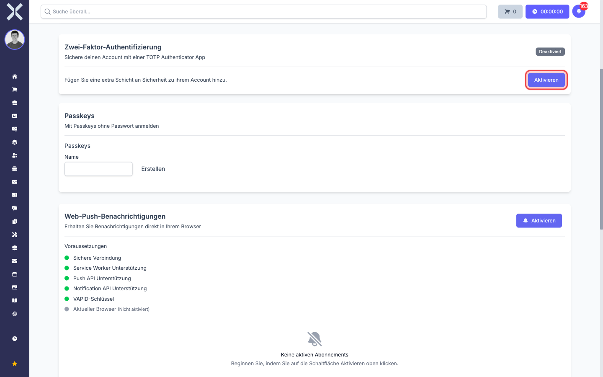
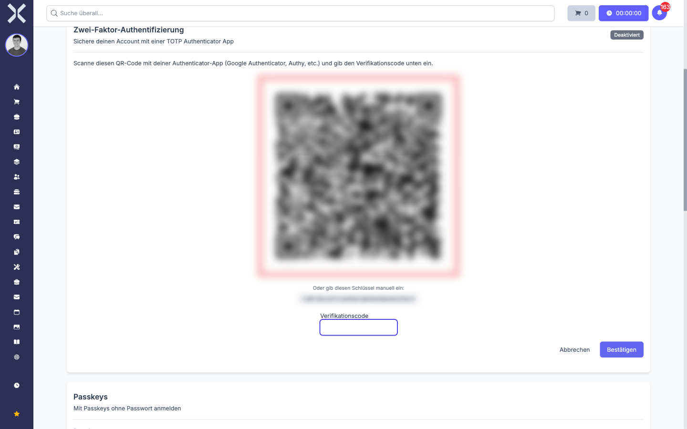
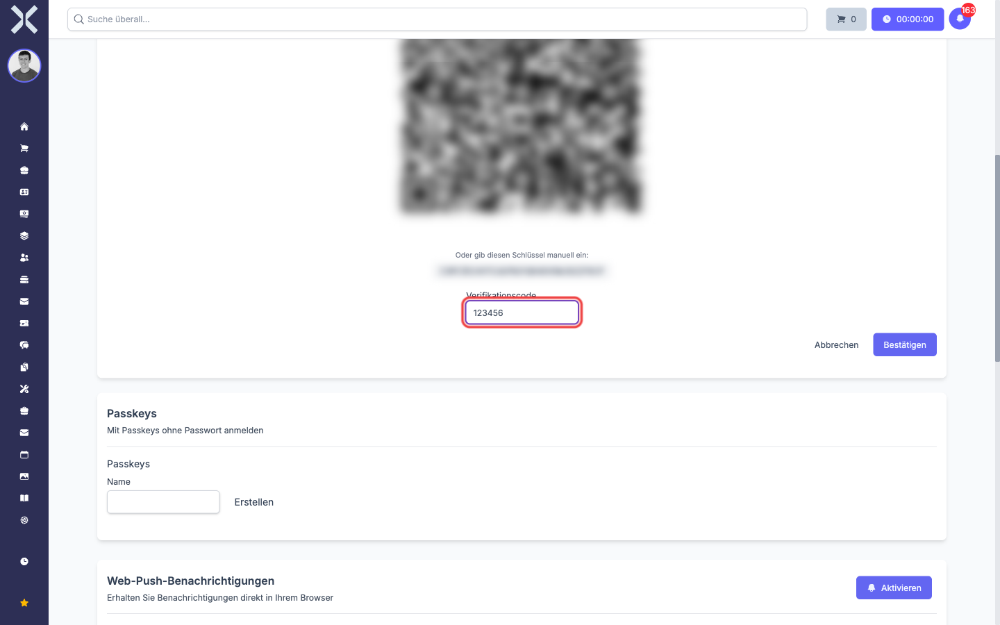
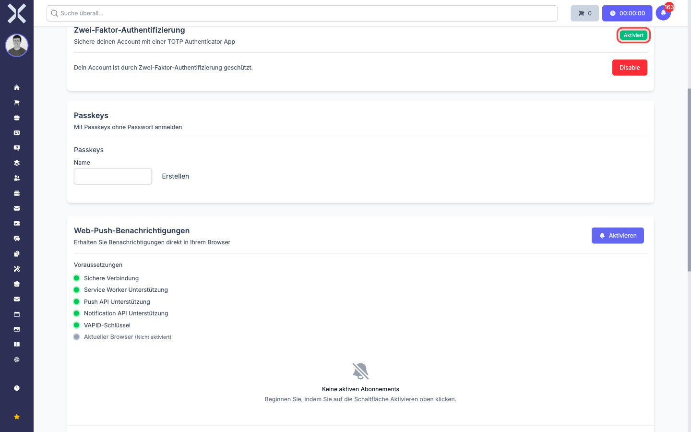
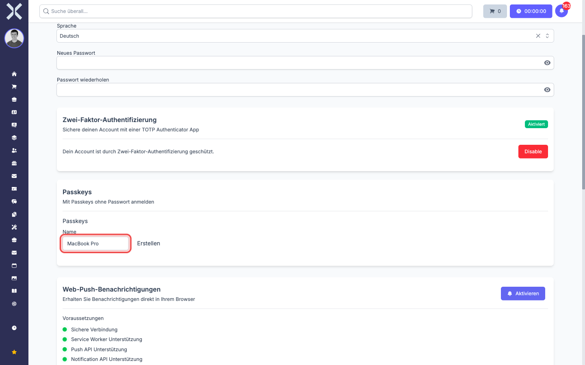
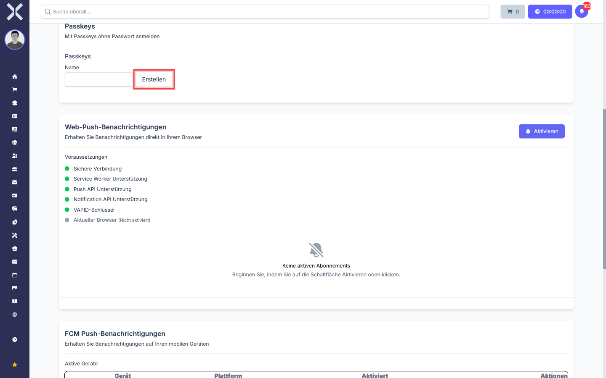
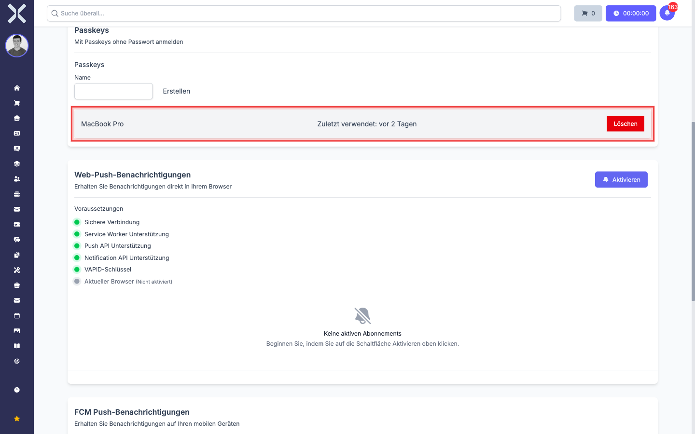

# Zwei-Faktor-Authentifizierung einrichten

Diese Seite zeigt Schritt für Schritt, wie Sie Ihre Zwei-Faktor-Authentifizierung in Nuxbe aktivieren. Es gibt zwei Wege:

- **Freiwillig im Profil:** Sie aktivieren 2FA selbst, weil Sie Ihren Account zusätzlich absichern möchten.
- **Erzwungen vom Administrator:** Ihr Mandant verlangt 2FA. Dann werden Sie nach dem nächsten Login automatisch zu einer Auswahl-Seite weitergeleitet und kommen erst nach abgeschlossener Einrichtung wieder ins normale Programm.

In beiden Fällen ist der eigentliche Vorgang gleich -- nur der Einstiegs-Punkt unterscheidet sich.

> **Hinweis:** Bevor Sie mit der TOTP-Einrichtung beginnen, sollten Sie eine Authenticator-App auf Ihrem Smartphone (oder im Passwort-Manager) installiert haben. Empfehlungen finden Sie in [Zwei-Faktor-Authentifizierung -- Grundlagen](7-zwei-faktor-grundlagen.md#authenticator-apps----unsere-empfehlung).

## Erzwungene Erst-Einrichtung

Wenn Ihr Administrator 2FA für Sie verpflichtend gemacht hat, verläuft das so:

1. Sie melden sich wie gewohnt mit Mail und Passwort an.
2. Anstatt im Dashboard zu landen, sehen Sie die folgende Auswahl-Seite. Diese Seite kommt vor jeder anderen Aktion -- Sie können sie nur durch Abschluss der Einrichtung verlassen.

   

3. Wählen Sie eine der beiden Karten: **Authenticator-App** oder **Passkey**. Wenn Sie unsicher sind, ist die Authenticator-App der zugänglichere Weg, weil sie auf jedem Gerät funktioniert.
4. Folgen Sie dem entsprechenden Abschnitt unten ([TOTP einrichten](#totp-einrichten-mit-authenticator-app) oder [Passkey einrichten](#passkey-einrichten)).
5. Nach erfolgreicher Einrichtung werden Sie automatisch ins Dashboard weitergeleitet.

> **Hinweis:** Die Schaltfläche **Zurück zur Anmeldung** unten auf der Seite meldet Sie wieder ab. Sie können sich danach erneut anmelden, landen aber bei aktivem Zwang wieder auf dieser Seite. Es führt also kein Weg daran vorbei, eine der beiden Methoden zu hinterlegen.

## Freiwillige Einrichtung im Profil

Wenn 2FA bei Ihnen nicht erzwungen ist, können Sie es trotzdem aus eigenem Antrieb aktivieren:

1. Klicken Sie oben links in der Sidebar auf Ihren Benutzernamen unterhalb von **Angemeldet als:**.
2. Klicken Sie auf **Mein Profil**.
3. Scrollen Sie auf der Profilseite nach unten zum Abschnitt **Zwei-Faktor-Authentifizierung**.

   

4. Folgen Sie dem entsprechenden Abschnitt unten -- entweder [TOTP einrichten](#totp-einrichten-mit-authenticator-app) oder [Passkey einrichten](#passkey-einrichten). Sie können auch beides nacheinander einrichten; das ist sogar empfohlen (siehe [Empfehlung A](7-zwei-faktor-grundlagen.md#welche-methode-soll-ich-wählen)).

## TOTP einrichten mit Authenticator-App

1. Klicken Sie im 2FA-Bereich auf **Aktivieren**. Die Karte klappt auf und zeigt einen QR-Code, einen alphanumerischen Schlüssel und ein Eingabefeld.

   

2. Öffnen Sie Ihre Authenticator-App auf dem Smartphone (oder im Passwort-Manager).
3. Wählen Sie in der App die Option **Konto hinzufügen** (oder ähnlich, je nach App).
4. **Variante A: QR-Code scannen.** Halten Sie die Kamera Ihres Smartphones auf den QR-Code. Die App liest den geheimen Schlüssel automatisch aus.
5. **Variante B: Schlüssel manuell eintragen.** Wenn die Kamera nicht funktioniert oder Sie 1Password/Bitwarden im Browser nutzen, kopieren Sie den Schlüssel unter dem QR-Code in das entsprechende Feld in Ihrem Passwort-Manager.

   > **Hinweis:** Den Schlüssel sieht man nur einmal -- bei der Einrichtung. Behandeln Sie ihn wie ein Passwort. Schicken Sie ihn nie per Mail oder Chat. Wenn Sie ihn verlieren, ist das kein Drama (Sie können die Einrichtung neu starten); aber wenn jemand anderes ihn bekommt, kann diese Person genau dieselben Codes erzeugen wie Sie.

6. Die App erzeugt jetzt alle 30 Sekunden einen 6-stelligen Code. Lesen Sie den **aktuellen** Code ab und geben Sie ihn in das Feld **Verifikationscode** ein.

   

   > **Hinweis:** Wenn der Code abgelaufen ist, bevor Sie ihn eingegeben haben, warten Sie kurz und nehmen den nächsten. Die App zeigt meistens einen Fortschritts-Balken oder Countdown.

7. Klicken Sie auf **Bestätigen**.
8. Wenn der Code korrekt war, schließt sich der QR-Bereich und Sie sehen oben rechts in der Karte das grüne Badge **Aktiviert**.

   

Ab jetzt werden Sie bei jedem neuen Login nach dem 6-stelligen Code gefragt -- siehe [Anmelden mit TOTP](9-anmelden-mit-zwei-faktor.md#anmeldung-mit-mail-passwort-und-totp-code).

> **Tipp:** Wenn Sie 1Password oder Bitwarden verwenden, fügen Sie den TOTP-Schlüssel **direkt im Passwort-Eintrag** für Nuxbe hinzu. Beim Anmelden ergänzen die Browser-Erweiterungen den Code dann automatisch -- Sie müssen ihn nicht abtippen.

## Passkey einrichten

Wenn Sie zusätzlich (oder anstelle der TOTP-App) einen Passkey hinterlegen möchten:

1. Scrollen Sie im Profil zum Abschnitt **Passkeys** -- direkt unter dem 2FA-Bereich.
2. Geben Sie im Feld **Name** eine Bezeichnung für diesen Passkey ein. Wählen Sie etwas, woran Sie das Gerät später wiedererkennen, zum Beispiel `MacBook Pro`, `iPhone privat`, `YubiKey Schreibtisch`.

   

   > **Hinweis:** Den Namen sehen nur Sie selbst, in der Liste Ihrer Passkeys. Er beeinflusst die Sicherheit nicht. Praktisch ist er, wenn Sie später mehrere Passkeys haben und einen davon gezielt entfernen möchten.

3. Klicken Sie auf **Erstellen**.

   

4. Ihr Browser oder Betriebssystem zeigt jetzt einen System-Dialog. Wie genau dieser Dialog aussieht, hängt von Ihrem Gerät ab:

   - **Mac/MacBook mit Touch ID:** Ein Dialog "Passkey für ... speichern" -- bestätigen Sie mit Touch ID.
   - **Windows mit Windows Hello:** Ein Dialog mit Kamera- oder Fingerabdruck-Anforderung.
   - **iPhone/iPad mit Face ID:** Bestätigung per Gesichtserkennung; der Passkey wird im iCloud-Schlüsselbund abgelegt.
   - **Android mit Fingerabdruck:** Bestätigung am Sensor; der Passkey landet im Google-Passwortmanager.
   - **YubiKey oder anderer Hardware-Schlüssel:** Stecken Sie den Schlüssel ein und tippen Sie auf den Knopf, sobald er blinkt.
   - **1Password / Bitwarden:** Eine Browser-Erweiterung fragt, ob der Passkey im Tresor gespeichert werden soll.

5. Bestätigen Sie den Dialog. Wenn alles geklappt hat, erscheint Ihr neuer Passkey in der Liste -- mit dem von Ihnen vergebenen Namen und dem Hinweis **Zuletzt verwendet**.

   

6. **Empfehlung:** Wiederholen Sie den Vorgang mit einem zweiten Gerät oder einem zweiten Passwort-Manager-Tresor. So haben Sie einen Backup-Passkey, falls Sie das primäre Gerät mal verlieren.

> **Hinweis:** Wenn die Schaltfläche **Erstellen** nichts tut oder eine Fehlermeldung erscheint, prüfen Sie die [Voraussetzungen für Passkeys](7-zwei-faktor-grundlagen.md#voraussetzungen-für-passkeys). Ältere Browser oder Geräte ohne biometrischen Sensor unterstützen Passkeys nicht.

## Fertig -- was jetzt?

- Wenn Sie sich mit der neuen Konfiguration anmelden möchten, lesen Sie [Anmelden mit Zwei-Faktor-Authentifizierung](9-anmelden-mit-zwei-faktor.md).
- Wenn Sie einen Passkey wieder löschen, einen weiteren ergänzen oder TOTP deaktivieren möchten, lesen Sie [Zwei-Faktor-Authentifizierung verwalten](10-zwei-faktor-verwalten.md).
- Wenn Sie sich Sorgen machen, was bei Geräte-Verlust passiert, lesen Sie [Was tun bei Verlust](10-zwei-faktor-verwalten.md#was-tun-bei-verlust).
