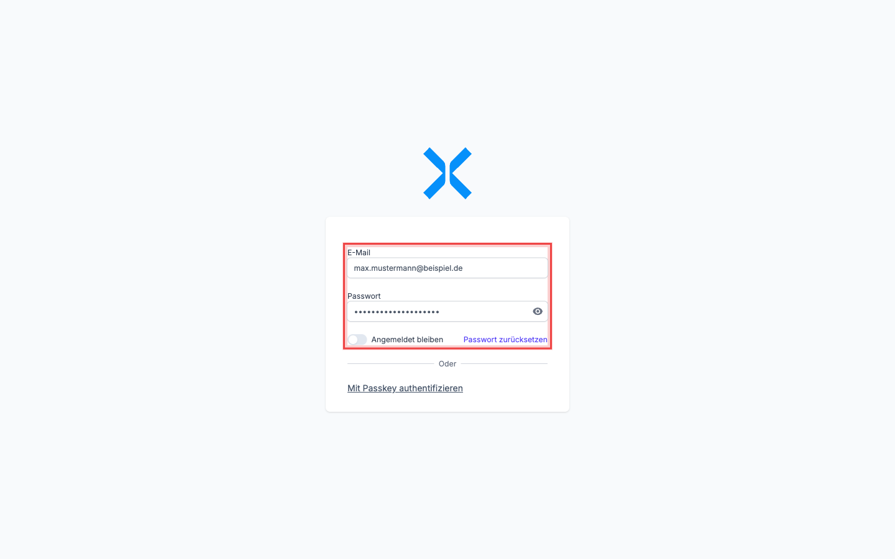
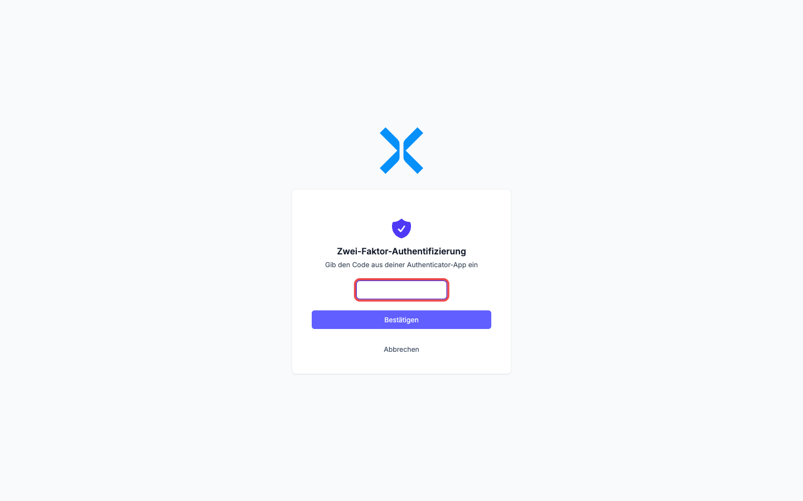
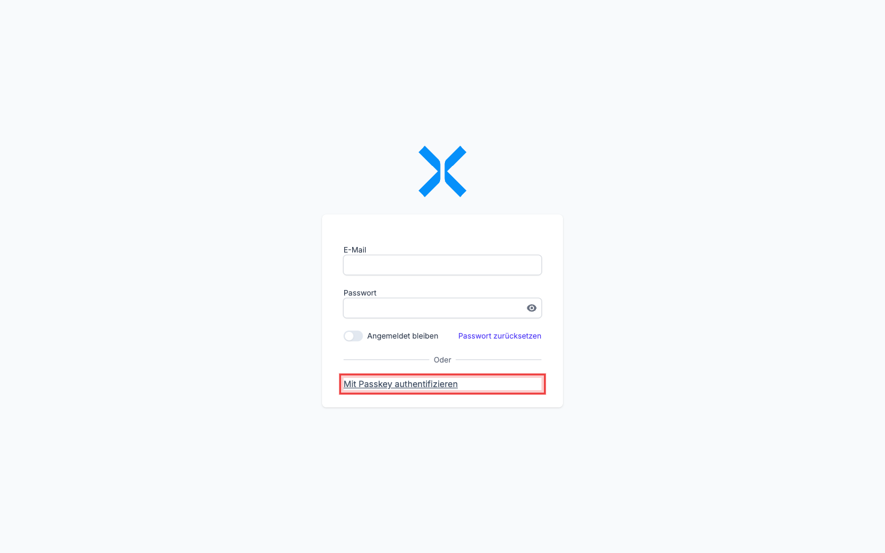

# Anmelden mit Zwei-Faktor-Authentifizierung

Sobald Sie [Zwei-Faktor-Authentifizierung eingerichtet haben](8-zwei-faktor-einrichten.md), verändert sich der Login. Diese Seite zeigt, wie genau die Anmeldung jetzt abläuft -- für beide Methoden.

## Anmeldung mit Mail, Passwort und TOTP-Code

Wenn Sie eine Authenticator-App eingerichtet haben (mit oder ohne zusätzlichen Passkey), läuft der klassische Login so ab:

1. Öffnen Sie die Nuxbe-Anmeldeseite.

   

2. Geben Sie Ihre **E-Mail-Adresse** und Ihr **Passwort** ein -- so wie Sie es bisher getan haben.
3. Klicken Sie auf **Anmelden**.
4. Anstatt direkt im Dashboard zu landen, sehen Sie jetzt eine zweite Seite mit der Aufforderung **Zwei-Faktor-Authentifizierung**:

   

5. Öffnen Sie Ihre Authenticator-App und lesen Sie den **aktuellen** 6-stelligen Code für Nuxbe ab.
6. Tippen Sie den Code in das Eingabefeld ein. Wenn Sie einen Passwort-Manager wie 1Password oder Apple Passwörter mit gespeichertem TOTP nutzen, wird der Code automatisch eingesetzt -- die Felder sind als `one-time-code` markiert, sodass Passwort-Manager und Smartphone-Tastaturen den Code anbieten.
7. Klicken Sie auf **Bestätigen** (oder drücken Sie **Enter**).

Wenn der Code stimmt, sind Sie eingeloggt und werden auf das Dashboard (oder die Seite, die Sie ursprünglich aufrufen wollten) weitergeleitet.

> **Hinweis:** TOTP-Codes sind 30 Sekunden gültig. Wenn Sie zu langsam sind oder der Code beim Eintippen wechselt, geben Sie einfach den nächsten ein -- es entstehen keine "verbrauchten" Codes, die Sie blockieren würden.

### Häufige Probleme bei der TOTP-Eingabe

- **"Falscher Code" trotz korrektem Eintippen:** Prüfen Sie die Uhrzeit Ihres Smartphones. TOTP funktioniert nur, wenn Smartphone und Server synchron laufen. In der Regel reicht es, wenn das Smartphone mit dem Internet verbunden ist und sich die Zeit automatisch holt. Eine Abweichung von ein paar Sekunden ist OK, mehrere Minuten nicht.
- **Code abgelaufen:** Warten Sie, bis die App den nächsten Code zeigt, und tippen Sie diesen ein.
- **Keine App zur Hand:** Klicken Sie auf **Abbrechen**. Sie landen wieder auf der Anmeldeseite -- starten Sie den Login von vorn, sobald Sie die App zur Verfügung haben.

## Anmeldung mit Passkey

Wenn Sie für dieses Gerät einen Passkey hinterlegt haben, ist der Login deutlich schneller:

1. Öffnen Sie die Nuxbe-Anmeldeseite.
2. Klicken Sie unterhalb des Trenners **Oder** auf **Mit Passkey authentifizieren**.

   

3. Ihr Browser oder Betriebssystem zeigt einen System-Dialog -- abhängig davon, wo der Passkey gespeichert ist:

   - **Mac mit Touch ID:** Bestätigung mit Fingerabdruck.
   - **Windows mit Hello:** Bestätigung mit Gesicht, Fingerabdruck oder PIN.
   - **iPhone / iPad:** Face ID oder Touch ID.
   - **Android:** Fingerabdruck oder Geräte-PIN.
   - **YubiKey / Hardware-Schlüssel:** Schlüssel einstecken und Knopf drücken.
   - **1Password / Bitwarden:** Tresor freischalten und Passkey auswählen.

4. Sobald Sie bestätigt haben, sind Sie eingeloggt -- ohne dass Sie Mail oder Passwort eingegeben haben.

> **Hinweis:** Der Passkey ist gleichzeitig erster und zweiter Faktor. Sie werden danach **nicht** zusätzlich nach einem TOTP-Code gefragt -- der Passkey ist beweissicher schon der zweite Faktor (durch die biometrische oder gerätegebundene Bestätigung).

### Wann erscheint die Passkey-Schaltfläche nicht?

Falls Sie die Schaltfläche **Mit Passkey authentifizieren** auf der Anmeldeseite nicht sehen, hat Ihr aktueller Browser keine Passkey-Unterstützung. Mögliche Ursachen:

- Sie nutzen einen sehr alten Browser oder eine eingeschränkte Umgebung (z. B. einen Browser auf einem Kiosk-System).
- Inkognito-/Privater Modus blockiert in manchen Browsern den Zugriff auf den Passkey-Tresor.
- Die Verbindung läuft über `http://` statt `https://`. Passkeys benötigen eine sichere Verbindung.

In dem Fall melden Sie sich mit Mail, Passwort und TOTP-Code an. Sobald Sie wieder auf einem unterstützten Gerät sind, klappt der Passkey-Login wieder.

## Wechsel zwischen den Methoden

Wenn Sie sowohl einen TOTP-Code als auch einen Passkey eingerichtet haben, können Sie bei jedem Login frei wählen:

- **Schnell und bequem auf Ihrem Hauptgerät** -- klicken Sie auf **Mit Passkey authentifizieren**.
- **Vom fremden Rechner ohne Passkey** -- nutzen Sie Mail, Passwort und den 6-stelligen Code aus der App.

Beide Wege führen zum gleichen Account.

## Wie geht es weiter?

- Sie haben Probleme mit Codes oder einem Passkey? Lesen Sie [Zwei-Faktor-Authentifizierung verwalten](10-zwei-faktor-verwalten.md) -- dort erfahren Sie, wie Sie Methoden austauschen oder löschen.
- Sie haben den zweiten Faktor verloren? Springen Sie direkt zu [Was tun bei Verlust](10-zwei-faktor-verwalten.md#was-tun-bei-verlust).
