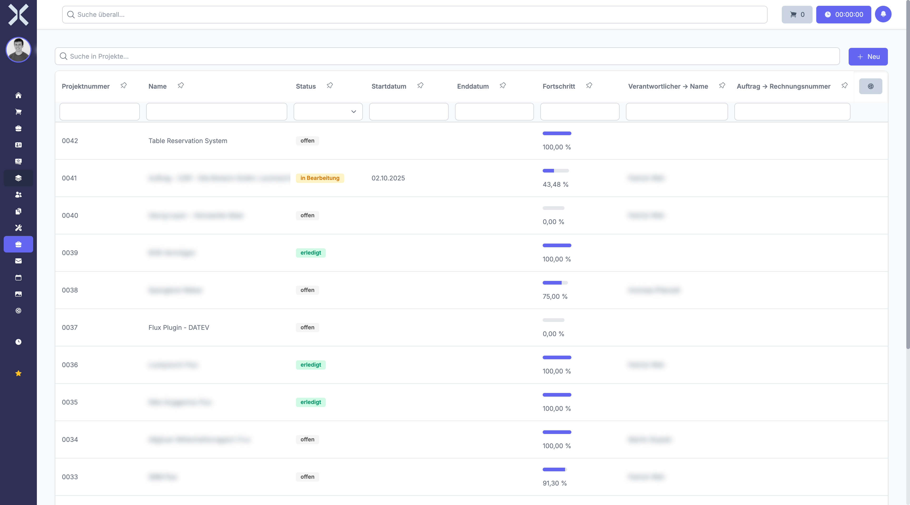

# Projekte

Im Modul **Projekte** verwalten Sie Ihre Projekte, koordinieren Aufgaben und verfolgen den Gesamtfortschritt. Projekte bündeln zusammengehörige Aufgaben, Arbeitszeiten und Ressourcen und können mit Aufträgen verknüpft werden, um die Abrechnung sicherzustellen.

## Übersicht

Navigieren Sie über die Sidebar zu **Projekte**. Sie sehen eine tabellarische Übersicht aller Projekte.

## Kernfunktionen

- **Aufgabenintegration** - Ordnen Sie Aufgaben direkt einem Projekt zu. Der Projektfortschritt berechnet sich auf Basis der erledigten Aufgaben.
- **Projekthierarchie** - Erstellen Sie übergeordnete und untergeordnete Projekte, um komplexe Vorhaben in Teilprojekte zu gliedern.
- **Fortschrittsverfolgung** - Verfolgen Sie den prozentualen Fortschritt basierend auf dem Abschluss der zugeordneten Aufgaben.
- **Auftragsverknüpfung** - Verknüpfen Sie ein Projekt mit einem Auftrag, um die Grundlage für die Abrechnung zu schaffen.
- **Zeiterfassung** - Alle Arbeitszeiten, die auf Aufgaben innerhalb des Projekts gebucht werden, fließen automatisch in die Projekt-Zeiterfassung ein.
- **Projektdashboard** - Grafische Auswertungen und Fortschrittsvisualisierungen pro Projekt.

## Projektstatus

Projekte können verschiedene Status haben:

| Status | Beschreibung |
|---|---|
| **Offen** | Das Projekt wurde angelegt, aber noch nicht begonnen |
| **In Bearbeitung** | Das Projekt wird aktiv bearbeitet |
| **Erledigt** | Das Projekt wurde erfolgreich abgeschlossen |

## Detailansicht

Klicken Sie auf ein Projekt, um die Detailansicht zu öffnen. Diese ist in mehrere Tabs unterteilt:

| Tab | Inhalt |
|---|---|
| **Allgemein** | Stammdaten des Projekts (Name, Beschreibung, Zeitraum, Verantwortlicher etc.) |
| **Aufgaben** | Alle zugeordneten Aufgaben mit Status, Priorität und Zuständigkeiten |
| **Kommentare** | Projektbezogene Kommentare und Notizen |
| **Arbeitszeiten** | Erfasste Zeiten für das Projekt und dessen Aufgaben |
| **Dashboard** | Grafische Auswertungen und Fortschrittsvisualisierungen |
| **Unterprojekte** | Untergeordnete Projekte in der Projekthierarchie |

## Seiten in diesem Kapitel

- [Projekte verwalten](1-projekte-verwalten.md) - Projektliste, Suche, Filter und neues Projekt anlegen
- [Projektdetails](2-projekt-detail.md) - Detailansicht eines Projekts mit allen Tabs

## Weiterführende Themen

- [Aufgaben](../8-aufgaben/0-index.md) - Aufgaben innerhalb von Projekten verwalten
- [Aufträge](../4-auftraege/0-index.md) - Verknüpfte Aufträge anzeigen und verwalten
- [Personalwesen > Arbeitszeiten](../7-personalwesen/5-arbeitszeiten.md) - Übersicht aller erfassten Arbeitszeiten
