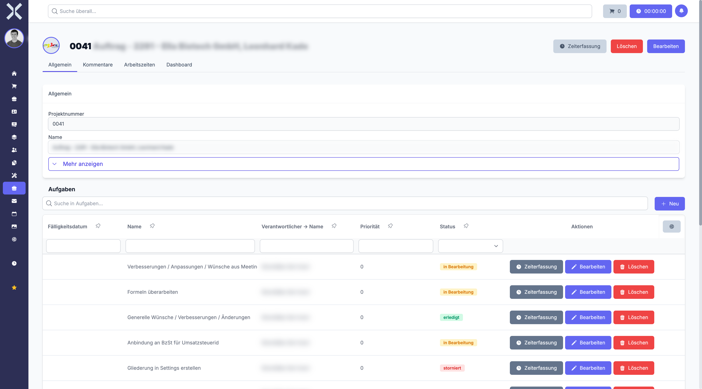

# Projektdetails

In der Detailansicht sehen und bearbeiten Sie alle Informationen zu einem Projekt. Die Ansicht ist in mehrere Tabs unterteilt, die Ihnen Zugriff auf Stammdaten, Aufgaben, Kommentare, Arbeitszeiten und das Projektdashboard bieten.

## Detailansicht öffnen

1. Navigieren Sie zur [Projektliste](1-projekte-verwalten.md).
2. Klicken Sie auf das gewünschte Projekt.

   

## Kopfbereich

Am oberen Rand der Detailansicht finden Sie die wichtigsten Informationen auf einen Blick:

- **Projektname** - Bezeichnung des Projekts, prominent dargestellt
- **Projektnummer** - Eindeutige Nummer zur Identifikation
- **Status** - Aktueller Projektstatus (Offen, In Bearbeitung, Erledigt)

Im Kopfbereich befinden sich auch die Aktionsschaltflächen:

- **Speichern** - Übernimmt alle vorgenommenen Änderungen
- **Löschen** - Entfernt das Projekt nach Bestätigung

Schnellaktionen ermöglichen es Ihnen, direkt aus dem Kopfbereich heraus:

- **Aufgabe hinzufügen** - Neue Aufgabe für dieses Projekt anlegen
- **Zeiterfassung starten** - Timer für dieses Projekt starten

## Tab: Allgemein

Der Tab **Allgemein** enthält die Stammdaten des Projekts.

### Projektdaten

- **Name** - Bezeichnung des Projekts
- **Beschreibung** - Ausführliche Beschreibung der Projektziele und des Umfangs
- **Status** - Aktueller Projektstatus (Offen, In Bearbeitung, Erledigt)
- **Startdatum** - Geplanter Beginn des Projekts
- **Enddatum** - Geplantes Ende des Projekts
- **Fortschritt** - Prozentualer Fortschritt, berechnet auf Basis der erledigten Aufgaben

### Zuständigkeiten und Verknüpfungen

- **Verantwortlicher** - Person, die für das Projekt verantwortlich ist
- **Auftrag** - Verknüpfter Auftrag für die Abrechnung. Klicken Sie auf die Auftragsnummer, um direkt zur [Auftragsdetailansicht](../4-auftraege/2-auftrag-detail.md) zu navigieren.
- **Kontakt** - Zugeordneter Kontakt (Kunde). Klicken Sie auf den Kontaktnamen, um direkt zur [Kontaktdetailansicht](../2-kontakte/2-kontakt-detail.md) zu navigieren.
- **Übergeordnetes Projekt** - Verweis auf das übergeordnete Projekt, falls das Projekt Teil einer Projekthierarchie ist

## Tab: Aufgaben

Der Tab **Aufgaben** zeigt alle dem Projekt zugeordneten Aufgaben in einer Tabellenansicht. Für jede Aufgabe werden angezeigt:

- **Name** - Bezeichnung der Aufgabe
- **Status** - Aktueller Bearbeitungsstand (Offen, In Bearbeitung, Erledigt, Abgebrochen)
- **Priorität** - Dringlichkeitsstufe mit farblicher Kennzeichnung
- **Zugewiesen an** - Verantwortliche Mitarbeiter
- **Fällig am** - Fälligkeitsdatum der Aufgabe

### Aufgabe direkt im Projekt anlegen

Klicken Sie auf **Neue Aufgabe** innerhalb des Aufgaben-Tabs, um eine neue Aufgabe zu erstellen, die automatisch diesem Projekt zugeordnet wird. Die Aufgabe erscheint sowohl im Projekt als auch in der globalen [Aufgabenliste](../8-aufgaben/1-aufgaben-verwalten.md).

Klicken Sie auf eine Aufgabe, um deren [Detailansicht](../8-aufgaben/2-aufgabe-detail.md) zu öffnen.

## Tab: Kommentare

Im Tab **Kommentare** hinterlassen Sie projektbezogene Notizen und kommunizieren mit dem Team:

- Schreiben Sie Kommentare, um Statusupdates, Entscheidungen oder Hinweise zu dokumentieren.
- Jeder Kommentar zeigt den Autor und den Zeitstempel an.
- Kommentare werden chronologisch aufgelistet.

Nutzen Sie Kommentare, um wichtige Projektentscheidungen nachvollziehbar festzuhalten.

## Tab: Arbeitszeiten

Der Tab **Arbeitszeiten** zeigt alle auf dieses Projekt und dessen Aufgaben gebuchten Arbeitszeiteinträge. Die Tabelle enthält:

| Spalte | Beschreibung |
|---|---|
| **Startzeit** | Beginn der Arbeitszeitbuchung |
| **Endzeit** | Ende der Arbeitszeitbuchung |
| **Dauer** | Berechnete Dauer des Eintrags |
| **Mitarbeiter** | Name des Mitarbeiters, der die Zeit erfasst hat |
| **Aufgabe** | Zugeordnete Aufgabe, auf die die Zeit gebucht wurde |
| **Beschreibung** | Optionale Beschreibung der durchgeführten Tätigkeit |

Die Arbeitszeiten umfassen sowohl direkt auf das Projekt gebuchte Zeiten als auch Zeiten, die auf einzelne Aufgaben des Projekts erfasst wurden.

## Tab: Dashboard

Der Tab **Dashboard** bietet grafische Auswertungen und Visualisierungen zum Projektfortschritt:

- **Fortschrittsbalken** - Zeigt den Gesamtfortschritt des Projekts basierend auf abgeschlossenen Aufgaben
- **Aufgabenstatistik** - Verteilung der Aufgaben nach Status (Offen, In Bearbeitung, Erledigt, Abgebrochen)
- **Zeitauswertung** - Vergleich von geplantem Zeitbudget und tatsächlich erfassten Arbeitszeiten

Das Dashboard gibt Ihnen einen schnellen Überblick über den Gesundheitszustand des Projekts.

## Tab: Unterprojekte

Wenn das Projekt als übergeordnetes Projekt fungiert, zeigt der Tab **Unterprojekte** alle untergeordneten Projekte an. Für jedes Unterprojekt werden Name, Status, Fortschritt und Verantwortlicher angezeigt.

Klicken Sie auf ein Unterprojekt, um dessen Detailansicht zu öffnen.

## Projekt bearbeiten

1. Ändern Sie die gewünschten Felder direkt in der Detailansicht.
2. Wechseln Sie bei Bedarf zwischen den Tabs, um verschiedene Bereiche zu bearbeiten.
3. Klicken Sie auf **Speichern**, um alle Änderungen zu übernehmen.

## Weiterführende Themen

- [Projekte verwalten](1-projekte-verwalten.md) - Zurück zur Projektliste
- [Aufgaben](../8-aufgaben/0-index.md) - Aufgaben verwalten
- [Aufträge](../4-auftraege/0-index.md) - Verknüpfte Aufträge anzeigen
- [Kontakte](../2-kontakte/0-index.md) - Verknüpfte Kontakte verwalten
