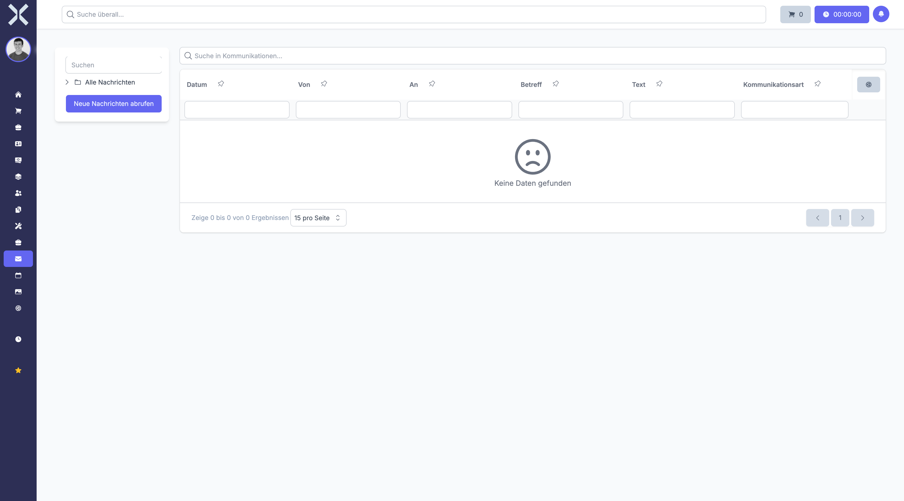

# E-Mail

Im Modul **E-Mail** verwalten Sie Ihre E-Mail-Kommunikation direkt in Nuxbe. Der integrierte E-Mail-Client unterstützt IMAP und ermöglicht es Ihnen, E-Mails zu empfangen, zu verfassen, zu beantworten und weiterzuleiten, ohne die Anwendung verlassen zu müssen. Darüber hinaus können Sie aus E-Mails heraus Tickets und Leads erstellen.

## Übersicht

Navigieren Sie über die Sidebar zu **E-Mail**. Sie sehen Ihr Postfach mit allen Nachrichten.

## Aufbau des Postfachs

Das Postfach ist in einem Drei-Bereiche-Layout aufgebaut:

| Bereich | Position | Inhalt |
|---|---|---|
| **Ordnerbereich** | Links | Ordnerstruktur mit allen E-Mail-Ordnern |
| **Nachrichtenliste** | Mitte | Tabellarische Auflistung aller E-Mails im ausgewählten Ordner |
| **Nachrichtenvorschau** | Unten / Rechts | Vorschau der ausgewählten Nachricht |

### Ordnerbereich

Im linken Bereich finden Sie die Ordnerstruktur Ihres Postfachs:

#### Standardordner

- **Alle Nachrichten** - Ordnerübergreifende Ansicht aller E-Mails. Hier sehen Sie sämtliche Nachrichten unabhängig davon, in welchem Ordner sie liegen.
- **Posteingang** - Empfangene Nachrichten
- **Gesendet** - Von Ihnen gesendete Nachrichten
- **Entwürfe** - Gespeicherte, aber noch nicht gesendete Nachrichten
- **Papierkorb** - Gelöschte Nachrichten

#### Benutzerdefinierte Ordner

Neben den Standardordnern können weitere benutzerdefinierte Ordner angezeigt werden, die in Ihrem E-Mail-Konto konfiguriert sind.

#### Neue Nachrichten abrufen

Klicken Sie auf die Schaltfläche **Neue Nachrichten abrufen** im Ordnerbereich, um manuell neue E-Mails vom Server abzurufen. E-Mails werden auch automatisch in regelmäßigen Intervallen synchronisiert.

### Nachrichtenliste

Im mittleren Bereich wird die Nachrichtenliste als Tabelle angezeigt mit folgenden Spalten:

- **Datum** - Empfangs- oder Sendedatum der Nachricht
- **Von** - Absender der Nachricht (Name und E-Mail-Adresse)
- **An** - Empfänger der Nachricht
- **Betreff** - Betreffzeile der E-Mail
- **Text** - Vorschau des Nachrichteninhalts (erste Zeilen)
- **Kommunikationsart** - Art der Kommunikation (z. B. E-Mail)

Klicken Sie auf eine Nachricht, um deren Inhalt in der Vorschau anzuzeigen.

### Nachrichtenvorschau

Der Vorschaubereich zeigt den vollständigen Inhalt der ausgewählten Nachricht an, einschließlich:

- Absender, Empfänger, CC und BCC
- Betreffzeile
- Datum und Uhrzeit
- Vollständiger Nachrichtentext mit Formatierungen
- Anhänge (falls vorhanden)

## E-Mails suchen

Nutzen Sie das Suchfeld **Suche in Kommunikationen...** oberhalb der Tabelle, um E-Mails nach Betreff, Absender, Empfänger oder Inhalt zu durchsuchen. Die Suche funktioniert ordnerübergreifend, wenn Sie sich in der Ansicht **Alle Nachrichten** befinden.

## E-Mails filtern

Verwenden Sie die Filterzeilen unterhalb der Spaltenüberschriften, um die Nachrichtenliste gezielt einzuschränken. Sie können nach einzelnen Spalten filtern, beispielsweise nach einem bestimmten Absender oder einem Zeitraum.

## Neue E-Mail verfassen

1. Klicken Sie auf die Schaltfläche zum Verfassen einer neuen E-Mail.
2. Füllen Sie die folgenden Felder aus:
   - **An** - Geben Sie einen oder mehrere Empfänger ein. Sie können direkt E-Mail-Adressen eingeben oder aus bestehenden Kontakten auswählen.
   - **CC** - Optionale Kopieempfänger, die die E-Mail zur Kenntnisnahme erhalten.
   - **BCC** - Optionale Blindkopieempfänger, die für andere Empfänger nicht sichtbar sind.
   - **Betreff** - Geben Sie eine aussagekräftige Betreffzeile ein.
   - **Nachrichtentext** - Verfassen Sie den Inhalt der E-Mail im Richtext-Editor. Sie können Formatierungen wie Fettschrift, Aufzählungen, Links und weitere Elemente verwenden.
   - **Anhänge** - Fügen Sie optional Dateien als Anhänge hinzu.
3. Klicken Sie auf **Senden**, um die E-Mail abzuschicken.

## E-Mails beantworten und weiterleiten

### Antworten

Klicken Sie auf **Antworten**, um dem Absender der ausgewählten Nachricht zu antworten. Der ursprüngliche Nachrichtentext wird zitiert.

### Allen antworten

Klicken Sie auf **Allen antworten**, um sowohl dem Absender als auch allen weiteren Empfängern (CC) zu antworten.

### Weiterleiten

Klicken Sie auf **Weiterleiten**, um die Nachricht an einen neuen Empfänger weiterzuleiten. Der ursprüngliche Nachrichtentext und eventuelle Anhänge werden übernommen.

## Aktionen aus E-Mails

Aus einer E-Mail heraus können Sie verschiedene Aktionen ausführen:

### Ticket aus E-Mail erstellen

Erstellen Sie direkt aus einer empfangenen E-Mail ein Support-Ticket. Die E-Mail-Daten (Betreff, Inhalt, Absender) werden automatisch in das neue Ticket übernommen. Das Ticket erscheint anschließend im Modul [Tickets](../9-tickets/0-index.md).

### Lead aus E-Mail erstellen

Erstellen Sie aus einer E-Mail einen neuen Lead für den Vertrieb. Die relevanten Informationen werden in den Lead übernommen, der anschließend im Modul [Verkauf](../3-verkauf/0-index.md) weiterbearbeitet werden kann.

### Kontaktzuordnung

E-Mails werden anhand der E-Mail-Adresse automatisch bestehenden Kontakten zugeordnet, sofern die Adresse im System hinterlegt ist. So können Sie die Kommunikationshistorie eines Kontakts jederzeit nachvollziehen.

## E-Mail-Konten

Die Konfiguration von E-Mail-Konten (IMAP-Server, Zugangsdaten, Signatur etc.) erfolgt in den [Einstellungen > Mail-Konten](../14-einstellungen/26-mail-konten.md). Dort können auch mehrere E-Mail-Konten eingerichtet werden, zwischen denen Sie im Postfach wechseln können.

## Weiterführende Themen

- [Kontakte](../2-kontakte/0-index.md) - Kontaktdaten für E-Mail-Empfänger verwalten
- [Tickets](../9-tickets/0-index.md) - E-Mails können in Tickets umgewandelt werden
- [Verkauf](../3-verkauf/0-index.md) - Leads aus E-Mails erstellen
- [Einstellungen > Mail-Konten](../14-einstellungen/26-mail-konten.md) - E-Mail-Konten konfigurieren
- [Einstellungen > E-Mail-Vorlagen](../14-einstellungen/25-email-vorlagen.md) - E-Mail-Vorlagen verwalten
