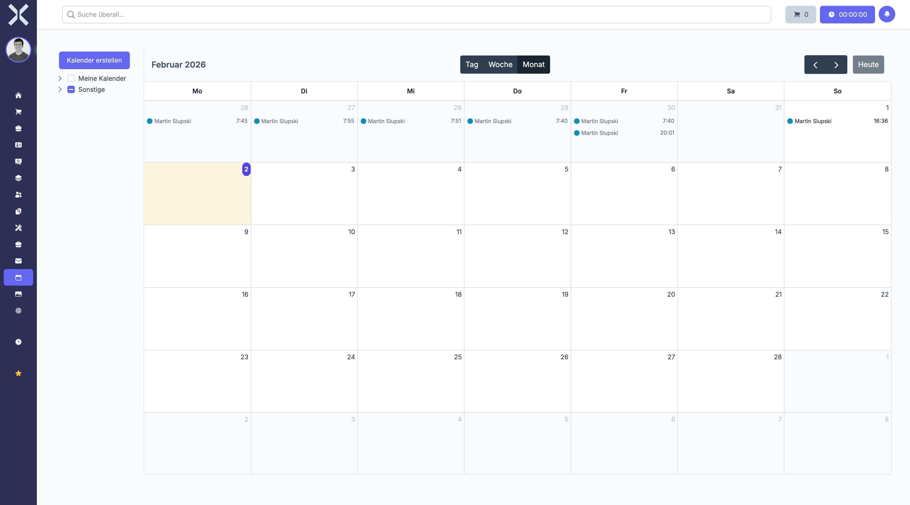

# Kalender

Im Modul **Kalender** verwalten Sie Termine und behalten den Überblick über anstehende Ereignisse. Der Kalender bietet verschiedene Ansichten, unterstützt mehrere Kalender gleichzeitig und ermöglicht das Anlegen einmaliger sowie wiederkehrender Termine.

## Übersicht

Navigieren Sie über die Sidebar zu **Kalender**. Sie sehen eine Kalenderansicht mit allen Terminen.

## Ansichten

Der Kalender bietet drei verschiedene Ansichten. Wechseln Sie über die Schaltflächen oben rechts zwischen den Ansichten:

| Ansicht | Beschreibung |
|---|---|
| **Tag** | Detaillierte Tagesansicht mit Stundenraster. Jede Stunde wird als eigene Zeile dargestellt, sodass Sie den Tagesablauf im Detail planen können. |
| **Woche** | Wochenansicht mit allen sieben Tagen nebeneinander und einem Stundenraster. Ideal für die Wochenplanung. |
| **Monat** | Monatsübersicht mit allen Tagen des Monats auf einen Blick. Termine werden als kompakte Einträge in den jeweiligen Tageszellen angezeigt. |

## Navigation

- Klicken Sie auf die **Pfeiltasten** (links/rechts) oben rechts, um zum vorherigen oder nächsten Zeitraum zu blättern (vorheriger/nächster Tag, Woche oder Monat, je nach aktiver Ansicht).
- Klicken Sie auf **Heute**, um sofort zum aktuellen Datum zurückzukehren.
- Der aktuelle Tag wird in allen Ansichten farblich hervorgehoben, sodass Sie ihn sofort erkennen.

## Kalender verwalten

Im linken Bereich sehen Sie Ihre Kalender, organisiert in zwei Gruppen:

### Meine Kalender

Ihre persönlichen Kalender. Sie können mehrere persönliche Kalender anlegen, um Termine thematisch zu trennen (z. B. Arbeit, Privat, Projekte). Jeder Kalender hat eine eigene Farbe, sodass Termine in der Kalenderansicht sofort zugeordnet werden können.

### Sonstige

Freigegebene Kalender und Teamkalender, die von anderen Benutzern für Sie freigegeben wurden. Hier sehen Sie Termine aus geteilten Kalendern.

### Kalender ein-/ausblenden

Klicken Sie auf einen Kalender in der Seitenleiste, um ihn in der Ansicht ein- oder auszublenden. So können Sie gezielt nur die Kalender anzeigen, die gerade relevant sind.

### Kalender-Overlay

Mehrere Kalender können gleichzeitig angezeigt werden. Die Termine der verschiedenen Kalender werden überlagert dargestellt und sind anhand ihrer Farbe unterscheidbar.

### Neuen Kalender erstellen

Klicken Sie auf die Schaltfläche **Kalender erstellen**, um einen neuen persönlichen Kalender anzulegen:

1. Geben Sie einen **Namen** für den Kalender ein (z. B. Projekttermine, Kundentermine).
2. Wählen Sie eine **Farbe**, mit der die Termine dieses Kalenders dargestellt werden.
3. Klicken Sie auf **Speichern**.

Der neue Kalender erscheint unter **Meine Kalender** und kann sofort für die Terminanlage verwendet werden.

## Neuen Termin anlegen

1. Klicken Sie auf den gewünschten Tag oder Zeitslot in der Kalenderansicht. In der Tages- und Wochenansicht können Sie direkt auf eine bestimmte Uhrzeit klicken.
2. Füllen Sie die folgenden Felder aus:
   - **Titel** - Geben Sie eine aussagekräftige Bezeichnung für den Termin ein.
   - **Beschreibung** - Beschreiben Sie optional den Inhalt oder Zweck des Termins.
   - **Startdatum/-zeit** - Legen Sie den Beginn des Termins fest (Datum und Uhrzeit).
   - **Enddatum/-zeit** - Legen Sie das Ende des Termins fest (Datum und Uhrzeit).
   - **Ganztägig** - Aktivieren Sie diese Option, wenn der Termin den gesamten Tag umfasst. Die Uhrzeitfelder werden dann ausgeblendet.
   - **Kalender** - Wählen Sie den Kalender, dem der Termin zugeordnet werden soll.
3. Klicken Sie auf **Speichern**, um den Termin anzulegen.

### Wiederkehrende Termine

Für regelmäßig stattfindende Termine können Sie eine Wiederholung einrichten:

| Wiederholung | Beschreibung |
|---|---|
| **Täglich** | Der Termin wiederholt sich jeden Tag |
| **Wöchentlich** | Der Termin wiederholt sich jede Woche am selben Wochentag |
| **Monatlich** | Der Termin wiederholt sich jeden Monat am selben Tag |
| **Jährlich** | Der Termin wiederholt sich jedes Jahr am selben Datum |

Wiederkehrende Termine werden in der Kalenderansicht als Serieneinträge dargestellt.

### Benutzerdefinierte Felder

Je nach Konfiguration können Terminen zusätzliche benutzerdefinierte Felder zugeordnet werden, um weitere Informationen zu erfassen (z. B. Ort, Teilnehmer, Priorität). Diese Felder werden in der Terminbearbeitung angezeigt, sofern sie konfiguriert sind.

## Termin bearbeiten

1. Klicken Sie auf einen bestehenden Termin in der Kalenderansicht.
2. Ändern Sie die gewünschten Daten (Titel, Zeitraum, Beschreibung etc.).
3. Klicken Sie auf **Speichern**, um die Änderungen zu übernehmen.

Bei wiederkehrenden Terminen können Sie wählen, ob die Änderung nur für diesen einzelnen Termin oder für alle künftigen Termine der Serie gelten soll.

## Termin löschen

1. Klicken Sie auf den gewünschten Termin.
2. Klicken Sie auf **Löschen** und bestätigen Sie den Vorgang.

## Kalender freigeben

Sie können Ihre persönlichen Kalender für andere Benutzer freigeben:

- **Lesezugriff** - Der andere Benutzer kann die Termine sehen, aber nicht bearbeiten.
- **Bearbeitungszugriff** - Der andere Benutzer kann Termine sehen und bearbeiten.

Freigegebene Kalender erscheinen beim Empfänger unter **Sonstige**.

## Weiterführende Themen

- [Aufgaben](../8-aufgaben/0-index.md) - Aufgaben mit Fälligkeitsdaten verwalten
- [Personalwesen](../7-personalwesen/0-index.md) - Abwesenheiten und Arbeitszeiten im Überblick
