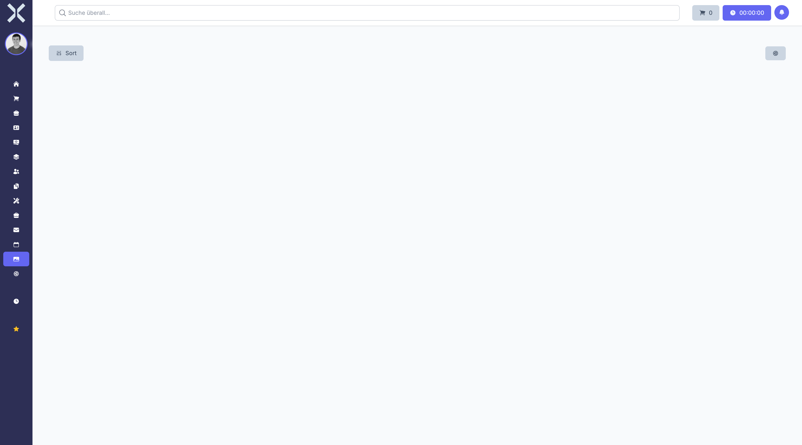

# Medien

Im Modul **Medien** verwalten Sie Dateien und Dokumente zentral in Nuxbe. Die Medienbibliothek bietet eine Ordnerstruktur, Vorschaufunktionen und die Möglichkeit, Dateien per Drag & Drop hochzuladen und zu organisieren. Medien können auch mit anderen Datensätzen wie Kontakten, Aufträgen, Produkten oder Mitarbeitern verknüpft werden.

## Übersicht

Navigieren Sie über die Sidebar zu **Medien**. Sie sehen die Medienbibliothek mit einer Übersicht aller hochgeladenen Dateien.

## Darstellung

Die Medienbibliothek zeigt Dateien in einer Rasteransicht mit Miniaturvorschauen für Bilder und Symbolen für andere Dateitypen. So erkennen Sie auf einen Blick, um welche Dateien es sich handelt.

## Dateien hochladen

### Drag & Drop

Ziehen Sie Dateien direkt von Ihrem Computer in den Medienbereich. Die Dateien werden automatisch hochgeladen und in der aktuellen Ordneransicht angezeigt.

### Upload-Schaltfläche

Alternativ klicken Sie auf die Upload-Schaltfläche, um Dateien über den Dateiauswahldialog Ihres Betriebssystems auszuwählen und hochzuladen.

### Unterstützte Dateitypen

Die Medienbibliothek unterstützt verschiedene Dateitypen:

| Kategorie | Dateitypen |
|---|---|
| **Bilder** | JPG, PNG, GIF, SVG, WebP und weitere Bildformate |
| **Dokumente** | PDF, Word (DOCX), Excel (XLSX), PowerPoint (PPTX) und weitere |
| **Videos** | MP4, WebM, AVI und weitere Videoformate |
| **Sonstige** | ZIP, CSV, TXT und weitere Dateiformate |

## Dateien organisieren

### Ordnerstruktur

Erstellen Sie eine hierarchische Ordnerstruktur, um Ihre Dateien thematisch zu organisieren:

- **Ordner erstellen** - Klicken Sie auf die Schaltfläche zum Erstellen eines neuen Ordners. Geben Sie einen Namen ein und bestätigen Sie.
- **Ordner umbenennen** - Klicken Sie mit der rechten Maustaste auf einen Ordner oder nutzen Sie die Bearbeitungsfunktion, um den Ordnernamen zu ändern.
- **Ordner löschen** - Löschen Sie leere Ordner, die nicht mehr benötigt werden.

### Dateien verschieben

Verschieben Sie Dateien zwischen Ordnern per Drag & Drop. Ziehen Sie eine Datei auf den gewünschten Zielordner, um sie dorthin zu verschieben.

### Sortierung

Klicken Sie auf **Sort** oben links, um die Sortierung der Dateien anzupassen. Verfügbare Sortieroptionen sind:

- **Name** - Alphabetische Sortierung nach Dateiname
- **Datum** - Sortierung nach Hochladedatum (neueste zuerst oder älteste zuerst)
- **Größe** - Sortierung nach Dateigröße

## Vorschau

Klicken Sie auf eine Datei, um eine Vorschau anzuzeigen. Je nach Dateityp wird der Inhalt unterschiedlich dargestellt:

| Dateityp | Vorschau |
|---|---|
| **Bilder** | Inline-Anzeige des Bildes in voller Größe |
| **PDF** | Integrierter PDF-Viewer mit Seitennavigation |
| **Dokumente** | Dokumentenvorschau, sofern vom Format unterstützt |
| **Videos** | Video-Player mit Wiedergabesteuerung |
| **Sonstige** | Anzeige der Dateiinformationen (Name, Größe, Typ, Hochladedatum) |

## Sammlungen

Sammlungen (Collections) ermöglichen es Ihnen, zusammengehörige Dateien unabhängig von der Ordnerstruktur zu gruppieren. Eine Datei kann mehreren Sammlungen angehören, ohne dupliziert zu werden. Dies ist nützlich, um projektbezogene oder thematische Zusammenstellungen zu erstellen, ohne die Ordnerstruktur anpassen zu müssen.

## Integration mit anderen Modulen

Medien können mit verschiedenen Datensätzen in Nuxbe verknüpft werden:

- **Kontakte** - Dokumente wie Verträge, Korrespondenz oder sonstige Unterlagen an Kontakte anhängen (über den Tab **Anhänge** in der [Kontaktdetailansicht](../2-kontakte/2-kontakt-detail.md))
- **Aufträge** - Belege, Spezifikationen oder andere auftragsbezogene Dateien an Aufträge anhängen
- **Produkte** - Produktbilder, Datenblätter oder technische Dokumentation zu Produkten zuordnen
- **Mitarbeiter** - Personalunterlagen oder Zertifikate dem Mitarbeiterprofil zuordnen

## Darstellungseinstellungen

Über das Zahnrad-Symbol oben rechts können Sie die Darstellung der Medienbibliothek anpassen. Hier lassen sich beispielsweise die Größe der Miniaturvorschauen oder die Anzahl der angezeigten Dateien pro Seite konfigurieren.

## Weiterführende Themen

- [Kontakte](../2-kontakte/0-index.md) - Dokumente können Kontakten zugeordnet werden
- [Aufträge](../4-auftraege/0-index.md) - Dateien an Aufträge anhängen
- [Produkte](../6-produkte/0-index.md) - Medien zu Produkten zuordnen
- [Personalwesen > Mitarbeiter](../7-personalwesen/4-mitarbeiter.md) - Dateien dem Mitarbeiterprofil zuordnen
