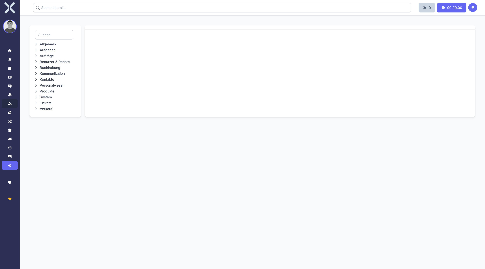

# Einstellungen

Im Modul **Einstellungen** konfigurieren Sie Nuxbe nach Ihren Anforderungen.

## Übersicht

Navigieren Sie über die Sidebar zu **Einstellungen**. Sie sehen eine Übersicht aller Einstellungsbereiche.

Die Einstellungen sind in folgende Kategorien unterteilt:

- **Allgemein** - Grundlegende Systemeinstellungen
- **Aufträge** - Einstellungen für Auftragstypen, Nummernkreise und mehr
- **Benutzer & Rechte** - Benutzerverwaltung und Berechtigungen
- **Buchhaltung** - Kontenrahmen, Steuersätze und Zahlungsarten
- **Kommunikation** - E-Mail-Vorlagen und Benachrichtigungen
- **Kontakte** - Einstellungen für die Kontaktverwaltung
- **Personalwesen** - Konfiguration des Personalmoduls
- **Produkte** - Produktkategorien und Einheiten
- **Tickets** - Tickettypen und Workflows
- **Verkauf** - Verkaufseinstellungen und Preislisten
- **System** - Systemweite Einstellungen und Wartung

## Funktionen

- **Suche** - Durchsuchen Sie die Einstellungen nach Stichworten.
- **Bearbeiten** - Klicken Sie auf eine Kategorie, um die zugehörigen Einstellungen anzuzeigen und zu bearbeiten.

## Seiten in diesem Kapitel

### Allgemein

- [Kategorien](1-kategorien.md) - Kategorien verwalten
- [Länder](2-laender.md) - Länder verwalten
- [Regionen](3-regionen.md) - Regionen verwalten
- [Währungen](4-waehrungen.md) - Währungen verwalten
- [Sprachen](5-sprachen.md) - Sprachen verwalten
- [Tags](6-tags.md) - Tags verwalten
- [Mandanten](7-mandanten.md) - Mandanten verwalten
- [Datenquellen](8-datenquellen.md) - Datenquellen verwalten
- [Branchen](9-branchen.md) - Branchen verwalten
- [Standorte](10-standorte.md) - Standorte verwalten

### Aufträge

- [Auftragsarten](11-auftragsarten.md) - Auftragsarten verwalten
- [Zahlungsarten](12-zahlungsarten.md) - Zahlungsarten verwalten
- [Rabattgruppen](13-rabattgruppen.md) - Rabattgruppen verwalten
- [Abonnement-Einstellungen](14-abo-einstellungen.md) - Abonnement-Einstellungen
- [Preislisten](15-preislisten.md) - Preislisten verwalten

### Benutzer & Rechte

- [Benutzer](16-benutzer.md) - Benutzer verwalten
- [Berechtigungen](17-berechtigungen.md) - Berechtigungen verwalten
- [API-Tokens](18-api-tokens.md) - API-Tokens verwalten

### Buchhaltung

- [Buchungskonten](19-buchungskonten.md) - Buchungskonten verwalten
- [MwSt.-Sätze](20-mwst-saetze.md) - MwSt.-Sätze verwalten
- [Bankverbindungen](21-bankverbindungen.md) - Bankverbindungen verwalten
- [Buchhaltungseinstellungen](22-buchhaltungseinstellungen.md) - Buchhaltungseinstellungen
- [Mahntexte](23-mahntexte.md) - Mahntexte verwalten
- [Mahneinstellungen](24-mahneinstellungen.md) - Mahneinstellungen

### Kommunikation

- [E-Mail-Vorlagen](25-email-vorlagen.md) - E-Mail-Vorlagen verwalten
- [E-Mail-Konten](26-mail-konten.md) - E-Mail-Konten verwalten
- [Benachrichtigungen](27-benachrichtigungen.md) - Benachrichtigungen konfigurieren

### Kontakte

- [Adresstypen](28-adresstypen.md) - Adresstypen verwalten

### Personalwesen

- [Abteilungen](29-abteilungen.md) - Abteilungen verwalten
- [Abwesenheitsarten](30-abwesenheitsarten.md) - Abwesenheitsarten verwalten
- [Abwesenheitsrichtlinien](31-abwesenheitsrichtlinien.md) - Abwesenheitsrichtlinien
- [Feiertage](32-feiertage.md) - Feiertage verwalten
- [Urlaubssperren](33-urlaubssperren.md) - Urlaubssperren verwalten
- [Urlaubsübertrag](34-urlaubsuebertrag.md) - Urlaubsübertrag-Regeln
- [Arbeitszeitmodelle](35-arbeitszeitmodelle.md) - Arbeitszeitmodelle verwalten
- [Arbeitszeittypen](36-arbeitszeittypen.md) - Arbeitszeittypen verwalten

### Produkte

- [Einheiten](37-einheiten.md) - Einheiten verwalten
- [Produktoptionsgruppen](38-produktoptionsgruppen.md) - Produktoptionsgruppen
- [Produkteigenschaften](39-produkteigenschaften.md) - Produkteigenschaften
- [Seriennummernbereiche](40-seriennummernbereiche.md) - Seriennummernbereiche
- [Lager](41-lager.md) - Lager verwalten

### Tickets

- [Ticketarten](42-ticketarten.md) - Ticketarten verwalten
- [Ticket-Einstellungen](43-ticket-einstellungen.md) - Ticket-Einstellungen

### Verkauf

- [Lead-Status](44-lead-status.md) - Lead-Status verwalten
- [Lead-Verlustgründe](45-lead-verlustgruende.md) - Lead-Verlustgründe
- [Verkaufsziele](46-ziele.md) - Verkaufsziele verwalten

### System

- [Kerneinstellungen](47-kerneinstellungen.md) - Kerneinstellungen
- [Systemeinstellungen](48-system.md) - Systemeinstellungen
- [Plugins](49-plugins.md) - Plugins verwalten
- [Zeitplanung](50-zeitplanung.md) - Zeitplanung (Scheduling)
- [Warteschlange](51-warteschlange.md) - Warteschlangen-Monitor
- [Fehlgeschlagene Jobs](52-fehlgeschlagene-jobs.md) - Fehlgeschlagene Jobs
- [Aktivitätsprotokolle](53-aktivitaetsprotokolle.md) - Aktivitätsprotokolle
- [Protokolle](54-protokolle.md) - System-Protokolle
- [Druckaufträge](55-druckauftraege.md) - Druckaufträge
- [Drucker](56-drucker.md) - Drucker verwalten

> **Hinweis:** Änderungen an den Einstellungen können Auswirkungen auf die gesamte Anwendung haben. Nehmen Sie Änderungen nur vor, wenn Sie sich über deren Auswirkungen im Klaren sind.
