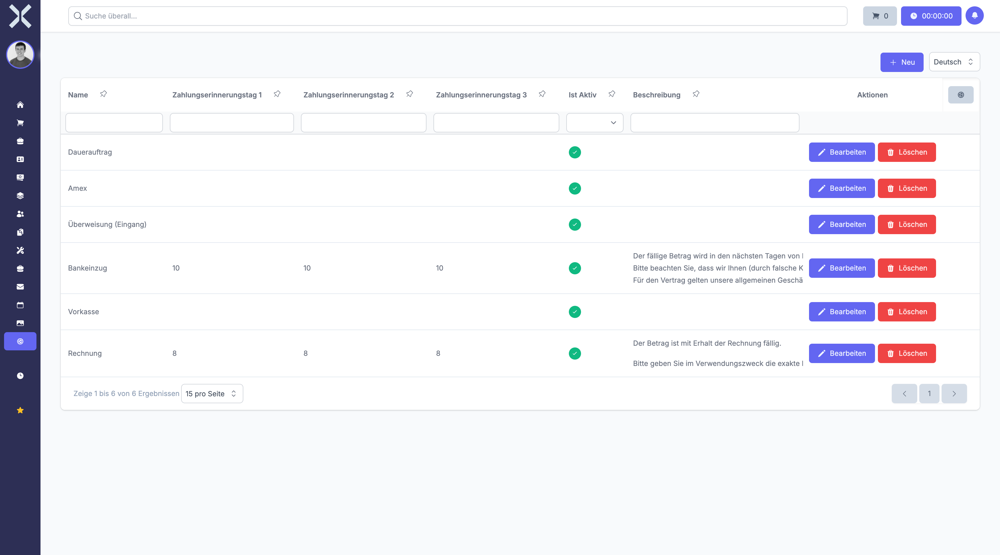

# Zahlungsarten

Zahlungsarten definieren die verfügbaren Zahlungsmethoden wie Überweisung, Lastschrift oder Kreditkarte. Sie legen Zahlungskonditionen, Skonti und Mahnfristen fest.

## Übersicht

1. Navigieren Sie zu **Einstellungen > Aufträge > Zahlungsarten**.

   

2. Die Tabelle zeigt alle Zahlungsarten mit folgenden Spalten:
   - **Name** - Bezeichnung der Zahlungsart
   - **Beschreibung** - Erläuterung zur Zahlungsart
   - **Zahlungsziel** - Frist in Tagen
   - **Standard** - Ob dies die voreingestellte Zahlungsart ist

## Zahlungsart anlegen

1. Klicken Sie auf **Neu**.
2. Füllen Sie das Formular aus:
   - **Name** - Geben Sie eine eindeutige Bezeichnung ein (z.B. "Überweisung 30 Tage", "Sofortzahlung")
   - **Beschreibung** - Optional eine ausführliche Erläuterung
   - **Mandant** - Wählen Sie den zugehörigen Mandanten (oder mehrere Mandanten)
   - **Zahlungsziel** - Anzahl der Tage bis zur Fälligkeit (z.B. 14, 30 oder 60 Tage)
   - **Skonto-Prozentsatz** - Optional ein Rabatt bei frühzeitiger Zahlung (z.B. 2%)
   - **Skonto-Tage** - Anzahl der Tage innerhalb derer der Skonto gewährt wird
   - **Mahnstufe 1 Tage** - Tage nach Fälligkeit für die erste Mahnung
   - **Mahnstufe 2 Tage** - Tage nach Fälligkeit für die zweite Mahnung
   - **Mahnstufe 3 Tage** - Tage nach Fälligkeit für die dritte Mahnung
   - **Mahnungstext** - Standardtext für Mahnungen
   - **Mahnungs-E-Mail-Text** - Standardtext für Mahnungs-E-Mails
   - **Ist aktiv** - Aktivieren Sie die Zahlungsart zur Nutzung
   - **Ist Standard** - Setzen Sie diese Zahlungsart als Vorauswahl
   - **Ist Lastschrift** - Kennzeichnet die Zahlungsart als SEPA-Lastschrift
   - **Ist Einkauf** - Für Lieferantenrechnungen verfügbar
   - **Ist Verkauf** - Für Kundenrechnungen verfügbar
   - **Benötigt manuelle Überweisung** - Kennzeichnet manuelle Zahlungsvorgänge
3. Klicken Sie auf **Speichern**.

## Zahlungsart bearbeiten

1. Klicken Sie auf eine Zahlungsart in der Liste.
2. Passen Sie die gewünschten Daten an.
3. Klicken Sie auf **Speichern**.

## Zahlungsart löschen

1. Klicken Sie auf eine Zahlungsart in der Liste.
2. Klicken Sie auf **Löschen**.
3. Bestätigen Sie die Sicherheitsabfrage.

> **Hinweis:** Zahlungsarten mit zugeordneten Aufträgen können nicht vollständig gelöscht werden. Sie werden als gelöscht markiert und bleiben für historische Daten erhalten.

## Besonderheiten

### Skonto-Regelung

Wenn Sie einen Skonto-Prozentsatz und Skonto-Tage definieren, können Kunden bei frühzeitiger Zahlung einen Rabatt erhalten. Beispiel: 2% Skonto bei Zahlung innerhalb von 10 Tagen.

### Mahnwesen

Die drei Mahnstufen definieren automatische Mahnläufe. Die Tage-Angaben beziehen sich auf das Fälligkeitsdatum der Rechnung.

### Standard-Zahlungsart

Es sollte immer genau eine Zahlungsart als Standard gekennzeichnet sein. Diese wird bei neuen Aufträgen automatisch vorausgewählt.

### Mandanten-Zuordnung

Zahlungsarten können mehreren Mandanten zugeordnet werden. Dies ist besonders in Multi-Mandanten-Umgebungen nützlich.

> **Wichtig:** Prüfen Sie Ihre Zahlungskonditionen regelmäßig und passen Sie diese bei Bedarf an Ihre Geschäftspolitik an.

## Weiterführende Themen

- [Einstellungen](0-index.md) - Zurück zur Einstellungsübersicht
- [Aufträge](../4-auftraege/0-index.md) - Aufträge verwalten
- [Auftragsarten](11-auftragsarten.md) - Dokumenttypen definieren
