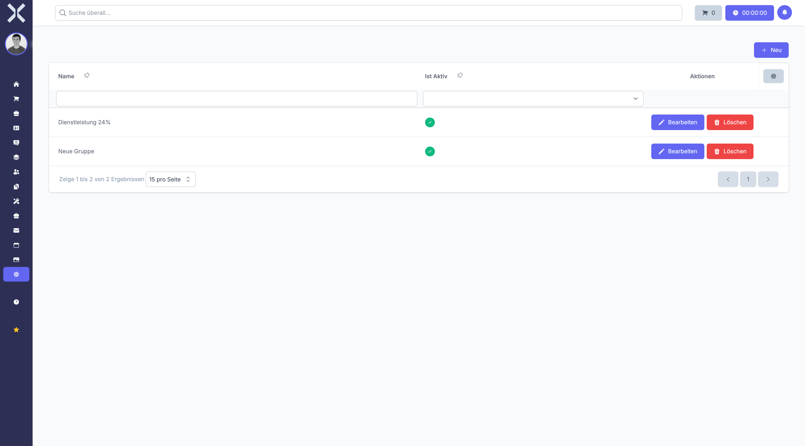

# Rabattgruppen

Rabattgruppen ermöglichen die automatische Preisgestaltung durch Zuordnung von Rabatten zu Kontakten oder Produkten. Sie erleichtern die Verwaltung von Kundenstaffeln und Sonderkonditionen.

## Übersicht

1. Navigieren Sie zu **Einstellungen > Aufträge > Rabattgruppen**.

   

2. Die Tabelle zeigt alle Rabattgruppen mit folgenden Spalten:
   - **Name** - Bezeichnung der Rabattgruppe
   - **Status** - Ob die Rabattgruppe aktiv ist
   - **Zugeordnete Kontakte** - Anzahl der verknüpften Kunden
   - **Zugeordnete Rabatte** - Anzahl der verknüpften Rabattsätze

## Rabattgruppe anlegen

1. Klicken Sie auf **Neu**.
2. Füllen Sie das Formular aus:
   - **Name** - Geben Sie eine aussagekräftige Bezeichnung ein (z.B. "Großkunden", "Händlerrabatt", "Treuerabatt")
   - **Ist aktiv** - Aktivieren Sie die Rabattgruppe zur Nutzung
3. Klicken Sie auf **Speichern**.
4. Nach dem Speichern können Sie Rabattsätze und Kontakte zuordnen.

## Rabattsätze zuordnen

Nach dem Anlegen einer Rabattgruppe können Sie konkrete Rabatte definieren:

1. Öffnen Sie die gespeicherte Rabattgruppe.
2. Navigieren Sie zum Bereich **Rabatte**.
3. Fügen Sie neue Rabatte hinzu:
   - **Name** - Bezeichnung des Rabatts
   - **Rabatt** - Wert des Rabatts
   - **Ist Prozentsatz** - Wählen Sie zwischen prozentualem oder festem Betrag
4. Klicken Sie auf **Speichern**.

## Kontakte zuordnen

Sie können die Rabattgruppe Kunden oder Lieferanten zuordnen:

1. Öffnen Sie die Rabattgruppe.
2. Navigieren Sie zum Bereich **Kontakte**.
3. Fügen Sie Kontakte zur Gruppe hinzu.
4. Alle zugeordneten Kontakte erhalten automatisch die definierten Rabatte.

## Rabattgruppe bearbeiten

1. Klicken Sie auf eine Rabattgruppe in der Liste.
2. Passen Sie Name oder Status an.
3. Bearbeiten Sie zugeordnete Rabatte oder Kontakte.
4. Klicken Sie auf **Speichern**.

## Rabattgruppe löschen

1. Klicken Sie auf eine Rabattgruppe in der Liste.
2. Klicken Sie auf **Löschen**.
3. Bestätigen Sie die Sicherheitsabfrage.

> **Hinweis:** Rabattgruppen mit zugeordneten Kontakten oder Rabatten sollten vor dem Löschen bereinigt werden, um unerwünschte Auswirkungen auf bestehende Aufträge zu vermeiden.

## Besonderheiten

### Automatische Rabattberechnung

Wenn ein Kontakt einer Rabattgruppe zugeordnet ist, werden die Rabatte automatisch bei der Auftragserfassung angewendet. Dies spart Zeit und verhindert Fehler bei der manuellen Rabattierung.

### Mehrfache Rabatte

Eine Rabattgruppe kann mehrere Rabattsätze enthalten. Diese werden nacheinander auf den Preis angewendet. Die Reihenfolge wird über die Sortierung gesteuert.

### Kombination mit Preislisten

Rabattgruppen können zusätzlich zu Preislisten verwendet werden. Erst wird der Preis aus der Preisliste ermittelt, dann werden die Rabatte der Rabattgruppe angewendet.

> **Wichtig:** Prüfen Sie regelmäßig die Zuordnungen Ihrer Rabattgruppen. Änderungen an Rabattsätzen wirken sich sofort auf neue Aufträge aus.

## Weiterführende Themen

- [Einstellungen](0-index.md) - Zurück zur Einstellungsübersicht
- [Preislisten](15-preislisten.md) - Kundenspezifische Preise verwalten
- [Kontakte](../3-kontakte/0-index.md) - Kunden und Lieferanten verwalten
