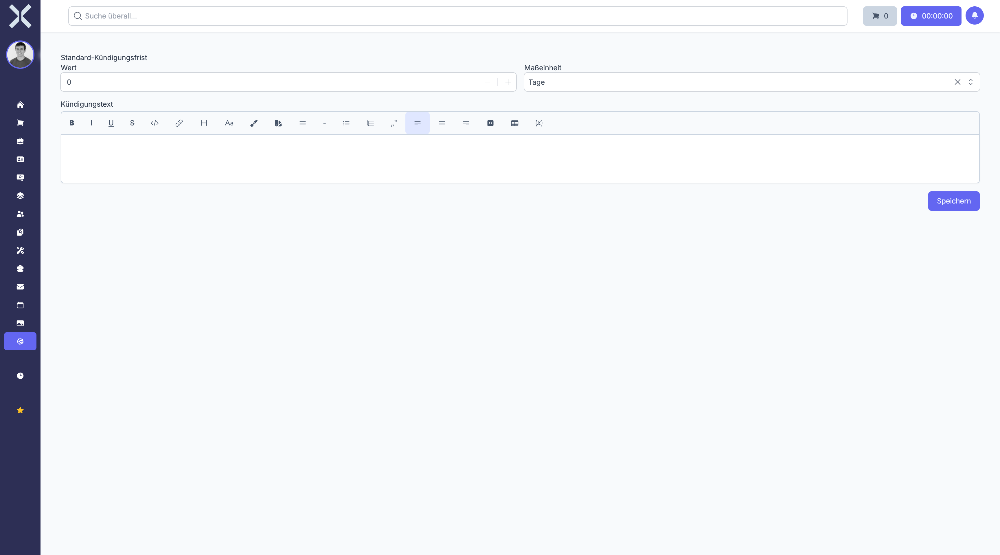

# Abonnement-Einstellungen

Die Abonnement-Einstellungen steuern die automatische Erstellung und Verwaltung wiederkehrender Aufträge. Sie definieren Kündigungsfristen und Standardtexte für Abonnements.

## Übersicht

1. Navigieren Sie zu **Einstellungen > Aufträge > Abonnement-Einstellungen**.

   

2. Diese Einstellungen gelten systemweit für alle Abonnements und wiederkehrenden Aufträge.

## Einstellungen konfigurieren

1. Passen Sie die folgenden Einstellungen an:
   - **Kündigungstext** - Standardtext für Kündigungsbestätigungen
   - **Standard-Kündigungsfrist Wert** - Numerischer Wert für die Kündigungsfrist (z.B. 30)
   - **Standard-Kündigungsfrist Einheit** - Zeiteinheit für die Kündigungsfrist (Tage, Wochen, Monate)
2. Klicken Sie auf **Speichern**.

## Kündigungsfristen

Die Kündigungsfrist definiert, wie lange vor dem nächsten Verlängerungszeitpunkt ein Abonnement gekündigt werden muss. Standardwerte sind:

- **30 Tage** - Für monatliche Abonnements
- **3 Monate** - Für jährliche Verträge
- **14 Tage** - Für kurzfristige Services

Diese Einstellung wird als Vorauswahl verwendet, kann aber bei jedem Abonnement individuell angepasst werden.

## Kündigungstext

Der Kündigungstext wird in automatischen Benachrichtigungen verwendet, wenn:

- Ein Kunde ein Abonnement kündigt
- Ein Abonnement automatisch ausläuft
- Eine Kündigungsbestätigung verschickt wird

Sie können Platzhalter verwenden, um dynamische Inhalte einzufügen:

- `{kunde}` - Name des Kunden
- `{vertragsnummer}` - Nummer des Abonnements
- `{kuendigungsdatum}` - Datum der Kündigung
- `{laufzeitende}` - Ende der aktuellen Laufzeit

## Besonderheiten

### Automatische Verlängerung

Abonnements werden automatisch verlängert, wenn keine Kündigung innerhalb der Kündigungsfrist erfolgt. Die Verlängerung erzeugt einen neuen Auftrag mit den aktuellen Konditionen.

### Kündigungsfrist-Berechnung

Die Kündigungsfrist wird rückwärts vom Verlängerungsdatum berechnet. Bei einem jährlichen Vertrag mit 3 Monaten Kündigungsfrist muss die Kündigung spätestens 3 Monate vor Ablauf eingehen.

### Abonnement-Zeitpläne

Wiederkehrende Aufträge nutzen Zeitpläne (Schedules), die festlegen:

- Intervall (täglich, wöchentlich, monatlich, quartalsweise, jährlich)
- Startdatum der ersten Ausführung
- Optionales Enddatum
- Uhrzeit der automatischen Erstellung

> **Wichtig:** Änderungen an den Abonnement-Einstellungen wirken sich nur auf neu angelegte Abonnements aus. Bestehende Verträge behalten ihre individuellen Einstellungen.

## Weiterführende Themen

- [Einstellungen](0-index.md) - Zurück zur Einstellungsübersicht
- [Abonnements](../4-auftraege/5-auftragsarten/4-abonnements.md) - Abonnements erstellen, Zeitpläne einrichten und kündigen
- [Aufträge](../4-auftraege/0-index.md) - Aufträge verwalten
- [Auftragsarten](11-auftragsarten.md) - Dokumenttypen definieren
- [E-Mail-Vorlagen](25-email-vorlagen.md) - Vorlagen für automatischen Versand
