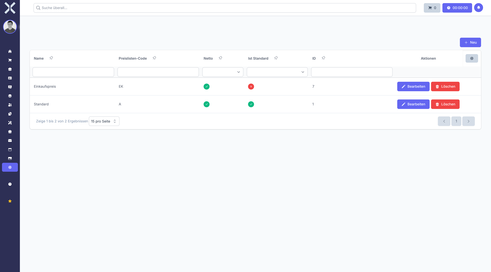

# Preislisten

Preislisten ermöglichen kundenspezifische oder regionale Preisgestaltung. Sie können für verschiedene Kundengruppen, Märkte oder Währungen unterschiedliche Preise definieren.

## Übersicht

1. Navigieren Sie zu **Einstellungen > Aufträge > Preislisten**.

   

2. Die Tabelle zeigt alle Preislisten mit folgenden Spalten:
   - **Name** - Bezeichnung der Preisliste
   - **Code** - Eindeutiger Kürzel-Code
   - **Standard** - Ob dies die Standardpreisliste ist
   - **Einkauf/Verkauf** - Verwendung für Einkaufs- oder Verkaufspreise
   - **Status** - Ob die Preisliste aktiv ist

## Preisliste anlegen

1. Klicken Sie auf **Neu**.
2. Füllen Sie das Formular aus:
   - **Name** - Geben Sie eine aussagekräftige Bezeichnung ein (z.B. "Standardpreise DE", "Händlerpreise", "Exportpreise UK")
   - **Preislisten-Code** - Eindeutiger Code zur Identifikation (z.B. "STD-DE", "HAENDLER")
   - **Übergeordnete Preisliste** - Optional eine Basis-Preisliste, von der geerbt wird
   - **Ist Standard** - Setzen Sie diese Preisliste als systemweite Vorauswahl
   - **Ist Netto** - Kennzeichnet Nettopreise (ohne Mehrwertsteuer)
   - **Ist Einkauf** - Verwendet für Lieferantenpreise
   - **Rabatt** - Optionaler Pauschalrabatt auf alle Preise
   - **Rabatt ist Prozentsatz** - Wählen Sie zwischen prozentualem oder festem Rabatt
   - **Rundungsmethode** - Wählen Sie die Rundungsart (keine, kaufmännisch, auf-/abrunden)
   - **Rundungsgenauigkeit** - Anzahl der Nachkommastellen
   - **Rundungsnummer** - Auf welche Zahl gerundet werden soll (z.B. 5, 10)
   - **Rundungsmodus** - Art der Rundung (halbe Einheiten auf/ab)
3. Klicken Sie auf **Speichern**.

## Preise in der Preisliste definieren

Nach dem Anlegen können Sie für einzelne Produkte spezifische Preise festlegen:

1. Öffnen Sie die gespeicherte Preisliste.
2. Navigieren Sie zum Bereich **Preise**.
3. Fügen Sie Preise für Produkte hinzu:
   - **Produkt** - Wählen Sie das Produkt aus
   - **Preis** - Geben Sie den Preis ein
   - **Gültig ab** - Optional ein Startdatum
   - **Gültig bis** - Optional ein Enddatum
4. Klicken Sie auf **Speichern**.

## Kategorie-Rabatte definieren

Sie können pauschale Rabatte für ganze Produktkategorien festlegen:

1. Öffnen Sie die Preisliste.
2. Navigieren Sie zum Bereich **Kategorie-Rabatte**.
3. Fügen Sie Kategorie-Rabatte hinzu:
   - **Kategorie** - Wählen Sie die Produktkategorie aus
   - **Rabatt** - Prozentsatz oder fester Betrag
4. Klicken Sie auf **Speichern**.

## Preisliste bearbeiten

1. Klicken Sie auf eine Preisliste in der Liste.
2. Passen Sie die gewünschten Einstellungen an.
3. Bearbeiten Sie Preise oder Kategorie-Rabatte.
4. Klicken Sie auf **Speichern**.

## Preisliste löschen

1. Klicken Sie auf eine Preisliste in der Liste.
2. Klicken Sie auf **Löschen**.
3. Bestätigen Sie die Sicherheitsabfrage.

> **Hinweis:** Preislisten mit zugeordneten Kontakten oder Preisen können nicht vollständig gelöscht werden. Sie werden als gelöscht markiert und bleiben für historische Daten erhalten.

## Besonderheiten

### Hierarchische Preislisten

Preislisten können voneinander erben. Wenn Sie eine übergeordnete Preisliste angeben, werden zunächst deren Preise verwendet. Nur wenn ein Produkt in der untergeordneten Liste einen eigenen Preis hat, wird dieser verwendet.

### Standard-Preisliste

Es sollte genau eine Preisliste als Standard gekennzeichnet sein. Diese wird verwendet, wenn ein Kontakt keine spezifische Preisliste zugeordnet hat.

### Zeitliche Gültigkeit

Preise können mit Gültigkeitszeiträumen versehen werden. Dies ist nützlich für Aktionen, Saisonpreise oder geplante Preisänderungen.

### Rundung

Die Rundungseinstellungen werden auf berechnete Preise angewendet. Dies ist besonders bei Rabatten wichtig, um saubere Endpreise zu erhalten.

### Kombination mit Rabatten

Die Preisberechnung erfolgt in dieser Reihenfolge:

1. Basispreis aus Preisliste oder Produkt
2. Anwendung des Preislisten-Rabatts
3. Anwendung von Rabattgruppen-Rabatten
4. Anwendung der Rundungsregeln

> **Wichtig:** Prüfen Sie nach Änderungen an Preislisten die Auswirkungen auf bestehende Angebote und Aufträge. Bereits erstellte Dokumente behalten ihre ursprünglichen Preise.

## Weiterführende Themen

- [Einstellungen](0-index.md) - Zurück zur Einstellungsübersicht
- [Rabattgruppen](13-rabattgruppen.md) - Automatische Rabatte verwalten
- [Produkte](../5-produkte/0-index.md) - Produktverwaltung
- [Kontakte](../3-kontakte/0-index.md) - Preislisten Kunden zuordnen
