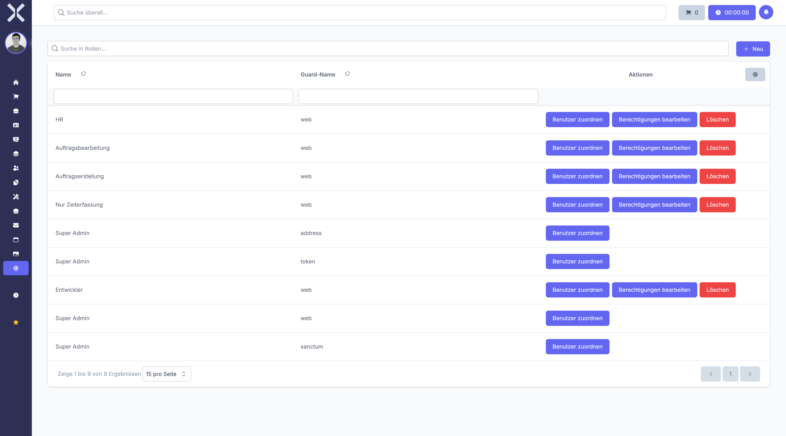

# Berechtigungen

Im Berechtigungssystem verwalten Sie Rollen und definieren, welche Zugriffsrechte Benutzer auf verschiedene Bereiche und Funktionen des Systems haben.

## Übersicht

1. Navigieren Sie zu **Einstellungen > Benutzer & Rechte > Berechtigungen**.

   

2. Die Übersicht zeigt alle verfügbaren Rollen mit folgenden Spalten:
   - **Name** - Bezeichnung der Rolle
   - **Guard** - Authentifizierungsbereich (web, api)
   - **Anzahl Benutzer** - Wie viele Benutzer diese Rolle haben
   - **Anzahl Berechtigungen** - Anzahl der zugewiesenen Rechte

## Rolle anlegen

1. Klicken Sie auf **Neu**.
2. Füllen Sie das Formular aus:
   - **Name** - Geben Sie einen aussagekräftigen Namen ein (z.B. "Vertrieb", "Buchhaltung", "Administration")
   - **Guard** - Wählen Sie den Authentifizierungsbereich (normalerweise "web")
3. Wählen Sie die gewünschten Berechtigungen aus:
   - Die Berechtigungen sind nach Modulen gruppiert
   - Jedes Modul hat typischerweise diese Rechte:
     - **Anzeigen** (Get) - Daten lesen
     - **Erstellen** (Create) - Neue Datensätze anlegen
     - **Bearbeiten** (Update) - Bestehende Daten ändern
     - **Löschen** (Delete) - Datensätze entfernen
   - Erweitern Sie die Module, um spezifische Rechte auszuwählen
4. Klicken Sie auf **Speichern**.

## Berechtigungsstruktur verstehen

Berechtigungen sind hierarchisch nach Modulen organisiert:

### Aufträge
- `order.get` - Aufträge anzeigen
- `order.create` - Aufträge erstellen
- `order.update` - Aufträge bearbeiten
- `order.delete` - Aufträge löschen
- `order.confirm` - Aufträge bestätigen
- `order.cancel` - Aufträge stornieren

### Kontakte
- `contact.get` - Kontakte anzeigen
- `contact.create` - Kontakte erstellen
- `contact.update` - Kontakte bearbeiten
- `contact.delete` - Kontakte löschen

### Produkte
- `product.get` - Produkte anzeigen
- `product.create` - Produkte erstellen
- `product.update` - Produkte bearbeiten
- `product.delete` - Produkte löschen

### Weitere Module
Entsprechende Rechte existieren für Tickets, Projekte, Rechnungen, Lager, etc.

## Benutzer einer Rolle zuweisen

1. Klicken Sie bei einer Rolle auf **Benutzer zuweisen**.
2. Wählen Sie die Benutzer aus, die diese Rolle erhalten sollen.
3. Klicken Sie auf **Speichern**.

Alternativ können Sie Rollen auch direkt in der Benutzerverwaltung zuweisen.

## Rolle bearbeiten

1. Klicken Sie bei einer Rolle auf **Berechtigungen bearbeiten**.
2. Passen Sie die Berechtigungen an:
   - Aktivieren Sie zusätzliche Rechte
   - Entfernen Sie nicht mehr benötigte Rechte
3. Klicken Sie auf **Speichern**.

> **Wichtig:** Änderungen an Rollen wirken sich sofort auf alle Benutzer mit dieser Rolle aus.

## Rolle löschen

1. Klicken Sie bei einer Rolle auf **Löschen**.
2. Bestätigen Sie die Sicherheitsabfrage.

> **Hinweis:** Die Rolle "Super Admin" kann nicht gelöscht oder bearbeitet werden. Diese Rolle hat immer alle Rechte.

## Besonderheiten

### Super Admin Rolle

Die vordefinierte Rolle "Super Admin" hat automatisch alle Berechtigungen. Diese Rolle sollte nur vertrauenswürdigen Administratoren zugewiesen werden.

### Mehrfache Rollen

Ein Benutzer kann mehrere Rollen haben. Die Berechtigungen werden additiv kombiniert. Hat ein Benutzer durch eine Rolle das Recht "contact.get", behält er dieses auch, wenn eine andere seiner Rollen dieses Recht nicht hat.

### Guards (Authentifizierungsbereiche)

- **web** - Für normale Benutzer im Web-Interface
- **token** - Für API-Zugriffe (siehe API-Tokens)
- **sanctum** - Für authentifizierte API-Anfragen

### Berechtigungs-Vererbung

Manche Berechtigungen implizieren andere. Beispiel: Um einen Auftrag zu bearbeiten (`order.update`), muss der Benutzer ihn auch anzeigen können (`order.get`).

### Modulare Rechte-Vergabe

Vergeben Sie Rechte nach Aufgabenbereichen:

**Vertriebsmitarbeiter:**
- Kontakte anzeigen, erstellen, bearbeiten
- Angebote und Aufträge erstellen
- Produkte anzeigen

**Buchhaltung:**
- Rechnungen anzeigen, erstellen, bearbeiten
- Zahlungen erfassen
- Finanzberichte anzeigen

**Lagerverwalter:**
- Lagerbestände anzeigen, bearbeiten
- Lieferscheine erstellen
- Inventur durchführen

> **Wichtig:** Prüfen Sie regelmäßig die Rollen-Zuordnungen. Entfernen Sie Rechte, die nicht mehr benötigt werden. Dokumentieren Sie, welche Rolle welche Aufgaben erfüllen soll.

## Berechtigungs-Prüfung

Sie können jederzeit testen, ob ein Benutzer eine bestimmte Berechtigung hat:

1. Melden Sie sich testweise als dieser Benutzer an (oder lassen Sie sich anmelden).
2. Navigieren Sie zu den entsprechenden Bereichen.
3. Prüfen Sie, ob die erwarteten Schaltflächen sichtbar sind.

Fehlende Berechtigungen äußern sich durch:
- Ausgeblendete Menüpunkte
- Fehlende Schaltflächen (z.B. "Neu", "Bearbeiten")
- Fehlermeldungen bei Zugriffsversuchen

## Weiterführende Themen

- [Einstellungen](0-index.md) - Zurück zur Einstellungsübersicht
- [Benutzer](16-benutzer.md) - Benutzerkonten verwalten
- [API-Tokens](18-api-tokens.md) - API-Berechtigungen verwalten
