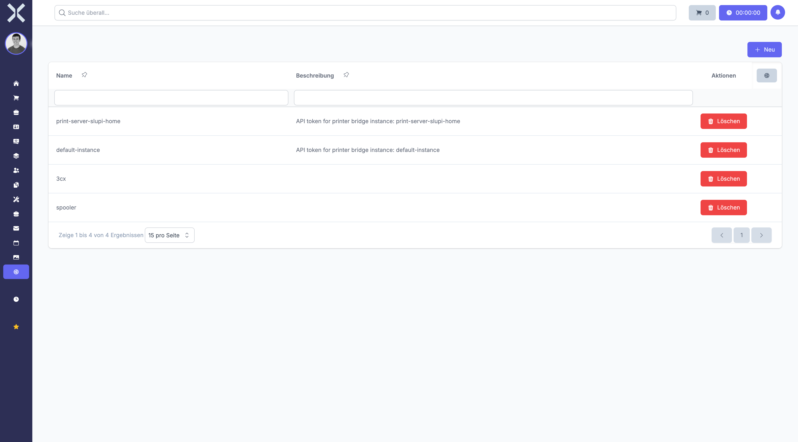

# API-Tokens

API-Tokens ermöglichen externen Anwendungen und Integrationen den sicheren Zugriff auf das System über die REST-API. Sie definieren präzise, welche Operationen erlaubt sind.

## Übersicht

1. Navigieren Sie zu **Einstellungen > Benutzer & Rechte > API-Tokens**.

   

2. Die Tabelle zeigt alle erstellten API-Tokens mit folgenden Spalten:
   - **Name** - Bezeichnung des Tokens
   - **Erstellt am** - Erstellungsdatum
   - **Letzter Zugriff** - Wann wurde der Token zuletzt verwendet
   - **Anzahl Berechtigungen** - Wie viele Rechte zugewiesen sind

## Token erstellen

1. Klicken Sie auf **Neu**.
2. Füllen Sie das Formular aus:
   - **Name** - Geben Sie eine aussagekräftige Bezeichnung ein (z.B. "Shop-Integration", "Mobile App", "Warenwirtschaft-Sync")
3. Wählen Sie die gewünschten Berechtigungen aus:
   - Die Berechtigungen sind nach Modulen gruppiert
   - Wählen Sie nur die minimal benötigten Rechte aus
   - Typische API-Berechtigungen:
     - **order.get** - Aufträge abrufen
     - **order.create** - Aufträge erstellen
     - **product.get** - Produkte abrufen
     - **contact.get** - Kontakte abrufen
     - **stock.get** - Lagerbestände abrufen
4. Klicken Sie auf **Speichern**.
5. **Wichtig:** Der Token wird nun einmalig angezeigt. Kopieren Sie ihn sofort und bewahren Sie ihn sicher auf.

> **Kritisch:** Der Token wird aus Sicherheitsgründen nur einmal angezeigt. Notieren Sie ihn sofort. Bei Verlust muss ein neuer Token erstellt werden.

## Token kopieren

Nach der Erstellung wird der Token in einem Dialog angezeigt:

1. Der vollständige Token-String wird im Klartext angezeigt.
2. Klicken Sie auf **Kopieren**, um ihn in die Zwischenablage zu kopieren.
3. Fügen Sie den Token in Ihre Anwendung oder Konfigurationsdatei ein.
4. Schließen Sie den Dialog erst, wenn Sie den Token sicher gespeichert haben.

## Token verwenden

Verwenden Sie den Token in HTTP-Anfragen an die API:

```
Authorization: Bearer IHR_TOKEN_HIER
```

Beispiel-Anfrage:

```bash
curl -H "Authorization: Bearer IHR_TOKEN_HIER" \
     https://ihr-system.de/api/orders
```

Die API-Dokumentation finden Sie unter `/api/documentation` Ihres Systems.

## Token bearbeiten

Sie können die Berechtigungen eines bestehenden Tokens anpassen:

1. Klicken Sie auf einen Token in der Liste.
2. Passen Sie die Berechtigungen an:
   - Fügen Sie neue Rechte hinzu
   - Entfernen Sie nicht mehr benötigte Rechte
3. Klicken Sie auf **Speichern**.

> **Hinweis:** Der Token-String selbst kann nicht geändert werden. Änderungen an Berechtigungen wirken sich sofort aus.

## Token löschen

Wenn ein Token nicht mehr benötigt wird oder kompromittiert wurde:

1. Klicken Sie auf einen Token in der Liste.
2. Klicken Sie auf **Löschen**.
3. Bestätigen Sie die Sicherheitsabfrage.

Der Token wird sofort ungültig und kann nicht mehr für API-Anfragen verwendet werden.

## Besonderheiten

### Sicherheit

- **Geheimhaltung:** Behandeln Sie API-Tokens wie Passwörter. Geben Sie sie niemals weiter.
- **Speicherung:** Speichern Sie Tokens in Umgebungsvariablen oder sicheren Konfigurationsdateien, nicht im Quellcode.
- **HTTPS:** Verwenden Sie API-Tokens ausschließlich über verschlüsselte HTTPS-Verbindungen.
- **Rotation:** Erneuern Sie Tokens regelmäßig durch Löschen und Neuerstellen.

### Minimal-Rechte-Prinzip

Vergeben Sie nur die minimal notwendigen Berechtigungen:

**Shop-Integration (nur Aufträge erstellen):**
- `order.create`
- `product.get`
- `contact.get`

**Warenwirtschafts-Sync (bidirektional):**
- `order.get`, `order.create`, `order.update`
- `product.get`, `product.update`
- `stock.get`, `stock.update`

**Reporting-Tool (nur lesen):**
- `order.get`
- `contact.get`
- `product.get`

### Token-Überwachung

Überprüfen Sie regelmäßig:
- Welche Tokens existieren
- Wann wurden sie zuletzt verwendet
- Sind alle noch benötigt
- Haben sie die richtigen Berechtigungen

### Rate Limiting

API-Tokens unterliegen Rate Limits, um Missbrauch zu verhindern. Bei zu vielen Anfragen in kurzer Zeit werden weitere Anfragen temporär blockiert.

### Fehlerbehandlung

Wenn API-Anfragen fehlschlagen, prüfen Sie:

1. **401 Unauthorized** - Token ungültig oder fehlend
2. **403 Forbidden** - Token hat nicht die benötigte Berechtigung
3. **429 Too Many Requests** - Rate Limit erreicht
4. **500 Server Error** - Systemfehler, Support kontaktieren

### Audit-Log

Alle API-Zugriffe werden protokolliert. Sie können nachvollziehen:
- Welcher Token wurde verwendet
- Welche Aktion wurde ausgeführt
- Wann erfolgte der Zugriff
- War die Anfrage erfolgreich

> **Wichtig:** Löschen Sie sofort jeden Token, bei dem Sie einen Sicherheitsvorfall vermuten. Im Zweifelsfall erstellen Sie einen neuen Token mit geänderten Berechtigungen.

## Typische Anwendungsfälle

### E-Commerce Integration
Ein Online-Shop sendet Bestellungen automatisch ins ERP-System. Der Token benötigt Rechte zum Erstellen von Aufträgen und Abrufen von Produktdaten.

### Mobile App
Eine mobile Verkaufs-App greift auf Kunden- und Produktdaten zu. Der Token ermöglicht Lese- und Schreibzugriff auf relevante Module.

### Reporting & BI
Ein Business-Intelligence-Tool liest Daten für Auswertungen. Der Token hat ausschließlich Leserechte.

### Automatisierung
Skripte für automatische Prozesse (z.B. nächtlicher Lagerabgleich) nutzen Tokens mit präzise definierten Rechten.

## Weiterführende Themen

- [Einstellungen](0-index.md) - Zurück zur Einstellungsübersicht
- [Berechtigungen](17-berechtigungen.md) - Rollen und Rechte verstehen
- [Benutzer](16-benutzer.md) - Benutzerkonten verwalten
