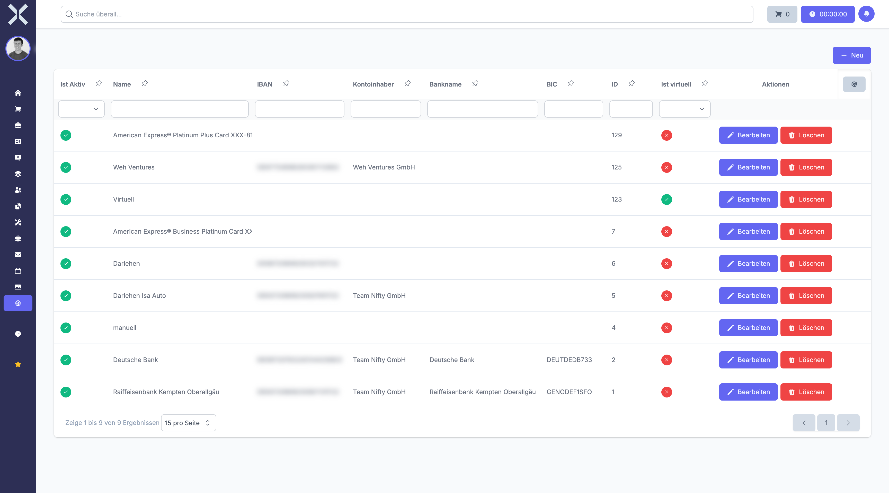

# Bankverbindungen

Bankverbindungen verwalten die Bankkonten Ihres Unternehmens. Diese werden für Zahlungsabwicklungen, den Import von Transaktionen und die Ausgabe von Kontodaten auf Rechnungen verwendet.

## Übersicht

1. Navigieren Sie zu **Einstellungen > Buchhaltung > Bankverbindungen**.

   

2. Die Tabelle zeigt alle Bankverbindungen mit folgenden Spalten:
   - **Name** - Bezeichnung der Bankverbindung
   - **IBAN** - Internationale Bankkontonummer
   - **BIC** - Bank Identifier Code (SWIFT-Code)
   - **Bankname** - Name des Kreditinstituts
   - **Kontoinhaber** - Name des Kontoinhabers
   - **Währung** - Kontowährung
   - **Aktiv** - Status der Bankverbindung

## Bankverbindung anlegen

1. Klicken Sie auf **Neu**.
2. Geben Sie einen **Namen** ein (z. B. "Geschäftskonto Sparkasse", "PayPal-Konto").
3. Tragen Sie den **Kontoinhaber** ein.
4. Geben Sie den **Banknamen** ein (z. B. "Sparkasse Köln Bonn").
5. Tragen Sie die **IBAN** ein. Leerzeichen werden automatisch entfernt.
6. Geben Sie den **BIC** ein (z. B. "COLSDE33XXX").
7. Wählen Sie die **Währung** aus (z. B. EUR).
8. Optional: Wählen Sie ein zugehöriges **Buchungskonto** aus.
9. Optional: Tragen Sie ein **Kreditlimit** ein.
10. Aktivieren Sie **Ist aktiv**, wenn die Bankverbindung verwendet werden soll.
11. Aktivieren Sie **Ist virtuell**, wenn es sich um ein virtuelles Konto handelt (z. B. PayPal, Stripe).
12. Klicken Sie auf **Speichern**.

## Bankverbindung bearbeiten

1. Klicken Sie auf eine Bankverbindung in der Liste.
2. Nehmen Sie die gewünschten Änderungen vor.
3. Klicken Sie auf **Speichern**.

## Bankverbindung löschen

Bankverbindungen können gelöscht werden, solange keine Transaktionen damit verknüpft sind. Klicken Sie auf **Löschen** im Bearbeitungsformular.

## Verwendung von Bankverbindungen

Bankverbindungen werden an verschiedenen Stellen verwendet:

- **Rechnungsausgabe** - IBAN und BIC erscheinen auf gedruckten Rechnungen
- **Transaktionsimport** - Zuordnung importierter Banktransaktionen zum richtigen Konto
- **Zahlungsabwicklung** - Verwaltung von Ein- und Ausgängen
- **Buchhaltung** - Verknüpfung mit Buchungskonten für automatische Buchungen

> **Hinweis:** Die IBAN wird automatisch normalisiert (Großbuchstaben ohne Leerzeichen). Stellen Sie sicher, dass die IBAN korrekt ist, da sie auf Rechnungen ausgegeben wird. Virtuelle Konten werden für elektronische Zahlungsmethoden verwendet und haben oft keine klassische IBAN.

## Weiterführende Themen

- [Einstellungen](0-index.md) - Zurück zur Einstellungsübersicht
- [Transaktionen](../5-buchhaltung/4-transaktionen.md) - Banktransaktionen verwalten
- [Buchungskonten](19-buchungskonten.md) - Kontenrahmen verwalten
