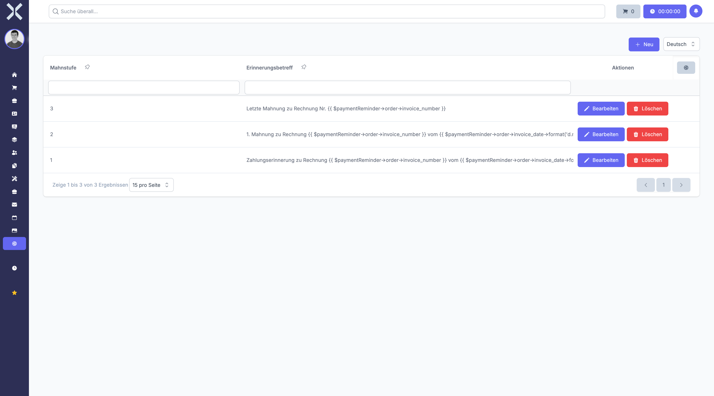

# Mahntexte

Mahntexte definieren den Inhalt der Mahnschreiben für verschiedene Mahnstufen. Sie können für jede Stufe individuelle Texte hinterlegen, die automatisch in Mahnungen verwendet werden.

## Übersicht

1. Navigieren Sie zu **Einstellungen > Buchhaltung > Mahntexte**.

   

2. Die Tabelle zeigt alle Mahntexte mit folgenden Spalten:
   - **Mahnstufe** - Stufe der Mahnung (1, 2, 3, etc.)
   - **Betreff** - E-Mail-Betreff der Mahnung
   - **Textvorschau** - Auszug aus dem Mahntext
   - **E-Mail-Vorlage** - Optionale zugeordnete E-Mail-Vorlage

## Mahntext anlegen

1. Klicken Sie auf **Neu**.
2. Wählen Sie die **Mahnstufe** aus (z. B. 1 für erste Mahnung, 2 für zweite Mahnung).
3. Geben Sie den **Betreff** ein (z. B. "Zahlungserinnerung", "1. Mahnung", "2. Mahnung").
4. Verfassen Sie den **Mahntext** im Textfeld. Dieser Text wird auf dem gedruckten Mahnschreiben ausgegeben.
5. Optional: Wählen Sie eine **E-Mail-Vorlage** aus, falls die Mahnung per E-Mail versendet werden soll.
6. Klicken Sie auf **Speichern**.

## Mahntext bearbeiten

1. Klicken Sie auf einen Mahntext in der Liste.
2. Nehmen Sie die gewünschten Änderungen am Betreff oder Text vor.
3. Klicken Sie auf **Speichern**.

## Mahnstufen und Eskalation

Mahnstufen bauen aufeinander auf:

- **Mahnstufe 1** - Freundliche Zahlungserinnerung ohne zusätzliche Kosten
- **Mahnstufe 2** - Erste Mahnung mit Hinweis auf Verzug und mögliche Mahngebühren
- **Mahnstufe 3** - Zweite Mahnung mit deutlichem Ton und Ankündigung rechtlicher Schritte

Das System wählt automatisch den Text der höchsten verfügbaren Mahnstufe, die kleiner oder gleich der aktuellen Mahnstufe ist.

## Platzhalter für dynamische Inhalte

In Mahntexten können Sie Platzhalter verwenden, die beim Erstellen der Mahnung durch echte Daten ersetzt werden:

- Kundendaten (Name, Anschrift)
- Rechnungsnummer und Rechnungsdatum
- Fälliges Datum und überfälliger Betrag
- Aktuelle Mahnstufe und Mahngebühr

> **Tipp:** Die genaue Syntax für Platzhalter hängt von der verwendeten E-Mail-Vorlage ab. Prüfen Sie die Dokumentation der E-Mail-Vorlagen für verfügbare Variablen.

## Beispieltext für Mahnstufe 1

```
Sehr geehrte Damen und Herren,

bisher konnten wir keinen Zahlungseingang zu Ihrer Rechnung feststellen.
Sollten Sie die Zahlung bereits veranlasst haben, betrachten Sie dieses
Schreiben als gegenstandslos.

Andernfalls bitten wir Sie, den ausstehenden Betrag innerhalb der nächsten
7 Tage zu begleichen.

Mit freundlichen Grüßen
```

> **Hinweis:** Mahntexte sollten höflich, aber bestimmt formuliert sein. Beachten Sie rechtliche Vorgaben für Mahnschreiben in Ihrem Land. Lassen Sie Mahntexte im Zweifel von einem Rechtsberater prüfen. Die Mahnstufe bestimmt nicht nur den Text, sondern auch die Mahngebühr gemäß den Mahneinstellungen.

## Weiterführende Themen

- [Einstellungen](0-index.md) - Zurück zur Einstellungsübersicht
- [Mahnungen](../5-buchhaltung/2-mahnungen.md) - Mahnungen verwalten
- [Mahneinstellungen](24-mahneinstellungen.md) - Mahnfristen und Gebühren konfigurieren
- [E-Mail-Vorlagen](25-email-vorlagen.md) - E-Mail-Vorlagen verwalten
