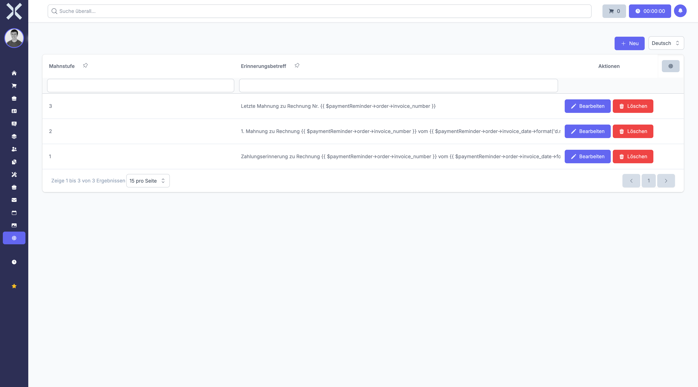

# Mahntexte

Mahntexte definieren den Inhalt der Mahnschreiben für verschiedene Mahnstufen. Sie können für jede Stufe individuelle Texte hinterlegen, die automatisch in Mahnungen verwendet werden.

## Übersicht

1. Navigieren Sie zu **Einstellungen > Buchhaltung > Mahntexte**.

   

2. Die Tabelle zeigt alle Mahntexte mit folgenden Spalten:
   - **Mahnstufe** - Stufe der Mahnung (1, 2, 3, etc.)
   - **Betreff** - E-Mail-Betreff der Mahnung
   - **Textvorschau** - Auszug aus dem Mahntext
   - **E-Mail-Vorlage** - Zugeordnete E-Mail-Vorlage, erforderlich für den Mahnlauf

## Mahntext anlegen

1. Klicken Sie auf **Neu**.
2. Wählen Sie die **Mahnstufe** aus (z. B. 1 für erste Mahnung, 2 für zweite Mahnung).
3. Geben Sie den **Betreff** ein (z. B. "Zahlungserinnerung", "1. Mahnung", "2. Mahnung").
4. Verfassen Sie den **Mahntext** im Textfeld. Dieser Text wird auf dem gedruckten Mahnschreiben ausgegeben.
5. Wählen Sie eine **E-Mail-Vorlage** aus. Ohne zugeordnete Vorlage kann der Mahnlauf für diese Stufe keine Mahnung per E-Mail versenden.
6. Klicken Sie auf **Speichern**.

> **Wichtig:** Der Mahnlauf versendet eine Mahnung nur dann, wenn für die benötigte Mahnstufe ein Mahntext existiert **und** diesem eine E-Mail-Vorlage zugeordnet ist. Fehlt eines von beidem, bleibt die betroffene Rechnung im Mahnlauf stehen und wird mit dem jeweiligen Grund ausgewiesen. Der Mahntext liefert dabei den Inhalt des gedruckten Mahnschreibens, die E-Mail-Vorlage den Text der Mahnmail.

## Mahntext bearbeiten

1. Klicken Sie auf einen Mahntext in der Liste.
2. Nehmen Sie die gewünschten Änderungen am Betreff oder Text vor.
3. Klicken Sie auf **Speichern**.

## Mahnstufen und Eskalation

Mahnstufen bauen aufeinander auf:

- **Mahnstufe 1** - Freundliche Zahlungserinnerung ohne zusätzliche Kosten
- **Mahnstufe 2** - Erste Mahnung mit Hinweis auf Verzug und mögliche Mahngebühren
- **Mahnstufe 3** - Zweite Mahnung mit deutlichem Ton und Ankündigung rechtlicher Schritte

Der Mahnlauf verwendet für jede Rechnung den Mahntext, dessen Mahnstufe exakt der nächsten fälligen Stufe entspricht. Existiert für diese Stufe kein Mahntext, wird die Rechnung nicht gemahnt und im Mahnlauf mit dem entsprechenden Hinweis ausgewiesen. Legen Sie daher für jede Stufe, die Sie tatsächlich nutzen, einen eigenen Mahntext an.

## Dynamische Inhalte mit Editor-Variablen

Im Mahntext können Sie [Editor-Variablen](../1-erste-schritte/6-editor-variablen.md) verwenden, um dynamische Werte einzufügen, die beim Erstellen der Mahnung automatisch durch die echten Daten ersetzt werden. Klicken Sie dazu auf die Variablen-Schaltfläche in der Editor-Werkzeugleiste, um die verfügbaren Variablen anzuzeigen und einzufügen.

## Beispieltext für Mahnstufe 1

```
Sehr geehrte Damen und Herren,

bisher konnten wir keinen Zahlungseingang zu Ihrer Rechnung feststellen.
Sollten Sie die Zahlung bereits veranlasst haben, betrachten Sie dieses
Schreiben als gegenstandslos.

Andernfalls bitten wir Sie, den ausstehenden Betrag innerhalb der nächsten
7 Tage zu begleichen.

Mit freundlichen Grüßen
```

> **Hinweis:** Mahntexte sollten höflich, aber bestimmt formuliert sein. Beachten Sie rechtliche Vorgaben für Mahnschreiben in Ihrem Land. Lassen Sie Mahntexte im Zweifel von einem Rechtsberater prüfen. Die Mahnstufe bestimmt nicht nur den Text, sondern auch die Mahngebühr gemäß den Mahneinstellungen.

## Weiterführende Themen

- [Einstellungen](0-index.md) - Zurück zur Einstellungsübersicht
- [Editor-Variablen](../1-erste-schritte/6-editor-variablen.md) - Dynamische Variablen in Textfeldern verwenden
- [Mahnungen](../5-buchhaltung/2-mahnungen.md) - Mahnungen verwalten
- [Mahneinstellungen](24-mahneinstellungen.md) - Mahnfristen und Gebühren konfigurieren
- [E-Mail-Vorlagen](25-email-vorlagen.md) - E-Mail-Vorlagen verwalten
