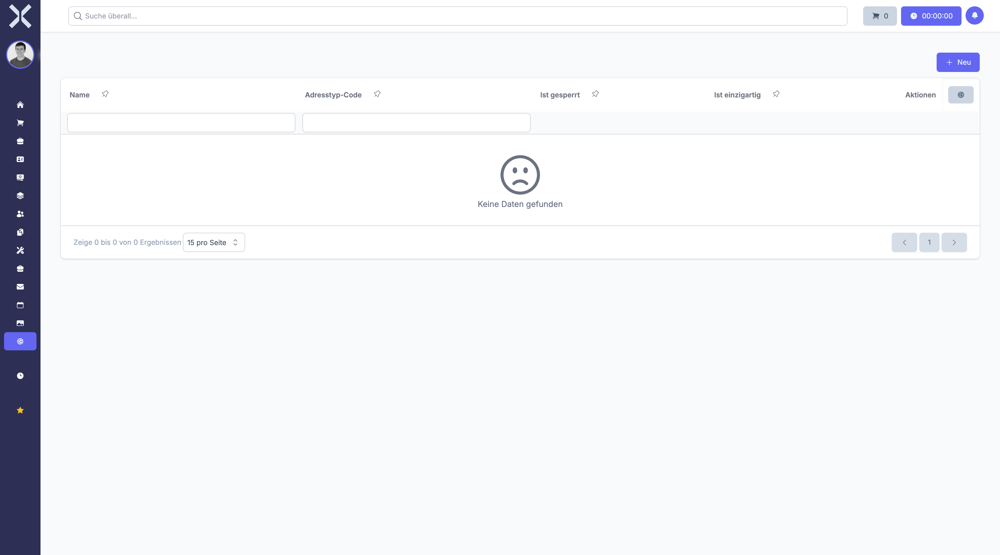

# Adresstypen

Adresstypen kategorisieren die verschiedenen Adressen eines Kontakts. Sie können für jeden Kontakt mehrere Adressen mit unterschiedlichen Typen hinterlegen, um zwischen Rechnungs-, Liefer- und weiteren Adressen zu unterscheiden.

## Übersicht

1. Navigieren Sie zu **Einstellungen > Kontakte > Adresstypen**.

   

2. Die Tabelle zeigt alle Adresstypen mit folgenden Spalten:
   - **Name** - Bezeichnung des Adresstyps
   - **Code** - Interner Systemcode (für spezielle Funktionen)
   - **Gesperrt** - Kennzeichnung für geschützte Systemtypen
   - **Eindeutig** - Nur eine Adresse dieses Typs pro Kontakt erlaubt
   - **Mandant** - Zugeordneter Mandant

## Adresstyp anlegen

1. Klicken Sie auf **Neu**.
2. Geben Sie den **Namen** des Adresstyps ein (z. B. "Rechnungsadresse", "Lieferadresse", "Abweichende Lieferadresse").
3. Optional: Tragen Sie einen **Code** ein. Dieser wird für systeminterner Funktionen verwendet (z. B. "inv" für Rechnungsadresse).
4. Aktivieren Sie **Ist gesperrt**, wenn der Adresstyp vor versehentlicher Löschung geschützt werden soll. Gesperrte Typen können nicht gelöscht werden.
5. Aktivieren Sie **Ist eindeutig**, wenn pro Kontakt nur eine Adresse dieses Typs erlaubt sein soll. Dies verhindert mehrfache Zuordnungen desselben Typs.
6. Wählen Sie den **Mandanten** aus, falls Sie mehrere Mandanten verwalten.
7. Klicken Sie auf **Speichern**.

## Adresstyp bearbeiten

1. Klicken Sie auf einen Adresstyp in der Liste.
2. Nehmen Sie die gewünschten Änderungen vor.
3. Klicken Sie auf **Speichern**.

> **Hinweis zu gesperrten Typen:** Gesperrte Adresstypen können zwar bearbeitet, aber nicht gelöscht werden. Dies schützt wichtige Systemtypen vor versehentlicher Entfernung.

## Adresstyp löschen

Adresstypen können nur gelöscht werden, wenn:
- Sie nicht als **gesperrt** markiert sind
- Keine Adressen diesem Typ zugeordnet sind
- Sie nicht in Aufträgen verwendet werden

Klicken Sie auf **Löschen** im Bearbeitungsformular.

## Standard-Adresstypen

Typische Adresstypen in einem ERP-System:

- **Rechnungsadresse** (Code: inv) - Adresse für Rechnungsstellung, meist eindeutig
- **Lieferadresse** (Code: del) - Adresse für Warenlieferungen, kann mehrfach vorkommen
- **Hauptadresse** (Code: main) - Primäre Geschäftsadresse, meist eindeutig
- **Weitere Adresse** - Zusätzliche Adressen ohne spezielle Funktion

## Verwendung in Aufträgen

Adresstypen werden beim Erstellen von Aufträgen und Rechnungen verwendet:

1. **Rechnungsadresse:** Erscheint auf der Rechnung als Empfängeradresse
2. **Lieferadresse:** Wird für den Versand und Lieferscheine verwendet
3. **Weitere Adressen:** Können für besondere Zwecke ausgewählt werden

## Code-Feld und Systemfunktionen

Das **Code**-Feld hat eine spezielle Bedeutung:

- Codes werden vom System für automatische Zuordnungen verwendet
- Der Code "inv" (invoice) wird z. B. für Rechnungsadressen benötigt
- Der Code "del" (delivery) kennzeichnet Lieferadressen
- Ändern Sie Codes von Systemtypen nur, wenn Sie genau wissen, was Sie tun

## Eindeutigkeit erzwingen

Mit der Option **Ist eindeutig** können Sie sicherstellen, dass:

- Pro Kontakt nur eine Adresse dieses Typs existieren kann
- Bei Zuweisung einer neuen Adresse dieses Typs die alte Zuweisung entfernt wird
- Dies ist sinnvoll für Rechnungsadressen und Hauptadressen

> **Hinweis:** Systemrelevante Adresstypen (mit Codes wie "inv" oder "del") sollten als **gesperrt** markiert werden, um versehentliches Löschen zu verhindern. Ohne entsprechende Adresstypen können Aufträge nicht korrekt erstellt werden. Die Eindeutigkeit sollte für Rechnungs- und Hauptadressen aktiviert sein, für Lieferadressen jedoch nicht, da ein Kunde mehrere Lieferorte haben kann.

## Weiterführende Themen

- [Einstellungen](0-index.md) - Zurück zur Einstellungsübersicht
- [Kontakte](../2-kontakte/0-index.md) - Kontakte verwalten
- [Adressen](../2-kontakte/2-adressen.md) - Adressen zu Kontakten hinzufügen
