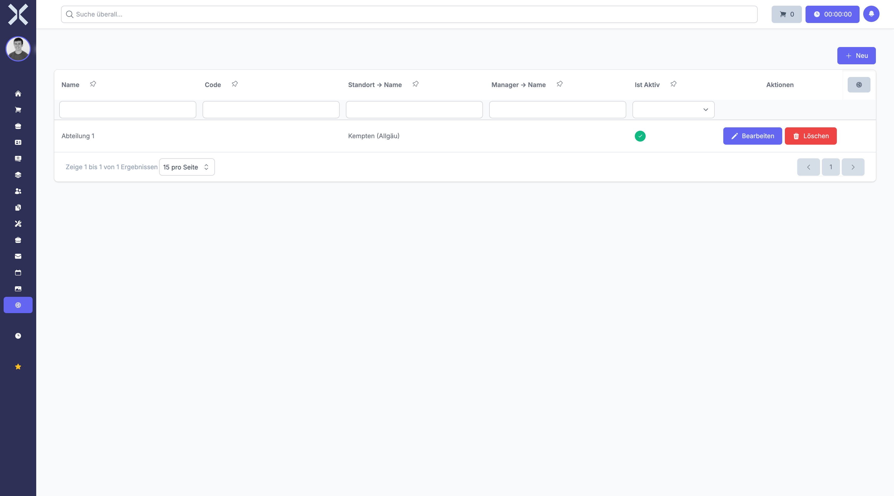

# Abteilungen

Unter **Einstellungen > Personalwesen > Abteilungen** verwalten Sie die Organisationsstruktur Ihres Unternehmens. Abteilungen können hierarchisch strukturiert werden und bilden die Grundlage für die Personalorganisation und Urlaubsverwaltung.

## Übersicht

1. Navigieren Sie zu **Einstellungen > Personalwesen > Abteilungen**.

   

2. Die Tabelle zeigt alle Abteilungen mit folgenden Informationen:
   - **Name** - Bezeichnung der Abteilung
   - **Code** - Optionale Kurzbezeichnung
   - **Standort** - Zugeordneter Unternehmensstandort
   - **Übergeordnete Abteilung** - Für hierarchische Strukturen
   - **Status** - Aktiv oder inaktiv

## Abteilung anlegen

1. Klicken Sie auf **Neu**.
2. Füllen Sie die Pflichtfelder aus:
   - **Name** - Geben Sie die Bezeichnung der Abteilung ein
3. Optional können Sie weitere Informationen hinterlegen:
   - **Code** - Kurzbezeichnung für die Abteilung
   - **Beschreibung** - Ausführliche Beschreibung der Abteilung
   - **Standort** - Wählen Sie den zugehörigen Standort aus
   - **Übergeordnete Abteilung** - Ordnen Sie die Abteilung einer übergeordneten Abteilung zu
   - **Abteilungsleiter** - Wählen Sie den verantwortlichen Mitarbeiter aus
   - **Aktiv** - Legen Sie fest, ob die Abteilung aktiv ist
4. Klicken Sie auf **Speichern**.

## Abteilung bearbeiten

1. Klicken Sie auf eine Abteilung in der Liste.
2. Passen Sie die gewünschten Felder an.
3. Klicken Sie auf **Speichern**.

## Abteilung löschen

1. Klicken Sie auf eine Abteilung in der Liste.
2. Klicken Sie auf **Löschen**.
3. Bestätigen Sie den Löschvorgang.

## Hierarchische Strukturen

Sie können Abteilungen hierarchisch organisieren, indem Sie bei jeder Abteilung eine übergeordnete Abteilung auswählen. Dies ermöglicht:
- Übersichtliche Darstellung der Organisationsstruktur
- Zuordnung von Mitarbeitern zu verschiedenen Hierarchieebenen
- Filterung nach Abteilungshierarchien in Berichten

## Urlaubssperren für Abteilungen

Abteilungen können mit Urlaubssperren verknüpft werden. Wenn eine Urlaubssperre für eine Abteilung gilt, können Mitarbeiter dieser Abteilung in dem definierten Zeitraum keinen Urlaub beantragen.

> **Hinweis:** Bevor Sie eine Abteilung löschen, stellen Sie sicher, dass keine Mitarbeiter mehr zugeordnet sind. Inaktive Abteilungen werden in Auswahlfeldern nicht mehr angezeigt, bleiben aber in historischen Daten erhalten.

## Weiterführende Themen

- [Einstellungen](0-index.md) - Zurück zur Einstellungsübersicht
- [Personalwesen](../7-personalwesen/0-index.md) - Personalmodul verwenden
