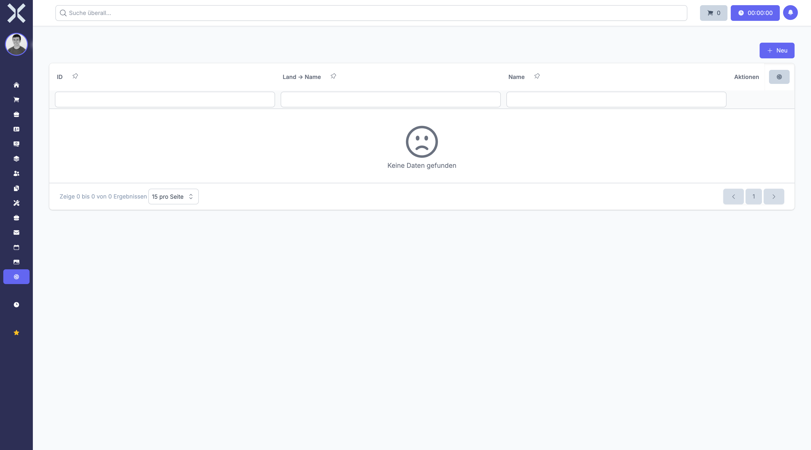

# Regionen

Unter **Einstellungen > Allgemein > Regionen** verwalten Sie Regionen innerhalb von Ländern. Regionen sind geografische Unterteilungen wie Bundesländer in Deutschland, Kantone in der Schweiz oder Provinzen in anderen Ländern. Sie werden für detaillierte Adressangaben und Standortzuordnungen verwendet.

## Übersicht

1. Navigieren Sie zu **Einstellungen > Allgemein > Regionen**.

   

2. Die Tabelle zeigt alle angelegten Regionen mit folgenden Spalten:
   - **Name** - Bezeichnung der Region (z. B. "Bayern", "Zürich")
   - **Land** - Das zugeordnete Land

## Region anlegen

1. Klicken Sie auf **Neu**.
2. Füllen Sie die folgenden Felder aus:
   - **Land** - Wählen Sie das Land, zu dem die Region gehört
   - **Name** - Bezeichnung der Region (z. B. "Baden-Württemberg", "Genf")
3. Klicken Sie auf **Speichern**.

## Region bearbeiten

1. Klicken Sie auf eine Region in der Liste.
2. Ändern Sie die gewünschten Felder.
3. Klicken Sie auf **Speichern**.

## Region löschen

1. Klicken Sie auf eine Region in der Liste.
2. Klicken Sie auf **Löschen**.
3. Bestätigen Sie die Löschung.

## Beispiele für Regionen

- **Deutschland:** Bundesländer (Bayern, Nordrhein-Westfalen, Berlin, etc.)
- **Schweiz:** Kantone (Zürich, Bern, Genf, etc.)
- **Österreich:** Bundesländer (Wien, Tirol, Salzburg, etc.)
- **Frankreich:** Regionen (Île-de-France, Provence-Alpes-Côte d'Azur, etc.)

> **Hinweis:** Regionen, die bereits in Adressen oder Standorten verwendet werden, können nicht gelöscht werden. Die Regionenzuordnung ist optional und wird für detaillierte Adressangaben benötigt.

## Weiterführende Themen

- [Einstellungen](0-index.md) - Zurück zur Einstellungsübersicht
- [Länder](2-laender.md) - Länder verwalten
- [Standorte](10-standorte.md) - Standorte mit Regionen
- [Adressen](../2-kontakte/2-adressen.md) - Adressen mit Regionen
