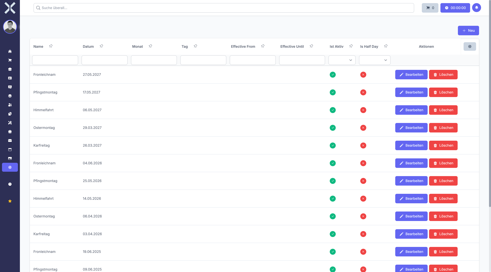

# Feiertage

Unter **Einstellungen > Personalwesen > Feiertage** verwalten Sie die gesetzlichen und betrieblichen Feiertage. Feiertage werden bei der Berechnung von Arbeitstagen und Abwesenheiten berücksichtigt und können standortspezifisch konfiguriert werden.

## Übersicht

1. Navigieren Sie zu **Einstellungen > Personalwesen > Feiertage**.

   

2. Die Tabelle zeigt alle Feiertage mit folgenden Informationen:
   - **Name** - Bezeichnung des Feiertags
   - **Datum** - Konkretes Datum oder wiederkehrendes Datum (Tag/Monat)
   - **Standorte** - Zugeordnete Standorte
   - **Tagesanteil** - Ganzer Tag oder halber Tag
   - **Status** - Aktiv oder inaktiv

## Feiertag anlegen

1. Klicken Sie auf **Neu**.
2. Füllen Sie die Pflichtfelder aus:
   - **Name** - Geben Sie die Bezeichnung des Feiertags ein (z. B. "Tag der Arbeit")
3. Legen Sie das Datum fest:
   - **Jährlich wiederkehrend** - Aktivieren Sie dies für jährlich wiederkehrende Feiertage
   - Wenn wiederkehrend:
     - **Monat** - Wählen Sie den Monat aus
     - **Tag** - Geben Sie den Tag ein
     - **Gültig von (Jahr)** - Optionales Startjahr
     - **Gültig bis (Jahr)** - Optionales Endjahr
   - Wenn einmalig:
     - **Datum** - Wählen Sie das konkrete Datum aus
4. Konfigurieren Sie weitere Optionen:
   - **Tagesanteil** - Wählen Sie "Ganzer Tag", "Erste Hälfte" oder "Zweite Hälfte"
   - **Standorte** - Wählen Sie die Standorte aus, für die der Feiertag gilt (leer = alle Standorte)
   - **Aktiv** - Legen Sie fest, ob der Feiertag aktiv ist
5. Klicken Sie auf **Speichern**.

## Feiertag bearbeiten

1. Klicken Sie auf einen Feiertag in der Liste.
2. Passen Sie die gewünschten Felder an.
3. Klicken Sie auf **Speichern**.

## Feiertag löschen

1. Klicken Sie auf einen Feiertag in der Liste.
2. Klicken Sie auf **Löschen**.
3. Bestätigen Sie den Löschvorgang.

## Wiederkehrende Feiertage

Für Feiertage, die jedes Jahr am gleichen Datum stattfinden (z. B. Tag der Arbeit am 1. Mai), aktivieren Sie die Option **Jährlich wiederkehrend**. Dies erspart Ihnen die jährliche Neuanlage.

Sie können optional einen Gültigkeitszeitraum festlegen:
- **Gültig von** - Ab welchem Jahr der Feiertag gilt
- **Gültig bis** - Bis zu welchem Jahr der Feiertag gilt

## Halbe Feiertage

Für Tage wie Heiligabend oder Silvester, an denen oft nur halbtags gearbeitet wird, können Sie den Tagesanteil auf "Erste Hälfte" oder "Zweite Hälfte" setzen. Dies berücksichtigt das System bei der Arbeitszeitberechnung.

## Standortspezifische Feiertage

Feiertage können standortspezifisch konfiguriert werden. Dies ist besonders wichtig für:
- Bundeslandspezifische Feiertage (z. B. Fronleichnam nur in bestimmten Bundesländern)
- Internationale Standorte mit unterschiedlichen Feiertagen
- Betriebliche Feiertage nur für bestimmte Standorte

Wenn Sie keine Standorte auswählen, gilt der Feiertag für alle Standorte.

## Automatische Berücksichtigung

Feiertage werden automatisch berücksichtigt bei:
- Berechnung der Arbeitstage in Abwesenheitsanträgen
- Zeiterfassung und Arbeitszeitkonten
- Berechnung von Überstunden
- Urlaubsplanung und Anwesenheitsübersichten

> **Hinweis:** Legen Sie Feiertage rechtzeitig für das kommende Jahr an. Bei wiederkehrenden Feiertagen reicht eine einmalige Anlage aus. Prüfen Sie regelmäßig, ob alle relevanten Feiertage für Ihre Standorte erfasst sind.

## Weiterführende Themen

- [Einstellungen](0-index.md) - Zurück zur Einstellungsübersicht
- [Personalwesen](../7-personalwesen/0-index.md) - Personalmodul verwenden
