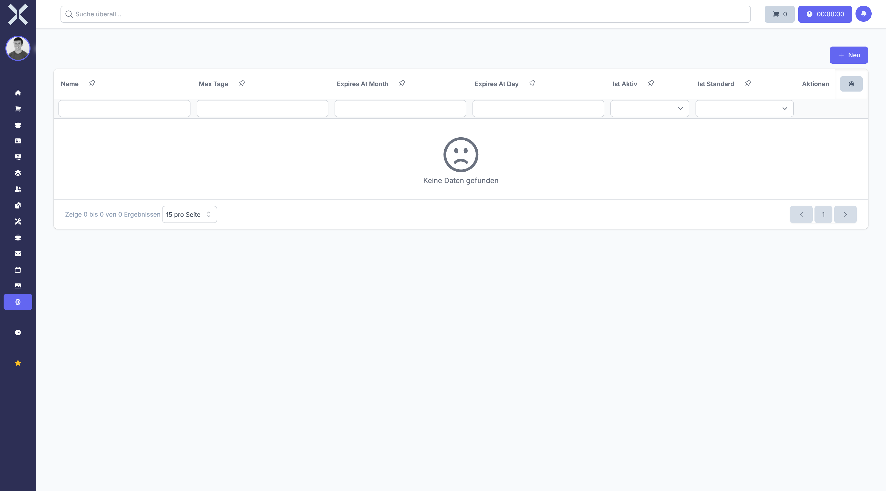

# Urlaubsübertrag

Unter **Einstellungen > Personalwesen > Urlaubsübertrag** konfigurieren Sie die Regeln für den Übertrag von Resturlaub ins Folgejahr. Sie können festlegen, wie viele Urlaubstage übertragen werden dürfen und bis wann der übertragene Urlaub genommen werden muss.

## Übersicht

1. Navigieren Sie zu **Einstellungen > Personalwesen > Urlaubsübertrag**.

   

2. Die Übersicht zeigt die Urlaubsübertrag-Regeln mit folgenden Informationen:
   - **Name** - Bezeichnung der Regel
   - **Maximale Übertragstage** - Anzahl der übertragbaren Tage
   - **Verfallsdatum** - Bis wann der Übertrag genommen werden muss
   - **Standard** - Ob dies die Standardregel ist
   - **Status** - Aktiv oder inaktiv

## Übertrag-Regel anlegen

1. Klicken Sie auf **Neu**.
2. Füllen Sie die Pflichtfelder aus:
   - **Name** - Geben Sie eine aussagekräftige Bezeichnung ein (z. B. "Standard-Übertrag")
3. Konfigurieren Sie die Übertrag-Parameter:
   - **Maximale Übertragstage** - Geben Sie die maximale Anzahl der Tage ein, die übertragen werden dürfen
   - **Verfallsmonat** - Wählen Sie den Monat aus, in dem der Übertrag verfällt
   - **Verfallstag** - Geben Sie den Tag im Monat ein (z. B. 31 für den letzten Tag)
4. Legen Sie die Standardeinstellung fest:
   - **Als Standard festlegen** - Aktivieren Sie dies, wenn diese Regel für neue Mitarbeiter gelten soll
   - **Aktiv** - Legen Sie fest, ob die Regel aktiv ist
5. Klicken Sie auf **Speichern**.

## Übertrag-Regel bearbeiten

1. Klicken Sie auf eine Regel in der Liste.
2. Passen Sie die gewünschten Einstellungen an.
3. Klicken Sie auf **Speichern**.

## Übertrag-Regel löschen

1. Klicken Sie auf eine Regel in der Liste.
2. Klicken Sie auf **Löschen**.
3. Bestätigen Sie den Löschvorgang.

## Standardregel festlegen

Sie können eine Urlaubsübertrag-Regel als Standard definieren. Diese wird automatisch neuen Mitarbeitern zugewiesen. Es kann immer nur eine Regel als Standard festgelegt sein.

Wenn Sie eine neue Regel als Standard festlegen, wird die vorherige Standardregel automatisch deaktiviert.

## Zuordnung zu Mitarbeitern

Urlaubsübertrag-Regeln werden in den Mitarbeiterstammdaten zugeordnet. Jeder Mitarbeiter kann eine individuelle Regel haben oder die Standardregel verwenden.

## Automatischer Jahreswechsel

Beim Jahreswechsel prüft das System automatisch für jeden Mitarbeiter:
- Wie viele Urlaubstage noch offen sind
- Wie viele Tage laut Übertrag-Regel übertragen werden dürfen
- Bis zu welchem Datum der Übertrag verfällt

Der übertragene Urlaub wird als separates Kontingent geführt und mit einem Verfallsdatum versehen.

## Verfallsdatum

Das Verfallsdatum bestimmt, bis wann der übertragene Urlaub genommen werden muss. Typische Einstellungen sind:
- **31. März** - Gesetzliche Regelung in Deutschland für Übertrag
- **31. Dezember** - Übertrag gilt das gesamte Folgejahr
- **30. Juni** - Übertrag muss im ersten Halbjahr genommen werden

## Beispiele für Übertrag-Regeln

**Gesetzlicher Standard:**
- Name: "Gesetzlicher Übertrag"
- Maximale Tage: 5
- Verfallsdatum: 31. März
- Als Standard: Ja

**Großzügige Regelung:**
- Name: "Erweiterter Übertrag Führungskräfte"
- Maximale Tage: 10
- Verfallsdatum: 31. Dezember
- Als Standard: Nein

**Kein Übertrag:**
- Name: "Kein Übertrag"
- Maximale Tage: 0
- Verfallsdatum: 31. Dezember
- Als Standard: Nein

> **Hinweis:** Beachten Sie die gesetzlichen Regelungen in Ihrem Land. In Deutschland müssen Arbeitnehmer ihren Urlaub grundsätzlich im laufenden Kalenderjahr nehmen. Ein Übertrag ist nur unter bestimmten Voraussetzungen möglich. Informieren Sie Ihre Mitarbeiter rechtzeitig über verfallenden Resturlaub.

## Weiterführende Themen

- [Einstellungen](0-index.md) - Zurück zur Einstellungsübersicht
- [Personalwesen](../7-personalwesen/0-index.md) - Personalmodul verwenden
