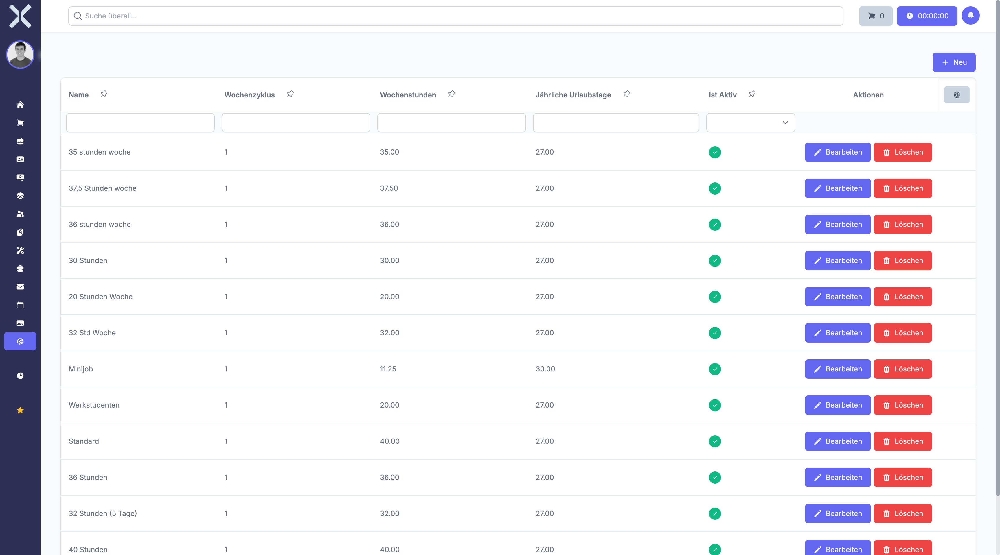

# Arbeitszeitmodelle

Unter **Einstellungen > Personalwesen > Arbeitszeitmodelle** verwalten Sie die verschiedenen Arbeitszeitmodelle Ihrer Mitarbeiter. Ein Arbeitszeitmodell definiert die Sollarbeitszeit pro Woche und die Verteilung auf die einzelnen Wochentage.

## Übersicht

1. Navigieren Sie zu **Einstellungen > Personalwesen > Arbeitszeitmodelle**.

   

2. Die Tabelle zeigt alle Arbeitszeitmodelle mit folgenden Informationen:
   - **Name** - Bezeichnung des Arbeitszeitmodells
   - **Wochenstunden** - Gesamtstunden pro Woche
   - **Arbeitstage pro Woche** - Anzahl der Arbeitstage
   - **Urlaubstage pro Jahr** - Jährlicher Urlaubsanspruch
   - **Status** - Aktiv oder inaktiv

## Arbeitszeitmodell anlegen

1. Klicken Sie auf **Neu**.
2. Füllen Sie die Grunddaten aus:
   - **Name** - Geben Sie eine Bezeichnung ein (z. B. "Vollzeit 40h", "Teilzeit 20h")
   - **Wochenstunden** - Geben Sie die Gesamtstunden pro Woche ein
   - **Arbeitstage pro Woche** - Geben Sie die Anzahl der Arbeitstage ein
   - **Urlaubstage pro Jahr** - Geben Sie den jährlichen Urlaubsanspruch ein
3. Konfigurieren Sie die Überstunden-Regelung:
   - **Überstunden-Ausgleich** - Wählen Sie zwischen "Freizeitausgleich", "Auszahlung" oder "Beides"
   - **Maximale Überstunden** - Geben Sie die maximale Anzahl an Überstunden ein (optional)
4. Legen Sie die wöchentliche Verteilung fest:
   - **Zykluswochen** - Geben Sie an, über wie viele Wochen sich das Modell wiederholt (Standard: 1)
   - Für jede Woche im Zyklus können Sie die Arbeitszeiten pro Wochentag definieren:
     - **Wochentag** - Montag bis Sonntag
     - **Startzeit** - Arbeitsbeginn (z. B. 08:00)
     - **Endzeit** - Arbeitsende (z. B. 17:00)
     - **Arbeitsstunden** - Sollstunden für diesen Tag
     - **Pausenminuten** - Pausenzeit in Minuten
5. Legen Sie fest, ob das Modell aktiv ist:
   - **Aktiv** - Aktivieren Sie dies, damit das Modell verwendet werden kann
6. Klicken Sie auf **Speichern**.

## Arbeitszeitmodell bearbeiten

1. Klicken Sie auf ein Arbeitszeitmodell in der Liste.
2. Passen Sie die gewünschten Felder an.
3. Klicken Sie auf **Speichern**.

## Arbeitszeitmodell löschen

1. Klicken Sie auf ein Arbeitszeitmodell in der Liste.
2. Klicken Sie auf **Löschen**.
3. Bestätigen Sie den Löschvorgang.

## Wochenplan konfigurieren

Für jeden Wochentag können Sie detaillierte Arbeitszeiten festlegen. Dies ermöglicht flexible Modelle wie:
- Montag bis Freitag 8 Stunden, Wochenende frei
- 4-Tage-Woche mit längeren Arbeitstagen
- Schichtmodelle mit wechselnden Arbeitszeiten
- Teilzeitmodelle mit individueller Verteilung

Die Summe der täglichen Arbeitsstunden sollte mit den Gesamtwochenstunden übereinstimmen.

## Mehrzyklische Modelle

Wenn Sie **Zykluswochen** auf einen Wert größer als 1 setzen, können Sie Modelle erstellen, die sich über mehrere Wochen erstrecken. Dies ist nützlich für:
- Schichtarbeit mit rotierenden Wochenenden
- Alternierende Arbeitszeiten
- Gleitzeit-Modelle mit flexibler Verteilung

Beispiel: 2-Wochen-Zyklus mit alternierenden Arbeitszeiten

## Überstunden-Regelung

Legen Sie fest, wie Überstunden kompensiert werden:
- **Freizeitausgleich** - Überstunden können nur durch Freizeit ausgeglichen werden
- **Auszahlung** - Überstunden werden finanziell vergütet
- **Beides** - Mitarbeiter oder Vorgesetzte können wählen

Die maximalen Überstunden definieren, wie viele Überstunden ein Mitarbeiter ansammeln darf.

## Pausenregelung

Die Pausenminuten werden von der Gesamtarbeitszeit abgezogen, aber als Anwesenheitszeit erfasst. Dies ist wichtig für:
- Korrekte Berechnung der Nettoarbeitszeit
- Einhaltung gesetzlicher Pausenregelungen
- Zeiterfassungssysteme

## Zuordnung zu Mitarbeitern

Arbeitszeitmodelle werden in den Mitarbeiterstammdaten zugeordnet. Ein Mitarbeiter kann über die Zeit verschiedene Arbeitszeitmodelle haben (z. B. Wechsel von Vollzeit zu Teilzeit).

## Beispiele für Arbeitszeitmodelle

**Vollzeit 40 Stunden:**
- Wochenstunden: 40
- Arbeitstage: 5
- Montag-Freitag: 08:00-17:00 (8h, 60min Pause)

**Teilzeit 20 Stunden:**
- Wochenstunden: 20
- Arbeitstage: 5
- Montag-Freitag: 08:00-12:00 (4h, 0min Pause)

**4-Tage-Woche:**
- Wochenstunden: 40
- Arbeitstage: 4
- Montag-Donnerstag: 07:00-17:30 (10h, 60min Pause)

> **Hinweis:** Beachten Sie bei der Erstellung von Arbeitszeitmodellen die gesetzlichen Regelungen zu Höchstarbeitszeiten und Pausenregelungen. Inaktive Arbeitszeitmodelle können nicht mehr neuen Mitarbeitern zugeordnet werden, bleiben aber bei bestehenden Zuordnungen erhalten.

## Weiterführende Themen

- [Einstellungen](0-index.md) - Zurück zur Einstellungsübersicht
- [Arbeitszeiten](../7-personalwesen/5-arbeitszeiten.md) - Arbeitszeiten erfassen
