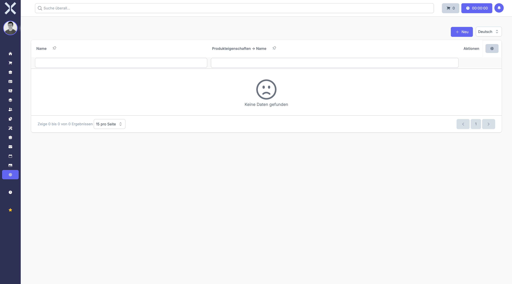

# Produkteigenschaften

Unter **Einstellungen > Produkte > Produkteigenschaften** verwalten Sie zusätzliche Eigenschaften, die Produkten zugewiesen werden können.

Produkteigenschaften sind benutzerdefinierte Felder, mit denen Sie spezifische Informationen zu Ihren Produkten hinterlegen können. Im Gegensatz zu Produktoptionsgruppen dienen sie nicht der Variantenerstellung, sondern der detaillierten Beschreibung von Produktmerkmalen.

## Übersicht

1. Navigieren Sie zu **Einstellungen > Produkte > Produkteigenschaften**.

   

2. Die Tabelle zeigt alle verfügbaren Produkteigenschaften.

### Angezeigte Spalten

- **Name** - Die Bezeichnung der Eigenschaft (z. B. "Material", "Garantie")
- **Datentyp** - Der Typ der Eigenschaft (Text oder Auswahl)
- **Gruppe** - Die zugeordnete Eigenschaftsgruppe (optional)

Die Liste kann nach Namen durchsucht werden.

## Produkteigenschaft anlegen

Um eine neue Produkteigenschaft zu erstellen:

1. Klicken Sie auf die Schaltfläche **Neu**.
2. Geben Sie im Feld **Name** die Bezeichnung der Eigenschaft ein (z. B. "Hersteller").
3. Wählen Sie den gewünschten **Datentyp** aus:
   - **Text** - Für Freitexteingaben
   - **Auswahl** - Für vordefinierte Auswahlmöglichkeiten
4. Optional: Wählen Sie eine **Eigenschaftsgruppe** zur besseren Organisation.
5. Klicken Sie auf **Speichern**, um die Eigenschaft zu erstellen.

### Verfügbare Datentypen

#### Text

Bei diesem Datentyp kann bei der Produktpflege ein beliebiger Text eingegeben werden. Beispiele:

- **Beschreibung** - Ausführliche Produktbeschreibung
- **Technische Daten** - Spezifische Angaben zum Produkt
- **Hinweise** - Besondere Verwendungshinweise

#### Auswahl

Bei diesem Datentyp können nur vordefinierte Werte ausgewählt werden. Dieses Format eignet sich für standardisierte Angaben. Beispiele:

- **Energieeffizienzklasse** - A+++, A++, A+, A, B, C, D
- **Verfügbarkeit** - Auf Lager, Lieferbar, Ausverkauft
- **Qualitätsstufe** - Standard, Premium, Deluxe

### Hinweise zum Anlegen

- Der **Name** sollte eindeutig und selbsterklärend sein.
- Überlegen Sie vorab, ob Text oder Auswahl besser geeignet ist.
- Nutzen Sie Eigenschaftsgruppen, um verwandte Eigenschaften zu organisieren.

## Produkteigenschaft bearbeiten

Um eine bestehende Produkteigenschaft zu ändern:

1. Klicken Sie auf die gewünschte Eigenschaft in der Tabelle.
2. Bearbeiten Sie den **Namen** oder den **Datentyp** nach Bedarf.
3. Passen Sie die Zuordnung zur **Eigenschaftsgruppe** an.
4. Klicken Sie auf **Speichern**, um die Änderungen zu übernehmen.

> **Achtung:** Änderungen am Datentyp können Auswirkungen auf bereits erfasste Produktdaten haben. Prüfen Sie dies vorab sorgfältig.

## Produkteigenschaft löschen

Eigenschaften können gelöscht werden, wenn sie nicht mehr benötigt werden:

1. Öffnen Sie die zu löschende Eigenschaft.
2. Klicken Sie auf **Löschen**.
3. Bestätigen Sie den Löschvorgang.

> **Hinweis:** Produkteigenschaften, die bereits Produkten zugeordnet sind, können nicht gelöscht werden. Sie müssen zunächst die Zuordnung bei den betroffenen Produkten entfernen.

## Verwendung von Produkteigenschaften

Produkteigenschaften werden bei der Produktverwaltung eingesetzt:

- **Detaillierte Produktbeschreibungen** - Erfassen Sie spezifische Merkmale
- **Filterung und Suche** - Finden Sie Produkte anhand ihrer Eigenschaften
- **Auswertungen** - Erstellen Sie Berichte nach Eigenschaftswerten
- **Kundeninformation** - Zeigen Sie relevante Informationen im Webshop an

### Unterschied zu Produktoptionsgruppen

| Produkteigenschaften | Produktoptionsgruppen |
|---------------------|----------------------|
| Beschreibende Merkmale | Varianten eines Produkts |
| Keine Variantenerstellung | Automatische Variantenerstellung |
| Optionale Angaben | Pflichtangaben für Varianten |
| Beispiel: Garantiezeit | Beispiel: Farbe, Größe |

> **Empfehlung:** Nutzen Sie Produkteigenschaften für beschreibende Merkmale und Produktoptionsgruppen für tatsächliche Produktvarianten. Dies sorgt für eine klare Struktur in Ihrer Produktverwaltung.

## Weiterführende Themen

- [Einstellungen](0-index.md) - Zurück zur Einstellungsübersicht
- [Produkte](../6-produkte/0-index.md) - Produkte verwalten
