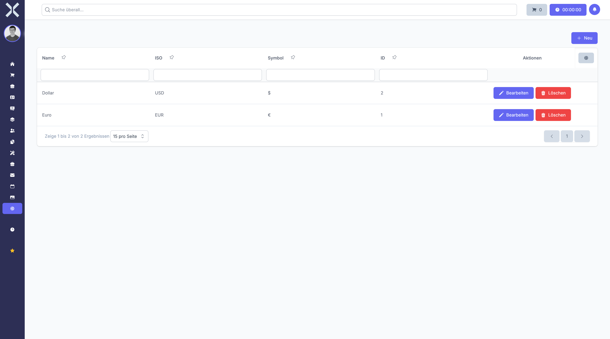

# Währungen

Unter **Einstellungen > Allgemein > Währungen** verwalten Sie die im System unterstützten Währungen. Währungen werden für Preise, Rechnungen, Angebote und die Finanzberichterstattung benötigt. Jede Währung wird mit einem ISO-Code und einem Symbol definiert.

## Übersicht

1. Navigieren Sie zu **Einstellungen > Allgemein > Währungen**.

   

2. Die Tabelle zeigt alle Währungen mit folgenden Spalten:
   - **Name** - Bezeichnung der Währung (z. B. "Euro", "Schweizer Franken")
   - **ISO** - Dreistelliger ISO-Währungscode (z. B. "EUR", "CHF", "USD")
   - **Symbol** - Währungssymbol (z. B. "€", "CHF", "$")
   - **Standard** - Kennzeichnet die Standardwährung des Systems

## Währung anlegen

1. Klicken Sie auf **Neu**.
2. Füllen Sie die folgenden Felder aus:
   - **Name** - Bezeichnung der Währung (z. B. "Euro", "US-Dollar")
   - **ISO** - Dreistelliger ISO-4217-Währungscode (Pflichtfeld, eindeutig)
   - **Symbol** - Währungssymbol zur Anzeige (z. B. "€", "$", "£")
   - **Standard** - Markiert diese Währung als Standardwährung für neue Datensätze
3. Klicken Sie auf **Speichern**.

## Währung bearbeiten

1. Klicken Sie auf eine Währung in der Liste.
2. Ändern Sie die gewünschten Felder.
3. Klicken Sie auf **Speichern**.

## Währung löschen

1. Klicken Sie auf eine Währung in der Liste.
2. Klicken Sie auf **Löschen**.
3. Bestätigen Sie die Löschung.

## Häufig verwendete Währungen

- **EUR** - Euro (€)
- **CHF** - Schweizer Franken (CHF)
- **USD** - US-Dollar ($)
- **GBP** - Britisches Pfund (£)

## Standardwährung

Die als Standard markierte Währung wird automatisch bei der Anlage neuer Datensätze vorausgewählt. Sie sollten genau eine Währung als Standard definieren.

> **Hinweis:** Währungen, die bereits in Preisen, Rechnungen oder anderen Datensätzen verwendet werden, können nicht gelöscht werden. Der ISO-Code muss dem internationalen Standard ISO 4217 entsprechen.

## Weiterführende Themen

- [Einstellungen](0-index.md) - Zurück zur Einstellungsübersicht
- [Länder](2-laender.md) - Länderzuordnung zu Währungen
- [Produkte](../6-produkte/0-index.md) - Preise in verschiedenen Währungen
- [Rechnungen](../10-rechnungen/0-index.md) - Rechnungen mit Währungen
