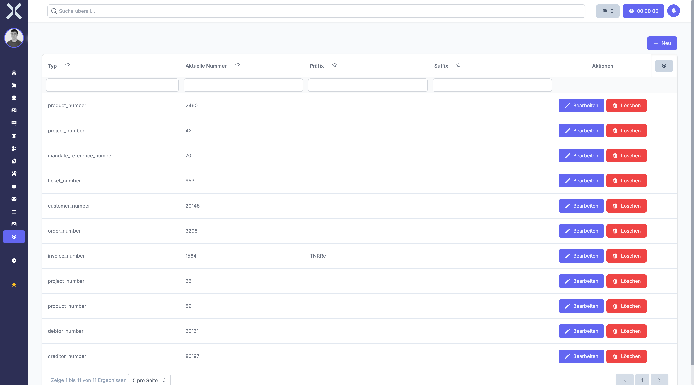

# Seriennummernbereiche

Unter **Einstellungen > Produkte > Seriennummernbereiche** verwalten Sie die Nummernbereiche für automatisch generierte Seriennummern.

Seriennummernbereiche definieren das Format und die Vergabe von eindeutigen Nummern für verschiedene Objekte im System. Dies können Produktseriennummern, Belegnummern oder andere durchnummerierte Datensätze sein.

## Übersicht

1. Navigieren Sie zu **Einstellungen > Produkte > Seriennummernbereiche**.

   

2. Die Tabelle zeigt alle konfigurierten Seriennummernbereiche.

### Angezeigte Spalten

- **Typ** - Die Art des Objekts, für das Nummern vergeben werden
- **Modell** - Das zugeordnete Datenmodell (z. B. Produkt, Auftrag)
- **Präfix** - Der vorangestellte Text (z. B. "SN-")
- **Aktueller Zählerstand** - Die zuletzt vergebene Nummer
- **Suffix** - Der nachgestellte Text (optional)
- **Länge** - Die Mindestlänge der Nummer (mit führenden Nullen)

## Seriennummernbereich anlegen

Um einen neuen Seriennummernbereich zu erstellen:

1. Klicken Sie auf die Schaltfläche **Neu**.
2. Wählen Sie den **Modelltyp** aus, für den Nummern vergeben werden sollen.
3. Geben Sie den **Typ** an (z. B. "serial_number").
4. Tragen Sie optional ein **Präfix** ein (z. B. "SN-" oder "2025-").
5. Legen Sie den **Startwert** für den Zähler fest (z. B. 1 oder 1000).
6. Definieren Sie die **Länge** der Nummer (z. B. 6 für Nummern wie 000001).
7. Tragen Sie optional ein **Suffix** ein (z. B. "-DE").
8. Fügen Sie bei Bedarf eine **Beschreibung** hinzu.
9. Klicken Sie auf **Speichern**.

### Felder im Detail

#### Präfix

Das Präfix wird dem Zählerstand vorangestellt. Sie können auch Platzhalter verwenden:

- **:current_year** - Das aktuelle Jahr (z. B. 2025)
- **:current_year_short** - Das Jahr zweistellig (z. B. 25)
- **:current_month** - Der aktuelle Monat (z. B. 01-12)
- **:current_day** - Der aktuelle Tag (z. B. 01-31)

Beispiel: Ein Präfix "SN-:current_year-" ergibt "SN-2025-".

#### Länge

Die Länge gibt an, auf wie viele Stellen der Zähler mit führenden Nullen aufgefüllt wird:

- Länge 4 und Zählerstand 23 ergibt 0023
- Länge 6 und Zählerstand 456 ergibt 000456

#### Suffix

Das Suffix wird dem Zählerstand nachgestellt. Auch hier können Platzhalter verwendet werden.

### Beispiel: Produktseriennummern

Sie möchten Seriennummern im Format "SN-2025-000001" vergeben:

- **Präfix**: SN-:current_year-
- **Startwert**: 1
- **Länge**: 6
- **Suffix**: (leer)

Die erste Seriennummer lautet dann "SN-2025-000001", die zweite "SN-2025-000002" usw.

## Seriennummernbereich bearbeiten

Um einen bestehenden Seriennummernbereich zu ändern:

1. Klicken Sie auf den gewünschten Bereich in der Tabelle.
2. Passen Sie die Felder nach Bedarf an.
3. Klicken Sie auf **Speichern**.

> **Achtung:** Änderungen am Präfix oder an der Länge beeinflussen nur zukünftig vergebene Nummern. Bereits vergebene Seriennummern bleiben unverändert.

### Zählerstand manuell anpassen

In besonderen Fällen kann es notwendig sein, den aktuellen Zählerstand manuell anzupassen:

1. Öffnen Sie den Seriennummernbereich.
2. Ändern Sie den Wert im Feld **Aktueller Zählerstand**.
3. Speichern Sie die Änderung.

Die nächste vergebene Nummer wird dann auf Basis des neuen Zählerstands generiert.

## Seriennummernbereich löschen

Seriennummernbereiche können gelöscht werden, wenn sie nicht mehr benötigt werden:

1. Öffnen Sie den zu löschenden Bereich.
2. Klicken Sie auf **Löschen**.
3. Bestätigen Sie den Löschvorgang.

> **Hinweis:** Seriennummernbereiche, die bereits verwendet wurden, sollten nicht gelöscht werden. Dies könnte zu Inkonsistenzen bei bereits vergebenen Nummern führen.

## Erweiterte Funktionen

### Vorgefüllte Nummernbereiche

Mit der Option **Vorgefüllt** können Sie einen Pool von Seriennummern vorab anlegen. Diese werden dann der Reihe nach vergeben.

### Zufällige Seriennummern

Mit der Option **Randomisiert** werden zufällige Seriennummern generiert statt fortlaufender Zähler.

### Speicherung der Seriennummern

Die Option **Seriennummern speichern** legt fest, ob vergebene Nummern als separate Datensätze in der Datenbank gespeichert werden.

> **Empfehlung:** Planen Sie Ihre Seriennummernbereiche mit Weitblick. Ein konsistentes Schema erleichtert die spätere Verwaltung und Zuordnung erheblich.

## Weiterführende Themen

- [Einstellungen](0-index.md) - Zurück zur Einstellungsübersicht
- [Seriennummern](../6-produkte/2-seriennummern.md) - Seriennummern verwalten
