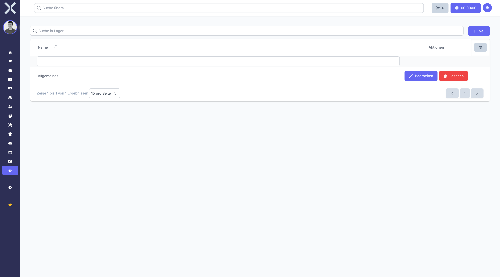

# Lager

Unter **Einstellungen > Produkte > Lager** verwalten Sie die Lagerstandorte für Ihre Produkte und Waren.

Lager sind physische oder logische Orte, an denen Ihre Bestände gelagert werden. Die Verwaltung mehrerer Lager ermöglicht eine präzise Bestandsführung über verschiedene Standorte hinweg.

## Übersicht

1. Navigieren Sie zu **Einstellungen > Produkte > Lager**.

   

2. Die Tabelle zeigt alle konfigurierten Lagerstandorte.

### Angezeigte Spalten

- **Name** - Die Bezeichnung des Lagers (z. B. "Hauptlager", "Filiallager Berlin")
- **Adresse** - Der zugeordnete Standort des Lagers
- **Standard** - Kennzeichnung, ob dies das Standardlager ist

Die Liste kann nach Namen durchsucht werden.

## Lager anlegen

Um ein neues Lager zu erstellen:

1. Klicken Sie auf die Schaltfläche **Neu**.
2. Geben Sie im Feld **Name** die Bezeichnung des Lagers ein (z. B. "Versandlager").
3. Wählen Sie optional eine **Adresse** aus, die den Standort des Lagers definiert.
4. Aktivieren Sie **Als Standard festlegen**, wenn dieses Lager das Standardlager sein soll.
5. Klicken Sie auf **Speichern**.

### Felder im Detail

#### Name

Der Name sollte eindeutig sein und die Funktion oder den Standort des Lagers widerspiegeln. Beispiele:

- **Hauptlager** - Das zentrale Warenlager
- **Filiallager München** - Lager einer Filiale
- **Retouren-Lager** - Separates Lager für Rücksendungen
- **Kommissionslager** - Lager für die Auftragsabwicklung

#### Adresse

Durch die Zuordnung einer Adresse können Sie:

- Den genauen Standort des Lagers dokumentieren
- Versandkosten korrekt berechnen
- Lieferzeiten präzise kalkulieren
- Standortbezogene Auswertungen erstellen

Die Adresse muss zuvor unter **Stammdaten > Adressen** angelegt worden sein.

#### Als Standard festlegen

Das Standardlager wird automatisch vorausgewählt:

- Bei der Anlage neuer Produkte
- Bei Wareneingängen ohne spezifische Lagerangabe
- In Bestellungen und Aufträgen

> **Hinweis:** Es kann nur ein Lager gleichzeitig als Standard markiert sein. Wenn Sie ein anderes Lager als Standard festlegen, wird die Markierung beim bisherigen Standardlager automatisch entfernt.

## Lager bearbeiten

Um ein bestehendes Lager zu ändern:

1. Klicken Sie auf das gewünschte Lager in der Tabelle.
2. Passen Sie die Felder **Name**, **Adresse** oder **Standard** nach Bedarf an.
3. Klicken Sie auf **Speichern**.

## Lager löschen

Lager können gelöscht werden, wenn sie nicht mehr benötigt werden:

1. Öffnen Sie das zu löschende Lager.
2. Klicken Sie auf **Löschen**.
3. Bestätigen Sie den Löschvorgang.

> **Hinweis:** Lager mit vorhandenen Beständen oder Lagerbuchungen können nicht gelöscht werden. Sie müssen zunächst alle Bestände ausbuchen oder auf ein anderes Lager umbuchen.

## Verwendung von Lagern

Lager spielen in verschiedenen Bereichen des Systems eine zentrale Rolle:

### Bestandsverwaltung

- Jedes Produkt kann Bestände in mehreren Lagern haben
- Lagerbestände werden separat für jedes Lager geführt
- Umbuchungen zwischen Lagern sind möglich

### Wareneingang

- Bei Wareneingängen wird das Ziellager ausgewählt
- Der Bestand im gewählten Lager wird erhöht

### Warenausgang

- Bei Lieferungen wird das Lager ausgewählt, aus dem entnommen wird
- Der Bestand im gewählten Lager wird reduziert

### Inventur

- Inventuren können lagerweise durchgeführt werden
- Dies erleichtert die Bestandsaufnahme bei mehreren Standorten

### Auswertungen

- Bestandsberichte können nach Lager gefiltert werden
- Lagerbewegungen sind nachvollziehbar dokumentiert

## Mehrere Lager verwalten

Bei der Verwendung mehrerer Lager sollten Sie folgende Punkte beachten:

### Klare Benennung

Wählen Sie aussagekräftige Namen, die Funktion oder Standort eindeutig beschreiben.

### Lagerstrukturen

Überlegen Sie vorab, wie Sie Ihre Lager organisieren möchten:

- **Nach Standorten** - Ein Lager pro Filiale oder Niederlassung
- **Nach Funktionen** - Hauptlager, Versandlager, Retouren
- **Nach Produktgruppen** - Lager für verschiedene Warengruppen

### Berechtigungen

Stellen Sie sicher, dass Mitarbeiter nur auf die für sie relevanten Lager zugreifen können.

> **Empfehlung:** Beginnen Sie mit wenigen Lagern und erweitern Sie die Struktur bei Bedarf. Eine zu komplexe Lagerstruktur kann die tägliche Arbeit erschweren.

## Weiterführende Themen

- [Einstellungen](0-index.md) - Zurück zur Einstellungsübersicht
- [Produkte](../6-produkte/0-index.md) - Produkte verwalten
