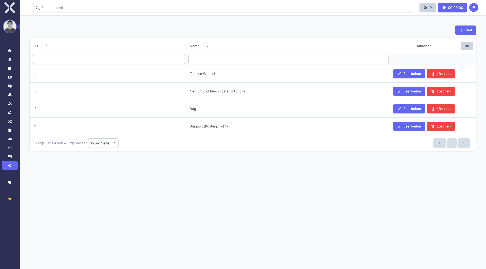

# Ticketarten

Unter **Einstellungen > Tickets > Ticketarten** verwalten Sie die verschiedenen Typen von Support-Tickets.

Ticketarten ermöglichen eine strukturierte Kategorisierung von Kundenanfragen und internen Tickets. Durch die Verwendung unterschiedlicher Ticketarten können Sie Anfragen gezielt zuordnen, priorisieren und auswerten.

## Übersicht

1. Navigieren Sie zu **Einstellungen > Tickets > Ticketarten**.

   

2. Die Tabelle zeigt alle verfügbaren Ticketarten.

### Angezeigte Spalten

- **Name** - Die Bezeichnung der Ticketart

Typische Ticketarten sind:

- **Support** - Allgemeine Support-Anfragen
- **Bug** - Fehlermeldungen und technische Probleme
- **Feature Wunsch** - Anfragen für neue Funktionen
- **Neu Entwicklung** - Umfangreiche Entwicklungsprojekte
- **Beratung** - Beratungsleistungen
- **Wartung** - Regelmäßige Wartungsarbeiten

## Ticketart anlegen

Um eine neue Ticketart zu erstellen:

1. Klicken Sie auf die Schaltfläche **Neu**.
2. Geben Sie im Feld **Name** die Bezeichnung der Ticketart ein (z. B. "Schulungsanfrage").
3. Klicken Sie auf **Speichern**.

### Hinweise zum Anlegen

- Der **Name** sollte eindeutig und selbsterklärend sein.
- Wählen Sie prägnante Bezeichnungen, die den Zweck klar beschreiben.
- Vermeiden Sie zu viele ähnliche Ticketarten, um die Auswahl übersichtlich zu halten.

### Best Practices für Ticketarten

#### Klare Abgrenzung

Jede Ticketart sollte einen eindeutigen Anwendungsbereich haben. Beispiele:

- **Bug** - Für technische Fehler im System
- **Feature Wunsch** - Für gewünschte Erweiterungen
- **Support** - Für Hilfestellungen bei der Nutzung

#### Konsistente Benennung

Verwenden Sie einheitliche Begriffe und Schreibweisen:

- Einheitliche Sprache (durchgängig Deutsch oder Englisch)
- Klare Formulierungen ohne Abkürzungen
- Verständliche Begriffe für alle Nutzer

## Ticketart bearbeiten

Um eine bestehende Ticketart zu ändern:

1. Klicken Sie auf die gewünschte Ticketart in der Tabelle.
2. Passen Sie den **Namen** nach Bedarf an.
3. Klicken Sie auf **Speichern**.

## Ticketart löschen

Ticketarten können gelöscht werden, wenn sie nicht mehr benötigt werden:

1. Öffnen Sie die zu löschende Ticketart.
2. Klicken Sie auf **Löschen**.
3. Bestätigen Sie den Löschvorgang.

> **Hinweis:** Ticketarten, die bereits Tickets zugeordnet sind, können nicht gelöscht werden. Sie müssen zunächst alle betroffenen Tickets einer anderen Ticketart zuordnen.

## Verwendung von Ticketarten

Ticketarten werden an verschiedenen Stellen im System verwendet:

### Bei der Ticketerstellung

- Bei der Anlage eines neuen Tickets wird die Ticketart ausgewählt
- Dies hilft bei der ersten Einordnung der Anfrage
- Die Ticketart kann auch später noch geändert werden

### Für die Bearbeitung

- Tickets können nach Ticketart gefiltert werden
- Mitarbeiter können sich auf bestimmte Ticketarten spezialisieren
- Workflows können ticketartspezifisch definiert werden

### Für Auswertungen

- Statistiken können nach Ticketarten ausgewertet werden
- Häufigkeitsanalysen zeigen typische Problemfelder auf
- Bearbeitungszeiten können pro Ticketart gemessen werden

### Für die Abrechnung

- Verschiedene Ticketarten können unterschiedlich abgerechnet werden
- Stundensätze können ticketartabhängig sein
- Pauschalen können pro Ticketart definiert werden

## Ticketarten strategisch einsetzen

### Priorisierung

Nutzen Sie Ticketarten zur Priorisierung:

- **Bug** - Höchste Priorität, schnelle Bearbeitung erforderlich
- **Feature Wunsch** - Mittlere Priorität, kann geplant werden
- **Beratung** - Nach Verfügbarkeit

### Service Level Agreements (SLA)

Definieren Sie für jede Ticketart eigene SLAs:

- **Support** - Reaktionszeit 4 Stunden, Lösungszeit 24 Stunden
- **Bug** - Reaktionszeit 2 Stunden, Lösungszeit 8 Stunden
- **Feature Wunsch** - Reaktionszeit 24 Stunden, keine feste Lösungszeit

### Verantwortlichkeiten

Ordnen Sie Ticketarten bestimmten Teams oder Personen zu:

- **Bug** - Entwicklungsteam
- **Support** - Support-Team
- **Neu Entwicklung** - Projektmanagement

> **Empfehlung:** Beginnen Sie mit wenigen, klar abgegrenzten Ticketarten. Sie können bei Bedarf jederzeit weitere hinzufügen. Eine zu feine Unterteilung kann die Auswahl erschweren und zu Fehlzuordnungen führen.

## Weiterführende Themen

- [Einstellungen](0-index.md) - Zurück zur Einstellungsübersicht
- [Tickets](../9-tickets/0-index.md) - Ticketmodul verwenden
