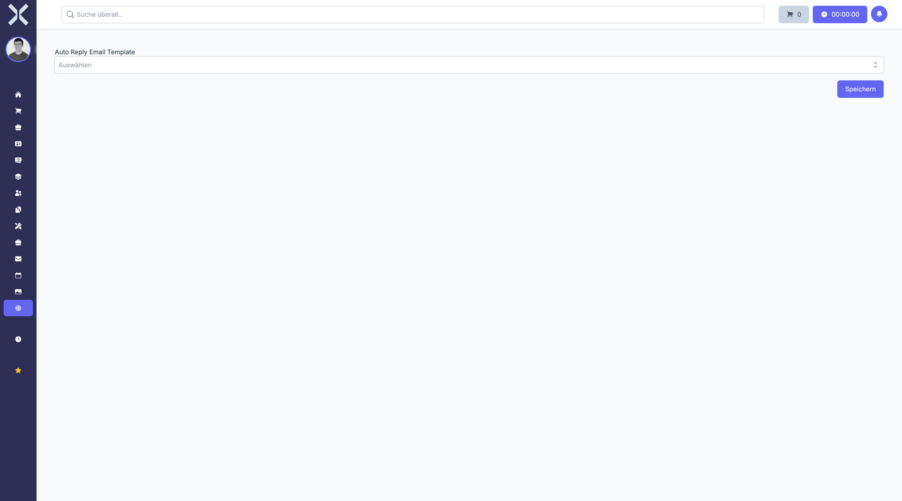

# Ticket-Einstellungen

Unter **Einstellungen > Tickets > Ticket-Einstellungen** konfigurieren Sie die allgemeinen Einstellungen für das Ticketmodul.

Die Ticket-Einstellungen definieren das grundlegende Verhalten des Ticketsystems, von der automatischen Ticketnummerierung über Benachrichtigungen bis hin zu Standard-Zuweisungen.

## Übersicht

1. Navigieren Sie zu **Einstellungen > Tickets > Ticket-Einstellungen**.

   

2. Hier legen Sie allgemeine Parameter für das Ticketsystem fest.

## Verfügbare Einstellungen

Die Ticket-Einstellungen umfassen verschiedene Bereiche zur Konfiguration des Ticketsystems.

### Ticketnummerierung

Legen Sie fest, wie Tickets nummeriert werden:

- **Präfix** - Vorangestellter Text (z. B. "TKT-")
- **Startnummer** - Die erste zu vergebende Ticketnummer
- **Nummerierung** - Format der Ticketnummer (fortlaufend, jahresbasiert)
- **Länge** - Mindestlänge mit führenden Nullen

Beispiel: Mit Präfix "TKT-" und Länge 5 ergibt sich "TKT-00001", "TKT-00002" usw.

### Standard-Ticketart

Wählen Sie die Ticketart, die bei neuen Tickets vorausgewählt wird:

- Diese Einstellung erleichtert die schnelle Ticketerstellung
- Die Ticketart kann beim Anlegen jederzeit geändert werden
- Sinnvoll ist die häufigste Ticketart (z. B. "Support")

### Automatische Zuweisungen

Konfigurieren Sie, wie neue Tickets automatisch zugewiesen werden:

#### Automatische Zuweisung aktivieren

Wenn aktiviert, werden neue Tickets automatisch einem Bearbeiter zugewiesen:

- **Round-Robin** - Gleichmäßige Verteilung auf alle verfügbaren Bearbeiter
- **Nach Verfügbarkeit** - Zuweisung an Bearbeiter mit den wenigsten offenen Tickets
- **Nach Ticketart** - Zuweisung abhängig von der Ticketart
- **Nach Kunde** - Zuweisung basierend auf der Kundenzuordnung

#### Standardbearbeiter

Definieren Sie einen Standardbearbeiter, wenn keine automatische Zuweisung greift.

### E-Mail-Einstellungen

Konfigurieren Sie die E-Mail-Funktionen des Ticketsystems:

#### E-Mail-Parsing

- **Aktivieren** - Eingehende E-Mails werden automatisch in Tickets umgewandelt
- **E-Mail-Konto** - Das zu überwachende E-Mail-Postfach
- **Automatische Kundenzuordnung** - Tickets werden anhand der Absender-E-Mail einem Kunden zugeordnet

#### E-Mail-Benachrichtigungen

Legen Sie fest, wann E-Mail-Benachrichtigungen versendet werden:

- **Bei neuem Ticket** - Benachrichtigung an zugewiesenen Bearbeiter
- **Bei neuem Kommentar** - Benachrichtigung an beteiligte Personen
- **Bei Statusänderung** - Benachrichtigung an Kunde und Bearbeiter
- **Bei Zuweisung** - Benachrichtigung an neu zugewiesenen Bearbeiter

### Service Level Agreements (SLA)

Definieren Sie Standard-SLA-Einstellungen:

#### Reaktionszeiten

- **Erste Antwort** - Maximale Zeit bis zur ersten Reaktion (in Stunden)
- **Eskalation** - Zeit bis zur Eskalation bei fehlender Reaktion

#### Lösungszeiten

- **Standard-Lösungszeit** - Erwartete Zeit bis zur Lösung (in Stunden)
- **Kritische Tickets** - Verkürzte Lösungszeit für dringende Fälle

#### Arbeitszeiten

- **Geschäftszeiten** - Zeiten, in denen SLAs gelten
- **Wochenenden** - Ob Wochenenden in SLA-Berechnungen einbezogen werden
- **Feiertage** - Berücksichtigung von Feiertagen

### Statusverwaltung

Konfigurieren Sie das Verhalten von Ticketstatus:

- **Standard-Status** - Status für neu erstellte Tickets (z. B. "Neu")
- **Status bei Zuweisung** - Automatische Statusänderung bei Zuweisung
- **Geschlossen-Status** - Status, die als "abgeschlossen" gelten

### Zusätzliche Optionen

#### Kundensichtbarkeit

- **Kundenportal** - Kunden können eigene Tickets einsehen
- **Kommentare** - Welche Kommentare für Kunden sichtbar sind
- **Anhänge** - Kunden können Dateien hochladen

#### Interne Notizen

- **Interne Kommentare** - Aktivierung von nicht-öffentlichen Kommentaren
- **Zeiterfassung** - Automatische Zeiterfassung bei Ticketbearbeitung

## Einstellungen anpassen

Um die Ticket-Einstellungen zu ändern:

1. Navigieren Sie zu den gewünschten Einstellungsbereichen.
2. Passen Sie die Optionen nach Ihren Anforderungen an.
3. Klicken Sie auf **Speichern**, um die Änderungen zu übernehmen.

> **Hinweis:** Einstellungsänderungen wirken sich nur auf neu erstellte Tickets oder zukünftige Aktionen aus. Bestehende Tickets bleiben unverändert.

## Best Practices

### Klare SLA-Definitionen

Definieren Sie realistische und erreichbare SLAs:

- Orientieren Sie sich an tatsächlichen Bearbeitungszeiten
- Berücksichtigen Sie Ihre Ressourcen
- Kommunizieren Sie SLAs transparent an Kunden

### E-Mail-Integration

Nutzen Sie E-Mail-Parsing für einen effizienten Workflow:

- Richten Sie ein dediziertes Support-Postfach ein
- Verwenden Sie automatische Bestätigungs-E-Mails
- Definieren Sie klare E-Mail-Vorlagen

### Automatisierung mit Bedacht

Automatische Zuweisungen können hilfreich sein, sollten aber:

- Flexibel bleiben (manuelle Umverteilung möglich)
- Überwacht werden (Gleichmäßige Auslastung prüfen)
- Angepasst werden (Bei Änderung der Teamstruktur)

> **Achtung:** Zu strenge SLAs oder zu viele automatische Benachrichtigungen können kontraproduktiv sein. Finden Sie ein ausgewogenes Maß, das Ihre Arbeitsabläufe unterstützt, ohne zu überfordern.

## Weiterführende Themen

- [Einstellungen](0-index.md) - Zurück zur Einstellungsübersicht
- [Tickets](../9-tickets/0-index.md) - Ticketmodul verwenden
