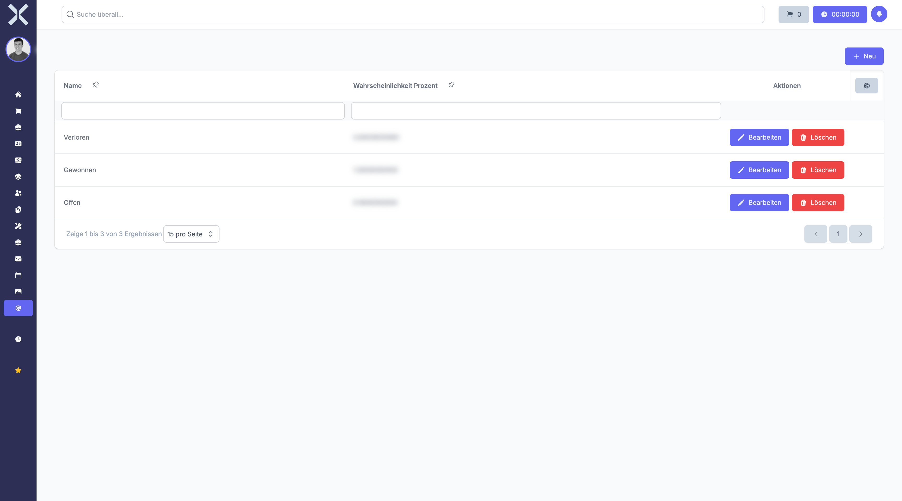

# Lead-Status

Unter **Einstellungen > Verkauf > Lead-Status** verwalten Sie die verfügbaren Statuswerte für Leads in Ihrer Vertriebspipeline.

Lead-Status repräsentieren die verschiedenen Phasen im Verkaufsprozess, die ein potenzieller Kunde durchläuft. Sie bilden die Grundlage für die visuelle Darstellung Ihrer Vertriebspipeline und ermöglichen eine strukturierte Nachverfolgung von Verkaufschancen.

## Übersicht

1. Navigieren Sie zu **Einstellungen > Verkauf > Lead-Status**.

   

2. Die Tabelle zeigt alle konfigurierten Lead-Status in ihrer Pipeline-Reihenfolge.

### Angezeigte Spalten

- **Name** - Die Bezeichnung des Status (z. B. "Erstkontakt", "Angebot erstellt")
- **Wahrscheinlichkeit** - Die prozentuale Erfolgswahrscheinlichkeit in dieser Phase
- **Farbe** - Die Farbkodierung für die visuelle Darstellung
- **Reihenfolge** - Die Position in der Pipeline

## Lead-Status anlegen

Um einen neuen Lead-Status zu erstellen:

1. Klicken Sie auf die Schaltfläche **Neu**.
2. Geben Sie im Feld **Name** die Bezeichnung des Status ein (z. B. "Verhandlung").
3. Legen Sie die **Wahrscheinlichkeit** fest (0-100 %).
4. Wählen Sie eine **Farbe** für die visuelle Darstellung.
5. Markieren Sie optional:
   - **Als Standard festlegen** - Dieser Status wird für neue Leads vorausgewählt
   - **Lead gewonnen** - Dieser Status kennzeichnet erfolgreich abgeschlossene Leads
   - **Lead verloren** - Dieser Status kennzeichnet gescheiterte Verkaufschancen
6. Klicken Sie auf **Speichern**.

### Felder im Detail

#### Name

Der Name sollte die Phase im Verkaufsprozess klar beschreiben. Typische Status sind:

- **Neu** - Lead wurde gerade angelegt
- **Qualifiziert** - Lead wurde als aussichtsreich eingestuft
- **Erstkontakt** - Erster Kontakt wurde hergestellt
- **Bedarfsanalyse** - Kundenbedarf wird ermittelt
- **Angebot erstellt** - Angebot wurde unterbreitet
- **Verhandlung** - Preis- und Vertragsverhandlungen laufen
- **Gewonnen** - Auftrag wurde erteilt
- **Verloren** - Verkaufschance wurde nicht realisiert

#### Wahrscheinlichkeit (Probability Percentage)

Die Wahrscheinlichkeit gibt an, mit welcher Chance ein Lead in dieser Phase zum Abschluss kommt:

- **0 %** - Sehr frühe Phase oder bereits verloren
- **25 %** - Erste Kontaktphase
- **50 %** - Konkrete Verhandlungen
- **75 %** - Kurz vor Abschluss
- **100 %** - Gewonnen

Diese Werte fließen in die Umsatzprognose ein und helfen bei der realistischen Einschätzung Ihrer Pipeline.

#### Farbe

Die Farbkodierung ermöglicht eine schnelle visuelle Orientierung:

- **Grün** - Positive Entwicklung, kurz vor Abschluss
- **Gelb** - Mittlere Phase, Entwicklung läuft
- **Orange** - Kritische Phase, Aufmerksamkeit erforderlich
- **Rot** - Verloren oder gefährdet
- **Blau** - Neutral, frühe Phase

#### Status-Markierungen

##### Als Standard festlegen

Der als Standard markierte Status wird automatisch bei der Anlage neuer Leads vorausgewählt. Üblicherweise ist dies der Status "Neu" oder "Qualifiziert".

##### Lead gewonnen

Markieren Sie Status, die einen erfolgreichen Abschluss repräsentieren. Leads mit diesem Status:

- Fließen in die Erfolgsstatistiken ein
- Werden in Umsatzauswertungen berücksichtigt
- Können in Kunden umgewandelt werden

##### Lead verloren

Markieren Sie Status, die gescheiterte Verkaufschancen kennzeichnen. Dies ermöglicht:

- Analyse der Verlustgründe
- Berechnung der Conversion Rate
- Identifikation von Schwachstellen im Vertriebsprozess

## Lead-Status bearbeiten

Um einen bestehenden Lead-Status zu ändern:

1. Klicken Sie auf den gewünschten Status in der Tabelle.
2. Passen Sie die Felder nach Bedarf an.
3. Klicken Sie auf **Speichern**.

### Reihenfolge ändern

Die Reihenfolge der Status definiert den logischen Ablauf Ihrer Vertriebspipeline. Sie können die Reihenfolge ändern durch:

- Drag & Drop in der Tabellenansicht (wenn verfügbar)
- Manuelle Anpassung der Positionsnummer

> **Hinweis:** Die Reihenfolge sollte den tatsächlichen Verkaufsprozess widerspiegeln, von der ersten Kontaktaufnahme bis zum Abschluss.

## Lead-Status löschen

Status können gelöscht werden, wenn sie nicht mehr benötigt werden:

1. Öffnen Sie den zu löschenden Status.
2. Klicken Sie auf **Löschen**.
3. Bestätigen Sie den Löschvorgang.

> **Hinweis:** Lead-Status, die bereits Leads zugeordnet sind, können nicht gelöscht werden. Sie müssen zunächst alle betroffenen Leads einem anderen Status zuweisen.

## Verwendung von Lead-Status

Lead-Status werden in verschiedenen Bereichen genutzt:

### Pipeline-Ansicht

- Visuelle Darstellung der Leads nach Status
- Drag & Drop zum Verschieben von Leads zwischen Status
- Schneller Überblick über die Verteilung

### Prognosen und Berichte

- Gewichtete Umsatzprognosen basierend auf Wahrscheinlichkeiten
- Conversion Rate pro Status
- Durchschnittliche Verweildauer in jeder Phase

### Workflow und Automatisierung

- Automatische Aktionen bei Statuswechsel
- Benachrichtigungen bei bestimmten Status
- Aufgaben-Erinnerungen für zeitkritische Phasen

## Best Practices für Lead-Status

### Realistische Wahrscheinlichkeiten

Basieren Sie die Wahrscheinlichkeiten auf tatsächlichen Erfahrungswerten:

- Analysieren Sie historische Conversion Rates
- Passen Sie Werte regelmäßig an
- Unterscheiden Sie zwischen optimistischer und realistischer Einschätzung

### Klarer Vertriebsprozess

Die Status sollten einen logischen Ablauf ergeben:

1. Neu/Erstkontakt (10-20 %)
2. Qualifiziert (25 %)
3. Bedarfsanalyse (40 %)
4. Angebot erstellt (60 %)
5. Verhandlung (80 %)
6. Gewonnen (100 %) oder Verloren (0 %)

### Nicht zu viele Status

Vermeiden Sie eine zu feine Unterteilung:

- 5-8 Status sind meist ausreichend
- Jeder Status sollte eine klare Bedeutung haben
- Zu viele Status erschweren die Übersicht

> **Empfehlung:** Starten Sie mit einem einfachen Prozess und verfeinern Sie ihn basierend auf den Erfahrungen Ihres Vertriebsteams. Die Status sollten die tatsächliche Arbeitsweise widerspiegeln, nicht eine theoretische Idealpipeline.

## Weiterführende Themen

- [Einstellungen](0-index.md) - Zurück zur Einstellungsübersicht
- [Verkauf](../3-verkauf/0-index.md) - Verkaufsmodul verwenden
