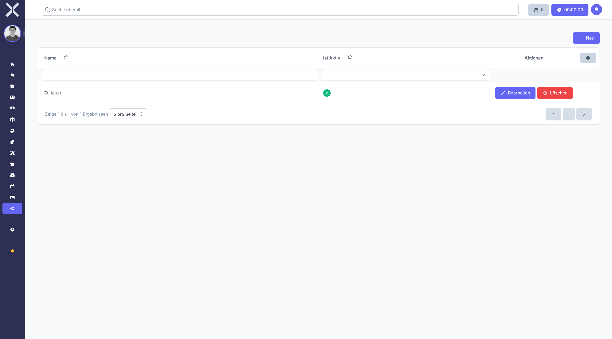

# Lead-Verlustgründe

Unter **Einstellungen > Verkauf > Lead-Verlustgründe** verwalten Sie die Gründe, die erfasst werden, wenn Verkaufschancen nicht erfolgreich abgeschlossen werden.

Die systematische Erfassung von Verlustgründen ist ein wichtiges Instrument zur Analyse und Verbesserung Ihrer Vertriebsaktivitäten. Sie ermöglicht es, Muster zu erkennen, Schwachstellen zu identifizieren und gezielte Maßnahmen zur Steigerung der Erfolgsquote zu ergreifen.

## Übersicht

1. Navigieren Sie zu **Einstellungen > Verkauf > Lead-Verlustgründe**.

   

2. Die Tabelle zeigt alle verfügbaren Verlustgründe.

### Angezeigte Spalten

- **Name** - Die Bezeichnung des Verlustgrundes

Die Liste kann nach Namen durchsucht werden.

## Verlustgrund anlegen

Um einen neuen Verlustgrund zu erstellen:

1. Klicken Sie auf die Schaltfläche **Neu**.
2. Geben Sie im Feld **Name** die Bezeichnung des Verlustgrundes ein (z. B. "Zu hoher Preis").
3. Klicken Sie auf **Speichern**.

### Typische Verlustgründe

Eine gut strukturierte Liste von Verlustgründen sollte die häufigsten Szenarien abdecken:

#### Preisbezogene Gründe

- **Zu hoher Preis** - Das Angebot war zu teuer
- **Günstigeres Konkurrenzangebot** - Mitbewerber war preislich attraktiver
- **Budget nicht vorhanden** - Kunde hat kein Budget für die Investition
- **Kosten-Nutzen-Verhältnis** - Preis steht nicht im Verhältnis zum erwarteten Nutzen

#### Produktbezogene Gründe

- **Funktionen fehlen** - Erforderliche Features sind nicht vorhanden
- **Zu komplex** - Lösung ist zu umfangreich für die Anforderungen
- **Technisch nicht geeignet** - Produkt erfüllt technische Anforderungen nicht
- **Qualitätsbedenken** - Zweifel an der Produktqualität

#### Zeitbezogene Gründe

- **Projekt verschoben** - Investition wurde auf unbestimmte Zeit verschoben
- **Zeitrahmen zu eng** - Umsetzung kann nicht im gewünschten Zeitrahmen erfolgen
- **Entscheidung verzögert** - Kunde benötigt mehr Zeit für die Entscheidung

#### Wettbewerbsbezogene Gründe

- **Konkurrent gewählt** - Kunde hat sich für einen Mitbewerber entschieden
- **Bestandssystem beibehalten** - Kunde bleibt bei der aktuellen Lösung
- **Inhouse-Entwicklung** - Kunde entwickelt eigene Lösung

#### Kommunikationsbezogene Gründe

- **Kein Interesse mehr** - Kunde hat das Interesse verloren
- **Kontakt abgebrochen** - Kunde reagiert nicht mehr
- **Falsche Zielgruppe** - Angebot passt nicht zur Zielgruppe
- **Entscheider nicht erreicht** - Zugang zum eigentlichen Entscheider fehlte

#### Sonstige Gründe

- **Unternehmensänderung** - Fusion, Übernahme oder andere strukturelle Änderungen
- **Wirtschaftliche Gründe** - Allgemeine wirtschaftliche Situation des Kunden
- **Sonstiges** - Für Sonderfälle, die nicht kategorisiert werden können

### Hinweise zum Anlegen

- Verwenden Sie klare, eindeutige Bezeichnungen
- Vermeiden Sie zu viele ähnliche Gründe
- Orientieren Sie sich an tatsächlich auftretenden Situationen
- Halten Sie die Liste überschaubar (10-15 Gründe sind meist ausreichend)

## Verlustgrund bearbeiten

Um einen bestehenden Verlustgrund zu ändern:

1. Klicken Sie auf den gewünschten Verlustgrund in der Tabelle.
2. Passen Sie den **Namen** nach Bedarf an.
3. Klicken Sie auf **Speichern**.

## Verlustgrund löschen

Verlustgründe können gelöscht werden, wenn sie nicht mehr benötigt werden:

1. Öffnen Sie den zu löschenden Verlustgrund.
2. Klicken Sie auf **Löschen**.
3. Bestätigen Sie den Löschvorgang.

> **Hinweis:** Verlustgründe, die bereits Leads zugeordnet sind, können nicht gelöscht werden. Die historischen Daten bleiben damit konsistent und auswertbar.

## Verwendung von Verlustgründen

Verlustgründe werden in verschiedenen Bereichen genutzt:

### Bei der Lead-Bearbeitung

Wenn ein Lead als verloren markiert wird:

1. Der Lead-Status wechselt zu einem "Verloren"-Status
2. Der zuständige Mitarbeiter wählt den zutreffenden Verlustgrund aus
3. Optional kann ein zusätzlicher Kommentar erfasst werden
4. Diese Informationen werden dauerhaft beim Lead gespeichert

### Für Auswertungen und Analysen

Die erfassten Verlustgründe ermöglichen wichtige Auswertungen:

#### Häufigkeitsanalyse

- Welche Verlustgründe treten am häufigsten auf?
- Gibt es Trends oder saisonale Muster?
- In welchen Vertriebsphasen verlieren wir die meisten Leads?

#### Finanzielle Auswirkung

- Wie viel potenzieller Umsatz geht durch welche Verlustgründe verloren?
- Welche Verlustgründe haben den größten finanziellen Impact?
- Wo lohnt sich der Einsatz von Verbesserungsmaßnahmen am meisten?

#### Mitarbeitervergleich

- Gibt es Unterschiede in den Verlustgründen zwischen Vertriebsmitarbeitern?
- Welche Mitarbeiter haben bei bestimmten Herausforderungen Erfolg?
- Wo besteht Schulungs- oder Unterstützungsbedarf?

#### Produktbezogene Erkenntnisse

- Welche Produktmängel führen zu Verlusten?
- Gibt es wiederkehrende Feature-Anfragen?
- Wo besteht Entwicklungsbedarf?

### Für Verbesserungsmaßnahmen

Basierend auf den Verlustgründen können gezielte Maßnahmen ergriffen werden:

#### Bei Preisproblemen

- Preismodelle überarbeiten
- Flexiblere Zahlungsbedingungen anbieten
- Wertargumentation verbessern
- ROI-Kalkulatoren bereitstellen

#### Bei Produktmängeln

- Entwicklungsroadmap anpassen
- Fehlende Features priorisieren
- Produktpositionierung überdenken

#### Bei Wettbewerbssituationen

- Competitive Intelligence verbessern
- Alleinstellungsmerkmale stärker kommunizieren
- Schnellere Angebotsabgabe

#### Bei Kommunikationsproblemen

- Vertriebsprozess optimieren
- Follow-up-Strategien anpassen
- Qualifizierung verbessern

## Best Practices

### Ehrliche Erfassung

Die Verlustgründe sollten ehrlich und realistisch erfasst werden:

- Keine Beschönigung aus falscher Rücksichtnahme
- Objektive Einschätzung, nicht Selbstschutz
- Bei Unsicherheit: Rücksprache mit Vorgesetzten

### Regelmäßige Überprüfung

Überprüfen Sie die Verlustgründe regelmäßig:

- Sind alle Gründe noch relevant?
- Fehlen neue Kategorien?
- Sind Anpassungen aufgrund von Marktveränderungen nötig?

### Aktive Nutzung

Verlustgründe sollten aktiv genutzt werden:

- Quartalsweise Auswertungen durchführen
- Erkenntnisse im Team besprechen
- Konkrete Maßnahmen ableiten und umsetzen
- Erfolg der Maßnahmen später bewerten

> **Empfehlung:** Nutzen Sie Verlustgründe nicht als Rechtfertigung, sondern als Chance zur Verbesserung. Eine offene Fehlerkultur und die systematische Analyse von gescheiterten Verkaufschancen sind der Schlüssel zu kontinuierlicher Weiterentwicklung.

## Weiterführende Themen

- [Einstellungen](0-index.md) - Zurück zur Einstellungsübersicht
- [Verkauf](../3-verkauf/0-index.md) - Verkaufsmodul verwenden
