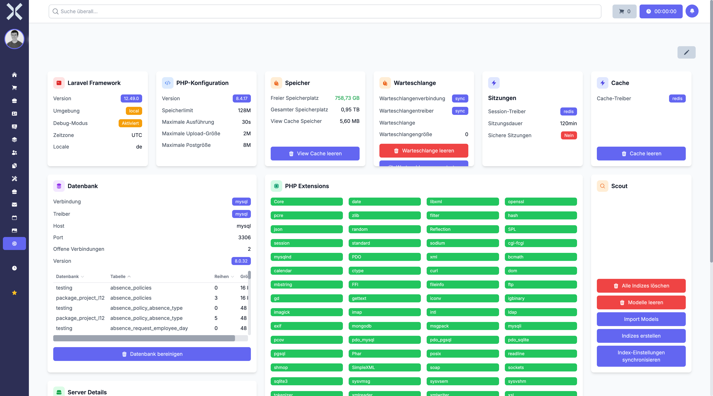

# Systemeinstellungen

Die Systemeinstellungen bieten einen Überblick über die technische Infrastruktur und erweiterte Systemparameter. Diese Seite richtet sich primär an Systemadministratoren und technische Betreuer.

## Navigation

1. Navigieren Sie zu **Einstellungen > System > Systemeinstellungen**.

   

2. Die Seite zeigt verschiedene Widgets mit Systeminformationen und Konfigurationsoptionen.

## Übersicht

Die Systemeinstellungen-Seite ist in mehrere Informationsbereiche unterteilt, die wichtige Systemdetails anzeigen.

### PHP-Informationen

Zeigt Details zur installierten PHP-Version:

- **Version** - Die aktuell verwendete PHP-Version
- **Memory Limit** - Das maximale Speicherlimit für PHP-Prozesse
- **Upload Max Filesize** - Die maximale Dateigröße für Uploads
- **Post Max Size** - Die maximale Größe für POST-Anfragen
- **Max Execution Time** - Die maximale Ausführungszeit für Skripte

### Laravel-Informationen

Zeigt Informationen zum Laravel-Framework:

- **Version** - Die installierte Laravel-Version
- **Umgebung** - Die aktuelle Umgebung (production, local, staging)
- **Debug-Modus** - Ob der Debug-Modus aktiviert ist
- **Wartungsmodus** - Ob sich die Anwendung im Wartungsmodus befindet

### Datenbank-Informationen

Zeigt Details zur Datenbankverbindung:

- **Treiber** - Der verwendete Datenbanktreiber (z.B. MySQL, PostgreSQL)
- **Version** - Die Version des Datenbankservers
- **Datenbankname** - Der Name der aktuellen Datenbank
- **Verbindungsstatus** - Ob die Verbindung aktiv ist

### Cache-Verwaltung

Ermöglicht die Verwaltung verschiedener Caches:

- **Anwendungs-Cache leeren** - Löscht den Application Cache
- **Konfigurations-Cache leeren** - Löscht den Config Cache
- **Route-Cache leeren** - Löscht den Route Cache
- **View-Cache leeren** - Löscht kompilierte Blade-Templates
- **Alle Caches leeren** - Löscht alle Cache-Typen gleichzeitig

### Server-Informationen

Zeigt Informationen zum Webserver:

- **Betriebssystem** - Das Serverbetriebssystem
- **Webserver** - Der verwendete Webserver (z.B. Apache, Nginx)
- **Server-IP** - Die IP-Adresse des Servers
- **Festplattenspeicher** - Verfügbarer und belegter Speicherplatz

### Queue-Informationen

Zeigt den Status der Warteschlangen:

- **Queue-Treiber** - Der verwendete Queue-Treiber (z.B. Redis, Database)
- **Wartende Jobs** - Anzahl der wartenden Hintergrundaufgaben
- **Verarbeitete Jobs** - Anzahl der erfolgreich abgeschlossenen Jobs
- **Fehlgeschlagene Jobs** - Anzahl der fehlgeschlagenen Jobs

### Session-Informationen

Zeigt Details zur Session-Verwaltung:

- **Session-Treiber** - Der verwendete Session-Speicher
- **Session-Lebensdauer** - Die Gültigkeitsdauer von Sessions
- **Aktive Sessions** - Anzahl der aktuell aktiven Benutzer-Sessions

### Storage-Informationen

Zeigt Informationen zu Dateispeichern:

- **Standard-Filesystem** - Das primär verwendete Filesystem
- **Verfügbare Disks** - Konfigurierte Speicherorte
- **Speicherplatz** - Belegung der verschiedenen Storage-Bereiche

### Scout-Informationen

Zeigt Details zur Suchfunktion (wenn aktiviert):

- **Scout-Treiber** - Der verwendete Such-Treiber (z.B. Meilisearch, Algolia)
- **Indexierte Modelle** - Anzahl der durchsuchbaren Datensätze
- **Index-Status** - Aktueller Status der Suchindizes

### PHP-Erweiterungen

Listet installierte PHP-Erweiterungen auf:

- **Geladene Erweiterungen** - Alle aktiven PHP-Module
- **Zend-Erweiterungen** - Spezielle Zend-Engine-Erweiterungen

## Cache leeren

### Was ist der Cache und wozu dient er?

Der Cache ist ein Zwischenspeicher, in dem Nuxbe häufig benötigte Daten ablegt, damit die Anwendung schneller reagieren kann. Anstatt Daten jedes Mal neu aus der Datenbank oder den Konfigurationsdateien zu laden, greift das System auf den Cache zurück. Das beschleunigt die Anwendung erheblich.

Manchmal kann es jedoch vorkommen, dass der Cache veraltete Daten enthält. In solchen Fällen muss er geleert werden, damit das System die aktuellen Daten neu laden kann.

> **Wichtig:** Das Leeren des Caches löscht **keine** Ihrer Daten. Es werden keine Aufträge, Kontakte, Produkte oder andere Geschäftsdaten gelöscht. Es wird lediglich der Zwischenspeicher geleert, sodass das System Konfigurationen und Darstellungen neu aufbaut.

### Wann sollte ich den Cache leeren?

Leeren Sie den Cache in folgenden Situationen:

| Situation | Empfohlene Cache-Aktion |
|-----------|------------------------|
| **Nach einem System-Update** | Alle Caches leeren |
| **Änderungen an Einstellungen werden nicht übernommen** | Konfigurations-Cache leeren |
| **Seiten werden nicht korrekt dargestellt** | View-Cache leeren |
| **Menüpunkte oder Links funktionieren nicht richtig** | Route-Cache leeren |
| **Allgemein unerwartetes Verhalten** | Alle Caches leeren |
| **Das System verhält sich nach einer Änderung wie vorher** | Anwendungs-Cache leeren |

### Cache leeren -- Schritt für Schritt

1. Navigieren Sie zu **Einstellungen > System > Systemeinstellungen**.
2. Suchen Sie das Widget **Cache-Verwaltung**.
3. Sie haben folgende Optionen:

   - **Anwendungs-Cache leeren** -- Löscht den allgemeinen Zwischenspeicher der Anwendung. Das ist die häufigste und sicherste Option.
   - **Konfigurations-Cache leeren** -- Löscht den Zwischenspeicher für Systemeinstellungen. Verwenden Sie dies, wenn Änderungen an den Einstellungen nicht wirksam werden.
   - **Route-Cache leeren** -- Löscht den Zwischenspeicher für Seitenlinks und Navigation. Verwenden Sie dies, wenn Links nicht funktionieren oder auf falsche Seiten führen.
   - **View-Cache leeren** -- Löscht kompilierte Ansichtsdateien (Blade-Templates). Verwenden Sie dies, wenn Seiten fehlerhaft dargestellt werden.
   - **Alle Caches leeren** -- Löscht alle oben genannten Caches gleichzeitig. Dies ist die sicherste Option, wenn Sie unsicher sind, welcher Cache das Problem verursacht.

4. Klicken Sie auf die gewünschte Schaltfläche.
5. Warten Sie auf die Bestätigungsmeldung.

> **Hinweis:** Nach dem Leeren des Caches kann die Anwendung für einige Sekunden bis Minuten **etwas langsamer** reagieren. Das ist normal, da das System alle Daten neu aufbauen muss. Nach kurzer Zeit erreicht die Anwendung wieder ihre normale Geschwindigkeit.

> **Tipp:** Wenn Sie unsicher sind, welchen Cache Sie leeren sollen, verwenden Sie einfach **Alle Caches leeren**. Das ist die einfachste und sicherste Methode. Es dauert nur etwas länger, bis das System wieder volle Geschwindigkeit erreicht.

## Wartungsmodus aktivieren

Der Wartungsmodus zeigt Benutzern eine Wartungsseite, während Sie Systemarbeiten durchführen.

1. Klicken Sie im Widget **Laravel-Informationen** auf **Wartungsmodus aktivieren**.
2. Optional: Geben Sie eine Nachricht ein, die Benutzern angezeigt wird.
3. Bestätigen Sie die Aktivierung.

Um den Wartungsmodus zu beenden, klicken Sie auf **Wartungsmodus deaktivieren**.

> **Hinweis:** Administratoren mit entsprechenden Berechtigungen können auch im Wartungsmodus auf die Anwendung zugreifen.

## Umgebungsvariablen

Die .env-Datei enthält sensible Konfigurationsparameter. Diese sollten niemals direkt in der Benutzeroberfläche angezeigt oder bearbeitet werden.

Umgebungsvariablen umfassen:
- Datenbankzugangsdaten
- API-Schlüssel für externe Dienste
- E-Mail-Server-Konfiguration
- Verschlüsselungsschlüssel

> **Warnung:** Ändern Sie Umgebungsvariablen nur, wenn Sie genau wissen, was Sie tun. Falsche Konfigurationen können die Anwendung unbrauchbar machen.

## Systemvoraussetzungen prüfen

Die Systemeinstellungen zeigen automatisch, ob die Mindestvoraussetzungen erfüllt sind:

- PHP-Version mindestens 8.2
- Erforderliche PHP-Erweiterungen (PDO, OpenSSL, Mbstring, etc.)
- Ausreichende Speicher- und Zeitlimits
- Schreibrechte für Storage- und Cache-Verzeichnisse

Rote Markierungen weisen auf Probleme hin, die behoben werden sollten.

## Wichtige Hinweise

> **Warnung:** Die Systemeinstellungen sollten nur von erfahrenen Administratoren verwendet werden. Unsachgemäße Änderungen können die Anwendung beschädigen.

> **Hinweis:** Nach Änderungen an der Konfiguration müssen oft Caches geleert werden, damit die Änderungen wirksam werden.

> **Sicherheit:** Aktivieren Sie den Debug-Modus niemals in Produktivumgebungen, da dieser sensible Informationen preisgibt.

> **Tipp:** Erstellen Sie vor größeren Systemänderungen immer ein Backup der Datenbank und der Konfigurationsdateien.

## Weiterführende Themen

- [Einstellungen](0-index.md) - Zurück zur Einstellungsübersicht
- [Kerneinstellungen](47-kerneinstellungen.md) - Grundlegende Anwendungseinstellungen
- [Protokolle](54-protokolle.md) - System- und Fehlerprotokolle ansehen
- [Warteschlange](51-warteschlange.md) - Warteschlangen-Monitor
