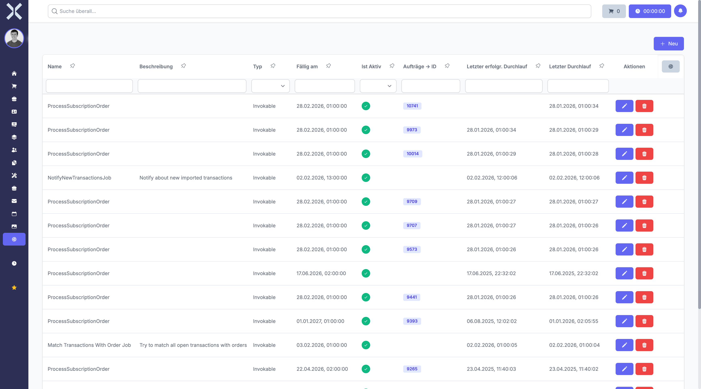

# Zeitplanung

Die Zeitplanung (Scheduling) ermöglicht es Ihnen, wiederkehrende Aufgaben zu automatisieren. Hier verwalten Sie geplante Aufgaben wie automatische Berichte, Datensicherungen, E-Mail-Versand und Datenbereinigung.

## Navigation

1. Navigieren Sie zu **Einstellungen > System > Zeitplanung**.

   

2. Die Tabelle zeigt alle konfigurierten geplanten Aufgaben mit ihren Ausführungsplänen.

## Übersicht

Die Zeitplanungs-Übersicht listet alle automatisierten Aufgaben auf.

### Spalten der Aufgaben-Liste

- **Name** - Der Name der geplanten Aufgabe
- **Beschreibung** - Eine Erklärung, was die Aufgabe macht
- **Typ** - Die Art der Aufgabe (Repeatable, Schedule, etc.)
- **Intervall** - Wie oft die Aufgabe ausgeführt wird
- **Nächste Ausführung** - Wann die Aufgabe das nächste Mal ausgeführt wird
- **Letzte Ausführung** - Wann die Aufgabe zuletzt ausgeführt wurde
- **Letzter Erfolg** - Zeitpunkt der letzten erfolgreichen Ausführung
- **Status** - Ob die Aufgabe aktiv oder pausiert ist

### Ausführungsintervalle

Geplante Aufgaben können in verschiedenen Intervallen ausgeführt werden:

- **Minütlich** - Jede Minute
- **Stündlich** - Jede Stunde zu einer bestimmten Minute
- **Täglich** - Jeden Tag zu einer bestimmten Uhrzeit
- **Wöchentlich** - An bestimmten Wochentagen zu einer bestimmten Uhrzeit
- **Monatlich** - An einem bestimmten Tag des Monats
- **Jährlich** - An einem bestimmten Datum
- **Benutzerdefiniert** - Mit einem benutzerdefinierten Cron-Ausdruck

## Geplante Aufgabe erstellen

Sie können neue wiederkehrende Aufgaben einrichten.

1. Klicken Sie auf **Neu**.
2. Wählen Sie die gewünschte Aufgabe aus der Liste der verfügbaren Aufgaben:
   - **E-Mail-Berichte versenden** - Automatischer Versand von Berichten
   - **Daten bereinigen** - Löschen alter oder temporärer Daten
   - **Import ausführen** - Automatischer Datenimport
   - **Export ausführen** - Automatischer Datenexport
   - **Statistiken aktualisieren** - Neuberechnung von Kennzahlen
3. Die Beschreibung und verfügbaren Parameter werden automatisch geladen.

### Zeitplan konfigurieren

1. Wählen Sie im Bereich **Grundfrequenz** das Basisintervall:
   - Minütlich, Stündlich, Täglich, Wöchentlich, Monatlich
2. Konfigurieren Sie im Bereich **Zeitbeschränkungen** die genaue Ausführungszeit:
   - **Uhrzeit** - Zu welcher Uhrzeit die Aufgabe ausgeführt werden soll
   - **Minute** - Zu welcher Minute die Aufgabe ausgeführt werden soll
3. Legen Sie im Bereich **Tagesbeschränkungen** fest, an welchen Tagen die Aufgabe läuft:
   - **Wochentage** - Montag bis Sonntag
   - **Tag im Monat** - Bestimmter Tag (1-31)

### Erweiterte Optionen

- **Wiederholungen** - Wie oft die Aufgabe maximal ausgeführt werden soll (leer = unbegrenzt)
- **Enddatum** - Wann die Aufgabe automatisch beendet werden soll
- **Fälligkeitsdatum** - Startdatum für die erste Ausführung
- **Aktiv** - Ob die Aufgabe sofort aktiv sein soll

### Parameter konfigurieren

Manche Aufgaben erfordern zusätzliche Parameter:

1. Im Bereich **Parameter** werden aufgabenspezifische Felder angezeigt.
2. Füllen Sie die erforderlichen Felder aus (z.B. E-Mail-Empfänger, Dateipfade).
3. Klicken Sie auf **Speichern**.

## Geplante Aufgabe bearbeiten

1. Klicken Sie in der Liste auf das Bearbeiten-Symbol bei der gewünschten Aufgabe.
2. Ändern Sie Zeitplan, Parameter oder Status.
3. Klicken Sie auf **Speichern**.

Änderungen werden sofort wirksam. Die nächste Ausführungszeit wird automatisch neu berechnet.

## Geplante Aufgabe löschen

1. Klicken Sie in der Liste auf das Löschen-Symbol bei der gewünschten Aufgabe.
2. Bestätigen Sie den Löschvorgang.

> **Hinweis:** Das Löschen einer geplanten Aufgabe stoppt alle zukünftigen Ausführungen. Bereits ausgeführte Aktionen bleiben unberührt.

## Aufgabe aktivieren oder deaktivieren

Sie können Aufgaben temporär pausieren, ohne diese zu löschen.

1. Klicken Sie auf das Bearbeiten-Symbol.
2. Deaktivieren Sie den Schalter **Aktiv**.
3. Klicken Sie auf **Speichern**.

Inaktive Aufgaben werden nicht ausgeführt, ihre Konfiguration bleibt jedoch erhalten.

## Cron-Ausdruck verwenden

Für komplexe Zeitpläne können Sie einen Cron-Ausdruck eingeben.

1. Aktivieren Sie die Option **Erweitert** oder **Cron-Ausdruck**.
2. Geben Sie einen gültigen Cron-Ausdruck ein, z.B.:
   - `*/15 * * * *` - Alle 15 Minuten
   - `0 2 * * *` - Täglich um 2:00 Uhr
   - `0 0 * * 1` - Jeden Montag um Mitternacht
   - `0 9 1 * *` - Am ersten Tag jedes Monats um 9:00 Uhr
3. Klicken Sie auf **Speichern**.

Die Anwendung zeigt Ihnen die nächsten geplanten Ausführungszeiten zur Überprüfung an.

## Ausführungshistorie

Die Spalten **Letzte Ausführung** und **Letzter Erfolg** zeigen:

- **Grün** - Letzte Ausführung war erfolgreich
- **Gelb** - Aufgabe wird gerade ausgeführt
- **Rot** - Letzte Ausführung ist fehlgeschlagen

Klicken Sie auf eine Aufgabe, um Details zu vergangenen Ausführungen zu sehen.

## Systemvoraussetzung

> **Wichtig:** Damit geplante Aufgaben automatisch ausgeführt werden, muss auf dem Server ein Cron-Job eingerichtet sein, der den Laravel Scheduler aufruft.

Der Server-Administrator muss folgenden Cron-Eintrag erstellen:

```
* * * * * cd /pfad/zur/anwendung && php artisan schedule:run >> /dev/null 2>&1
```

Dieser Eintrag sorgt dafür, dass Laravel jede Minute prüft, ob geplante Aufgaben fällig sind.

## Wichtige Hinweise

> **Hinweis:** Geplante Aufgaben werden nur ausgeführt, wenn der Server-Cron-Job korrekt konfiguriert ist. Kontaktieren Sie Ihren Administrator, wenn Aufgaben nicht ausgeführt werden.

> **Warnung:** Setzen Sie Aufgaben, die große Datenmengen verarbeiten, nicht zu häufig an. Dies kann die Server-Performance beeinträchtigen.

> **Tipp:** Testen Sie neue geplante Aufgaben zunächst mit einem kurzen Intervall und überwachen Sie die Ausführung, bevor Sie den endgültigen Zeitplan setzen.

> **Zeitzone:** Alle Zeitangaben verwenden die in den Kerneinstellungen festgelegte Zeitzone.

## Weiterführende Themen

- [Einstellungen](0-index.md) - Zurück zur Einstellungsübersicht
- [Warteschlange](51-warteschlange.md) - Hintergrundaufgaben überwachen
- [Protokolle](54-protokolle.md) - Fehlerprotokolle bei Problemen ansehen
