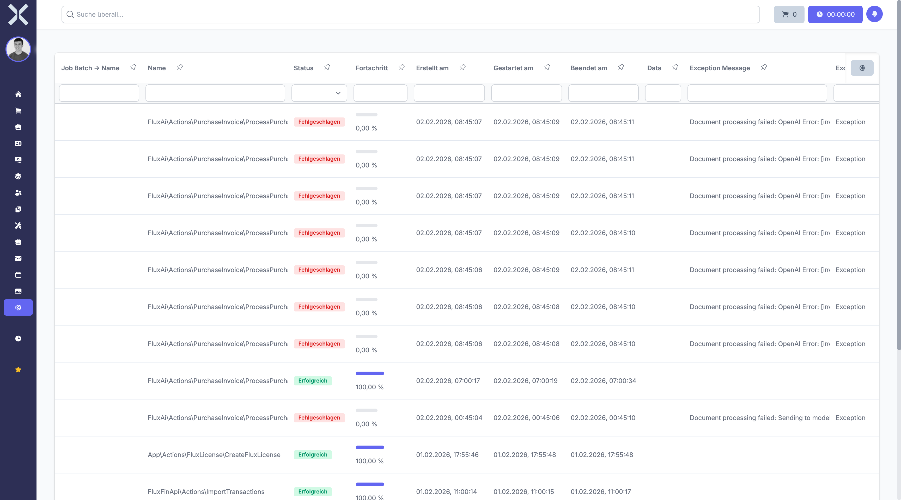

# Warteschlangen-Monitor

Der Warteschlangen-Monitor zeigt den Status von Hintergrundaufgaben (Jobs) in Echtzeit an. Hier überwachen Sie die Verarbeitung zeitintensiver Prozesse wie E-Mail-Versand, Datenimporte, PDF-Generierung und andere asynchrone Aufgaben.

## Navigation

1. Navigieren Sie zu **Einstellungen > System > Warteschlange**.

   

2. Die Übersicht zeigt den aktuellen Status aller Warteschlangen mit Statistiken und aktiven Jobs.

## Übersicht

Die Warteschlangen-Übersicht gliedert sich in mehrere Bereiche.

### Statistiken

Der obere Bereich zeigt wichtige Kennzahlen:

- **Wartende Jobs** - Anzahl der Jobs, die auf Verarbeitung warten
- **Aktive Jobs** - Anzahl der Jobs, die gerade verarbeitet werden
- **Verarbeitete Jobs** - Anzahl der erfolgreich abgeschlossenen Jobs (heute)
- **Fehlgeschlagene Jobs** - Anzahl der fehlgeschlagenen Jobs
- **Durchsatz** - Anzahl der Jobs pro Minute
- **Durchschnittliche Wartezeit** - Wie lange Jobs durchschnittlich in der Warteschlange verbleiben

### Job-Liste

Die Tabelle zeigt alle aktiven und wartenden Jobs:

- **Job-ID** - Eindeutige Kennung des Jobs
- **Typ** - Die Art des Jobs (z.B. SendEmailJob, GeneratePdfJob)
- **Warteschlange** - Die Queue, in der der Job verarbeitet wird (default, high, low, etc.)
- **Status** - Der aktuelle Status des Jobs
- **Fortschritt** - Prozentsatz der Fertigstellung (wenn verfügbar)
- **Versuche** - Wie oft der Job bereits ausgeführt wurde
- **In Warteschlange seit** - Wann der Job erstellt wurde
- **Gestartet um** - Wann die Verarbeitung begonnen hat
- **Daten** - Zusätzliche Informationen zum Job

### Job-Status

Jobs können verschiedene Status haben:

- **Wartend (Queued)** - Der Job wartet auf Verarbeitung
- **Läuft (Running)** - Der Job wird gerade verarbeitet
- **Abgeschlossen (Completed)** - Der Job wurde erfolgreich verarbeitet
- **Fehlgeschlagen (Failed)** - Der Job ist fehlgeschlagen
- **Wiederholend (Retrying)** - Der Job wird nach einem Fehler wiederholt

## Warteschlangen-Typen

Die Anwendung verwendet verschiedene Warteschlangen mit unterschiedlichen Prioritäten:

- **high** - Hochprioritäre Jobs (z.B. Passwortzurücksetzung)
- **default** - Standardpriorität für die meisten Jobs
- **low** - Niedrigprioritäre Jobs (z.B. Statistikaktualisierungen)
- **emails** - Speziell für E-Mail-Versand
- **exports** - Für Datenexporte
- **imports** - Für Datenimporte

Jobs in der high-Queue werden vor Jobs in der default-Queue verarbeitet.

## Job-Details ansehen

1. Klicken Sie auf einen Job in der Liste.
2. Ein Dialog zeigt detaillierte Informationen:
   - Vollständiger Klassenname des Jobs
   - Übergabeparameter und Daten
   - Ausführungshistorie
   - Eventuell aufgetretene Fehler
3. Klicken Sie auf **Schließen**, um den Dialog zu schließen.

## Warteschlangen filtern

Sie können die Anzeige nach verschiedenen Kriterien filtern:

1. Verwenden Sie die Filter oberhalb der Tabelle:
   - **Status** - Nur bestimmte Status anzeigen
   - **Warteschlange** - Nach Queue-Name filtern
   - **Typ** - Nach Job-Typ filtern
   - **Zeitraum** - Jobs aus einem bestimmten Zeitraum
2. Die Liste wird automatisch aktualisiert.

## Echtzeit-Aktualisierung

Der Warteschlangen-Monitor aktualisiert sich automatisch:

- Die Statistiken werden alle 5 Sekunden aktualisiert
- Die Job-Liste wird alle 10 Sekunden aktualisiert
- Neue Jobs erscheinen automatisch in der Liste
- Abgeschlossene Jobs werden nach kurzer Zeit ausgeblendet

Sie können die automatische Aktualisierung pausieren, indem Sie auf **Pause** klicken.

## Diagramme und Visualisierungen

Zusätzlich zur Tabelle zeigt der Monitor Diagramme:

- **Jobs pro Stunde** - Balkendiagramm der Verarbeitungsrate
- **Durchsatzdiagramm** - Zeitverlauf der Job-Verarbeitung
- **Warteschlangen-Verteilung** - Kreisdiagramm der Jobs nach Queue

Diese Diagramme helfen, Engpässe und Lastspitzen zu erkennen.

## Worker-Status

Der Monitor zeigt auch Informationen über die Queue-Worker:

- **Aktive Worker** - Anzahl der laufenden Worker-Prozesse
- **Worker-ID** - Eindeutige Kennung jedes Workers
- **Gestartet um** - Startzeit des Workers
- **Verarbeitete Jobs** - Anzahl der von diesem Worker verarbeiteten Jobs
- **Arbeitsspeicher** - Speichernutzung des Workers

> **Hinweis:** Wenn keine Worker aktiv sind, werden keine Jobs verarbeitet. Kontaktieren Sie Ihren Administrator, um Queue-Worker zu starten.

## Performance-Überwachung

Achten Sie auf folgende Warnzeichen:

- **Steigende Anzahl wartender Jobs** - Worker könnten überlastet sein
- **Hohe durchschnittliche Wartezeit** - Mehr Worker-Prozesse könnten benötigt werden
- **Viele fehlgeschlagene Jobs** - Überprüfen Sie die Fehlermeldungen
- **Lange Laufzeiten** - Einzelne Jobs könnten optimiert werden müssen

## Jobs manuell verarbeiten

In Ausnahmefällen können Sie die Queue-Verarbeitung manuell starten:

> **Warnung:** Diese Funktion ist nur für Administratoren verfügbar und sollte nur in Notfällen verwendet werden, wenn die automatische Verarbeitung nicht funktioniert.

## Wichtige Hinweise

> **Hinweis:** Der Warteschlangen-Monitor zeigt nur Jobs, die im Queue-System gespeichert sind. Synchron ausgeführte Aufgaben erscheinen hier nicht.

> **Performance:** Bei sehr vielen Jobs kann die Anzeige verzögert sein. Verwenden Sie Filter, um die Ansicht zu beschränken.

> **Tipp:** Wenn Jobs dauerhaft in der Warteschlange verbleiben, prüfen Sie, ob Queue-Worker laufen. Der Administrator kann Worker mit `php artisan queue:work` starten.

> **Systemvoraussetzung:** Für die Verarbeitung von Warteschlangen muss auf dem Server ein Queue-Worker-Prozess laufen, typischerweise als Systemdienst konfiguriert.

## Weiterführende Themen

- [Einstellungen](0-index.md) - Zurück zur Einstellungsübersicht
- [Fehlgeschlagene Jobs](52-fehlgeschlagene-jobs.md) - Fehlgeschlagene Aufgaben ansehen und wiederholen
- [Systemeinstellungen](48-system.md) - Queue-Konfiguration prüfen
- [Protokolle](54-protokolle.md) - Detaillierte Fehlerinformationen
