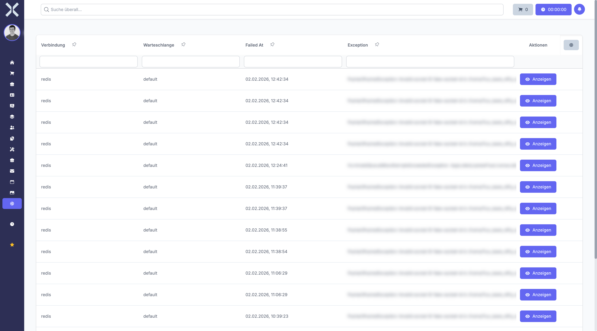

# Fehlgeschlagene Jobs

Die Übersicht der fehlgeschlagenen Jobs zeigt Hintergrundaufgaben an, die nicht erfolgreich verarbeitet werden konnten. Hier können Sie Fehlerursachen analysieren und Jobs erneut ausführen.

## Navigation

1. Navigieren Sie zu **Einstellungen > System > Fehlgeschlagene Jobs**.

   

2. Die Tabelle zeigt alle fehlgeschlagenen Jobs mit Fehlerinformationen und Aktionsmöglichkeiten.

## Übersicht

Die Übersicht listet alle Jobs auf, deren Verarbeitung fehlgeschlagen ist.

### Spalten der Job-Liste

- **Job-ID** - Eindeutige Kennung des fehlgeschlagenen Jobs
- **Typ** - Die Klasse oder Art des Jobs
- **Warteschlange** - In welcher Queue der Job war (default, high, emails, etc.)
- **Fehlgeschlagen am** - Zeitpunkt des Fehlers
- **Fehlermeldung** - Kurze Zusammenfassung des aufgetretenen Fehlers
- **Exception** - Die erste Zeile der Exception-Meldung
- **Versuche** - Wie oft der Job bereits versucht wurde
- **Daten** - Die Payload-Daten des Jobs

## Häufige Fehlerursachen

Jobs können aus verschiedenen Gründen fehlschlagen:

- **Datenbankfehler** - Verbindungsprobleme oder ungültige Daten
- **Externe Dienste** - API-Fehler oder Netzwerkprobleme
- **Fehlende Dateien** - Nicht vorhandene Anhänge oder Ressourcen
- **Speicherprobleme** - PHP-Speicherlimit überschritten
- **Zeitüberschreitung** - Job dauerte zu lange
- **Programmfehler** - Bugs im Code oder fehlende Abhängigkeiten
- **Berechtigungsprobleme** - Fehlende Zugriffsrechte

## Job-Details anzeigen

Um die vollständigen Fehlerinformationen zu sehen:

1. Klicken Sie in der Liste auf **Details anzeigen** oder auf die Zeile des Jobs.
2. Ein Dialog öffnet sich mit detaillierten Informationen:
   - **Vollständiger Exception-Stack-Trace** - Die komplette Fehlermeldung
   - **Job-Daten** - Die Parameter, mit denen der Job ausgeführt wurde
   - **Zeitstempel** - Wann der Job erstellt und wann er fehlgeschlagen ist
   - **Kontext** - Zusätzliche Informationen zum Ausführungskontext
3. Verwenden Sie diese Informationen zur Fehleranalyse.

Der Stack-Trace zeigt genau, an welcher Stelle im Code der Fehler aufgetreten ist.

## Fehlgeschlagenen Job erneut ausführen

Wenn Sie den Fehler behoben haben, können Sie den Job wiederholen:

1. Klicken Sie bei dem gewünschten Job auf **Erneut ausführen**.
2. Der Job wird zurück in die Warteschlange gelegt.
3. Die Queue-Worker verarbeiten den Job erneut.

Der Job verschwindet aus der Liste der fehlgeschlagenen Jobs und erscheint im Warteschlangen-Monitor.

> **Hinweis:** Führen Sie einen Job nur erneut aus, wenn Sie die Fehlerursache behoben haben, sonst schlägt er erneut fehl.

## Mehrere Jobs erneut ausführen

Sie können mehrere fehlgeschlagene Jobs gleichzeitig wiederholen:

1. Aktivieren Sie die Kontrollkästchen der gewünschten Jobs.
2. Klicken Sie auf **Ausgewählte erneut ausführen**.
3. Alle ausgewählten Jobs werden in die Warteschlange zurückgelegt.

Oder klicken Sie auf **Alle erneut ausführen**, um alle fehlgeschlagenen Jobs zu wiederholen.

> **Warnung:** Das erneute Ausführen aller Jobs ohne Fehleranalyse kann zu wiederholten Fehlern führen und die Warteschlange belasten.

## Fehlgeschlagenen Job löschen

Wenn ein Job nicht mehr benötigt wird oder nicht repariert werden kann:

1. Klicken Sie bei dem Job auf **Löschen**.
2. Bestätigen Sie den Löschvorgang.
3. Der Job wird endgültig aus der Datenbank entfernt.

Der gelöschte Job kann nicht wiederhergestellt werden.

## Alle fehlgeschlagenen Jobs löschen

Um die Liste vollständig zu bereinigen:

1. Klicken Sie auf **Alle löschen**.
2. Bestätigen Sie, dass Sie alle fehlgeschlagenen Jobs löschen möchten.
3. Die gesamte Liste wird geleert.

> **Warnung:** Diese Aktion löscht alle fehlgeschlagenen Jobs unwiderruflich. Verwenden Sie diese Funktion nur, wenn Sie sicher sind, dass keiner der Jobs wiederholt werden muss.

## Jobs nach Typ filtern

Bei vielen fehlgeschlagenen Jobs können Sie die Anzeige einschränken:

1. Verwenden Sie das Filterfeld oberhalb der Tabelle.
2. Geben Sie einen Job-Typ, eine Queue oder ein Datum ein.
3. Die Liste zeigt nur passende Jobs.

Dies hilft, systematische Fehler zu erkennen, wenn viele Jobs des gleichen Typs fehlschlagen.

## Fehleranalyse

Bei der Analyse fehlgeschlagener Jobs sollten Sie:

1. **Exception-Typ prüfen** - Handelt es sich um einen bekannten Fehlertyp?
2. **Häufigkeit beachten** - Schlägt ein bestimmter Job-Typ häufig fehl?
3. **Zeitpunkt berücksichtigen** - Gab es zu dieser Zeit andere Probleme?
4. **Job-Daten untersuchen** - Sind die Parameter valide?
5. **System-Logs konsultieren** - Gibt es verwandte Fehlermeldungen?

Wenn viele Jobs zur gleichen Zeit fehlschlagen, deutet dies oft auf ein systemweites Problem hin (z.B. Datenbankausfall, fehlende Netzwerkverbindung).

## Automatische Wiederholungsversuche

Viele Jobs werden automatisch mehrfach versucht, bevor sie als fehlgeschlagen markiert werden:

- Standard: 3 Versuche
- Mit exponentieller Verzögerung zwischen Versuchen
- Nach dem letzten Fehlversuch landet der Job in dieser Liste

Die Spalte **Versuche** zeigt, wie oft der Job bereits ausgeführt wurde.

## Benachrichtigungen

Sie können Benachrichtigungen bei fehlgeschlagenen Jobs einrichten:

1. Navigieren Sie zu **Einstellungen > Benachrichtigungen**.
2. Aktivieren Sie **Bei fehlgeschlagenen Jobs benachrichtigen**.
3. Wählen Sie die Benachrichtigungskanäle (E-Mail, In-App).
4. Klicken Sie auf **Speichern**.

So werden Sie sofort informiert, wenn wichtige Jobs fehlschlagen.

## Wichtige Hinweise

> **Hinweis:** Fehlgeschlagene Jobs bleiben unbegrenzt in der Datenbank, bis Sie diese manuell löschen. Bereinigen Sie die Liste regelmäßig, um die Übersicht zu behalten.

> **Tipp:** Erstellen Sie Screenshots oder exportieren Sie wichtige Fehlerinformationen, bevor Sie Jobs löschen. Diese Informationen können bei der Fehlersuche hilfreich sein.

> **Warnung:** Das wiederholte Ausführen eines fehlerhaften Jobs kann zu Datenduplikaten führen, wenn der Job teilweise erfolgreich war. Prüfen Sie vorher, ob bereits Daten erstellt wurden.

> **Performance:** Eine große Anzahl fehlgeschlagener Jobs kann die Datenbankgröße erhöhen. Löschen Sie alte, nicht mehr relevante Jobs regelmäßig.

## Weiterführende Themen

- [Einstellungen](0-index.md) - Zurück zur Einstellungsübersicht
- [Warteschlange](51-warteschlange.md) - Warteschlangen-Monitor
- [Protokolle](54-protokolle.md) - Detaillierte System-Logs ansehen
- [Aktivitätsprotokolle](53-aktivitaetsprotokolle.md) - Benutzeraktivitäten nachverfolgen
