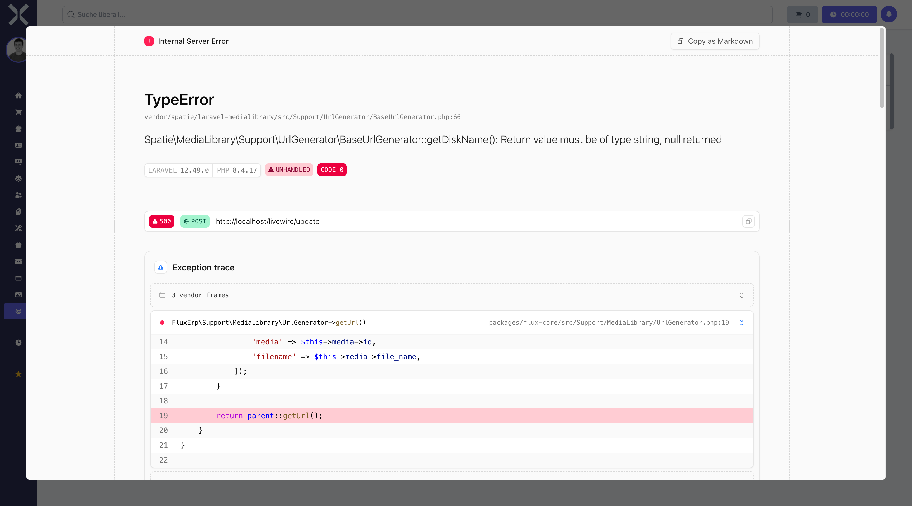

# Druckaufträge

Die Druckaufträge-Übersicht zeigt alle in der Warteschlange befindlichen und abgeschlossenen Druckaufträge. Hier überwachen Sie den Status von Dokumenten, die zum Drucken an Drucker gesendet wurden.

## Navigation

1. Navigieren Sie zu **Einstellungen > System > Druckaufträge**.

   

2. Die Tabelle zeigt alle Druckaufträge mit Status, Drucker und Zeitpunkt.

## Übersicht

Die Druckaufträge-Übersicht listet alle Druckjobs auf.

### Spalten der Druckaufträge-Liste

- **Dokument** - Name oder Typ des zu druckenden Dokuments
- **Drucker** - Auf welchem Drucker der Auftrag ausgegeben werden soll
- **Benutzer** - Wer den Druckauftrag erstellt hat
- **Anzahl** - Wie viele Exemplare gedruckt werden sollen
- **Papierformat** - Das gewählte Format (A4, A5, Letter, etc.)
- **Status** - Der aktuelle Zustand des Druckauftrags
- **Erstellt am** - Wann der Druckauftrag angelegt wurde
- **Aktionen** - Verfügbare Aktionen für den Auftrag

## Druckauftrag-Status

Druckaufträge durchlaufen verschiedene Status:

### Wartend (Pending)

- **Bedeutung** - Der Auftrag wurde erstellt und wartet auf Verarbeitung
- **Anzeige** - Gelbes Badge
- **Nächster Schritt** - Wird zum Drucker gesendet, sobald dieser verfügbar ist

### Druckend (Printing)

- **Bedeutung** - Der Auftrag wird gerade an den Drucker übertragen oder gedruckt
- **Anzeige** - Blaues Badge
- **Dauer** - Abhängig von Dokumentgröße und Druckergeschwindigkeit

### Gedruckt (Completed)

- **Bedeutung** - Der Auftrag wurde erfolgreich gedruckt
- **Anzeige** - Grünes Badge
- **Hinweis** - Der Auftrag bleibt zur Dokumentation in der Liste

### Fehlgeschlagen (Failed)

- **Bedeutung** - Der Druckauftrag konnte nicht verarbeitet werden
- **Anzeige** - Rotes Badge
- **Ursachen** - Drucker offline, Verbindungsfehler, ungültiges Format

## Druckauftrag-Details anzeigen

Um vollständige Informationen zu einem Druckauftrag zu sehen:

1. Klicken Sie auf einen Druckauftrag in der Liste.
2. Ein Dialog öffnet sich mit detaillierten Informationen:
   - **Dokumenttyp** - Art des Dokuments (Rechnung, Lieferschein, etc.)
   - **Datei-Informationen** - Dateigröße, Format (PDF, etc.)
   - **Druckerdetails** - Name, Standort, Modell
   - **Zeitstempel** - Erstellung, Start, Abschluss
   - **Fehlermeldung** - Falls der Auftrag fehlgeschlagen ist
3. Klicken Sie auf **Schließen**, um den Dialog zu schließen.

## Druckauftrag erneut drucken

Wenn ein Druckauftrag fehlgeschlagen ist oder erneut gedruckt werden soll:

1. Klicken Sie in der Zeile des Auftrags auf **Erneut drucken**.
2. Optional: Ändern Sie den Zieldrucker oder die Anzahl der Exemplare.
3. Klicken Sie auf **Drucken**.
4. Ein neuer Druckauftrag wird erstellt.

> **Hinweis:** Bereits erfolgreich gedruckte Aufträge können ebenfalls erneut gedruckt werden, falls Sie weitere Exemplare benötigen.

## Druckauftrag löschen

Um einen Druckauftrag aus der Warteschlange oder Historie zu entfernen:

1. Klicken Sie in der Zeile des Auftrags auf **Löschen**.
2. Bestätigen Sie den Löschvorgang.

Das Löschen eines wartenden Auftrags verhindert dessen Druck. Das Löschen eines abgeschlossenen Auftrags entfernt nur den Eintrag aus der Liste.

> **Warnung:** Druckaufträge, die sich bereits im Status "Druckend" befinden, können möglicherweise nicht mehr gestoppt werden.

## Mehrere Druckaufträge verwalten

Sie können mehrere Aufträge gleichzeitig bearbeiten:

### Mehrere Aufträge erneut drucken

1. Aktivieren Sie die Kontrollkästchen der gewünschten Aufträge.
2. Klicken Sie auf **Ausgewählte erneut drucken**.
3. Alle ausgewählten Dokumente werden neu in die Druckwarteschlange eingereiht.

### Mehrere Aufträge löschen

1. Aktivieren Sie die Kontrollkästchen der gewünschten Aufträge.
2. Klicken Sie auf **Ausgewählte löschen**.
3. Bestätigen Sie den Löschvorgang.

## Druckaufträge filtern

Bei vielen Aufträgen können Sie die Anzeige einschränken:

### Nach Status filtern

1. Verwenden Sie das Auswahlfeld **Status**.
2. Wählen Sie einen oder mehrere Status.
3. Die Liste zeigt nur Aufträge mit diesem Status.

### Nach Drucker filtern

1. Verwenden Sie das Auswahlfeld **Drucker**.
2. Wählen Sie einen Drucker aus der Liste.
3. Die Liste zeigt nur Aufträge für diesen Drucker.

### Nach Benutzer filtern

1. Verwenden Sie das Feld **Benutzer**.
2. Wählen Sie einen Benutzer aus.
3. Die Liste zeigt nur Aufträge dieses Benutzers.

### Nach Zeitraum filtern

1. Verwenden Sie die Felder **Von** und **Bis**.
2. Wählen Sie Start- und Enddatum.
3. Die Liste zeigt nur Aufträge aus diesem Zeitraum.

## Dokument-Vorschau

Sie können Dokumente vor oder nach dem Druck ansehen:

1. Klicken Sie bei einem Druckauftrag auf **Vorschau**.
2. Das Dokument öffnet sich in einem neuen Fenster oder Tab.
3. Sie können das Dokument prüfen, herunterladen oder manuell drucken.

Dies ist besonders nützlich bei fehlgeschlagenen Druckaufträgen, um das Dokument dennoch zu erhalten.

## Automatisches Drucken

Bestimmte Dokumente können automatisch gedruckt werden:

- **Rechnungen** - Nach Finalisierung direkt drucken
- **Lieferscheine** - Bei Kommissionierung drucken
- **Versandetiketten** - Bei Versandvorbereitung drucken
- **Kassenbons** - Nach Zahlungsabschluss drucken

Die automatischen Druckaufträge erscheinen in dieser Liste und können überwacht werden.

## Druckauftrag-Historie

Die Historie aller Druckaufträge dient der Dokumentation:

- **Compliance** - Nachweis über gedruckte Dokumente
- **Nachvollziehbarkeit** - Wer hat wann was gedruckt
- **Fehleranalyse** - Muster bei Druckproblemen erkennen

Abgeschlossene Druckaufträge werden standardmäßig 90 Tage aufbewahrt.

## Häufige Probleme

### Drucker offline

Wenn ein Drucker offline ist:
1. Prüfen Sie die Druckerverbindung unter **Einstellungen > System > Drucker**.
2. Stellen Sie sicher, dass der Drucker eingeschaltet ist.
3. Prüfen Sie die Netzwerkverbindung.
4. Sobald der Drucker wieder online ist, werden wartende Aufträge automatisch verarbeitet.

### Falsches Papierformat

Wenn das Papierformat nicht passt:
1. Klicken Sie auf **Erneut drucken**.
2. Wählen Sie das korrekte Format aus.
3. Senden Sie den Auftrag erneut.

### Leeres Dokument

Wenn ein Dokument nicht richtig gerendert wurde:
1. Öffnen Sie die Vorschau.
2. Falls das Dokument in der Vorschau korrekt ist, liegt ein Druckerproblem vor.
3. Falls auch die Vorschau leer ist, muss das Dokument neu generiert werden.

## Wichtige Hinweise

> **Hinweis:** Druckaufträge werden asynchron verarbeitet. Es kann einige Sekunden dauern, bis ein Auftrag den Status "Druckend" oder "Gedruckt" erreicht.

> **Netzwerkdrucker:** Bei Netzwerkdruckern hängt die Verfügbarkeit von der Netzwerkverbindung ab. Stellen Sie sicher, dass der Druckserver erreichbar ist.

> **Große Dokumente:** Sehr umfangreiche Dokumente (z.B. 100+ Seiten) können längere Übertragungszeiten haben.

> **Tipp:** Richten Sie für verschiedene Dokumenttypen Standard-Drucker ein, um den Workflow zu optimieren.

> **Sicherheit:** Benutzer sehen nur ihre eigenen Druckaufträge, es sei denn, sie haben Administratorrechte.

## Weiterführende Themen

- [Einstellungen](0-index.md) - Zurück zur Einstellungsübersicht
- [Drucker](56-drucker.md) - Drucker verwalten und konfigurieren
- [Warteschlange](51-warteschlange.md) - Hintergrundaufgaben überwachen
