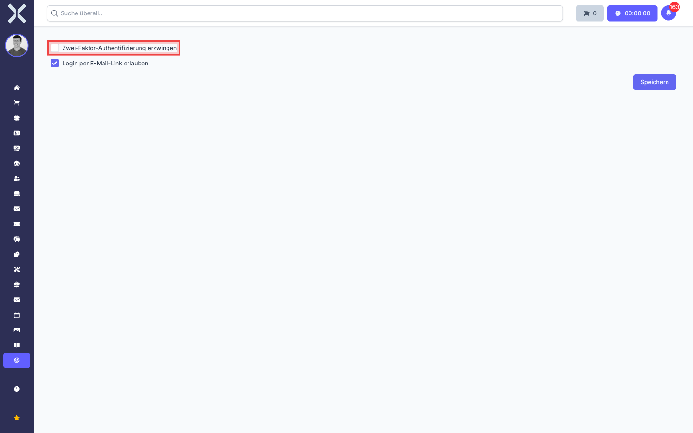
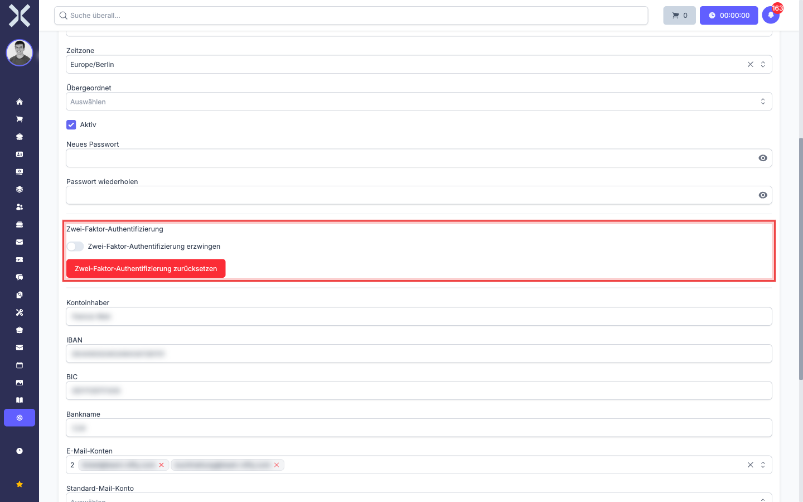
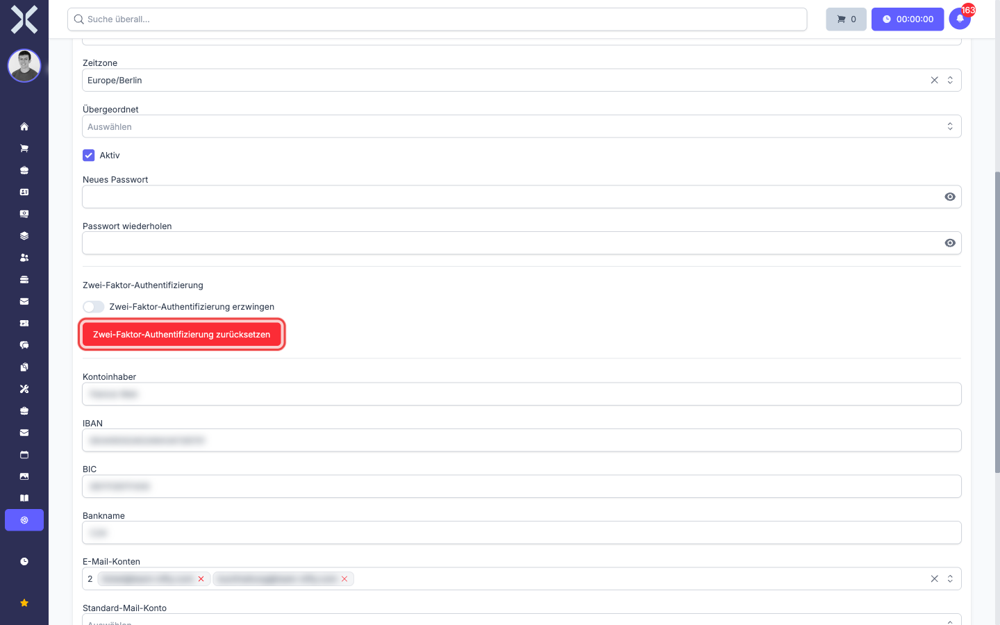
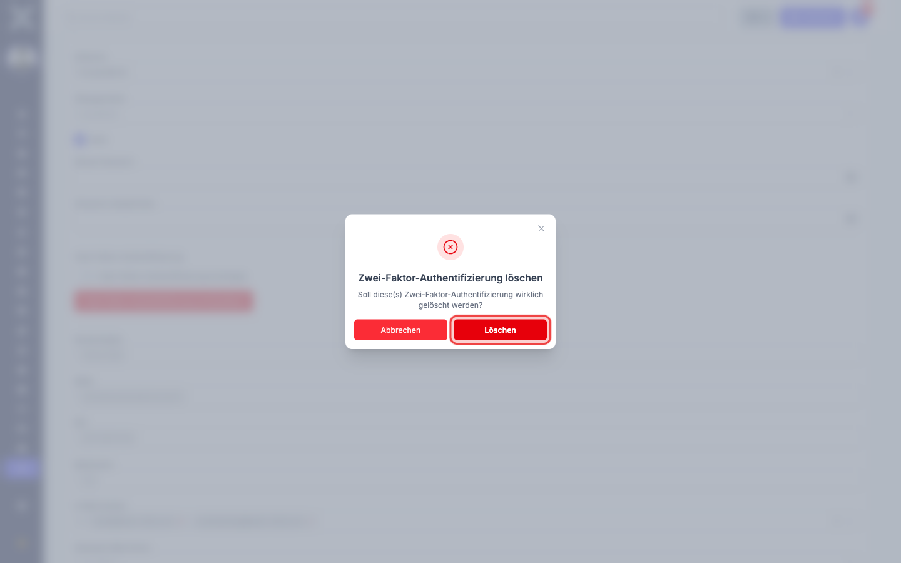

# Sicherheitseinstellungen

Im Bereich **Sicherheitseinstellungen** legen Sie als Administrator fest, welche Anmelde-Verfahren in Ihrem Mandanten erlaubt oder verpflichtend sind. Außerdem führen Sie hier den Reset der Zwei-Faktor-Authentifizierung für einzelne Anwender durch, falls diese den Zugang verloren haben.

> **Hinweis:** Diese Seite richtet sich an Tenant-Administratoren. Anwender finden alles, was sie zu 2FA wissen müssen, in den Kapiteln [Zwei-Faktor-Authentifizierung -- Grundlagen](../1-erste-schritte/7-zwei-faktor-grundlagen.md) und [Zwei-Faktor-Authentifizierung verwalten](../1-erste-schritte/10-zwei-faktor-verwalten.md).

## Sicherheitseinstellungen öffnen

1. Klicken Sie in der Sidebar auf **Einstellungen**.
2. Wählen Sie **Sicherheitseinstellungen**.

   

Sie sehen zwei globale Optionen:

- **Zwei-Faktor-Authentifizierung erzwingen**
- **Login per E-Mail-Link erlauben**

Änderungen an einer der beiden Optionen werden erst nach einem Klick auf **Speichern** wirksam.

## Zwei-Faktor-Authentifizierung für alle erzwingen

Setzen Sie das Häkchen bei **Zwei-Faktor-Authentifizierung erzwingen**, wenn jeder Anwender in Ihrem Mandanten einen zweiten Faktor hinterlegen muss.

**Was passiert nach dem Aktivieren:**

- Anwender, die bereits einen zweiten Faktor (TOTP oder Passkey) eingerichtet haben, merken zunächst nichts -- sie melden sich wie gewohnt an.
- Anwender **ohne** zweiten Faktor werden beim nächsten Versuch, eine geschützte Seite (Dashboard, Aufträge, Kontakte, Einstellungen, ...) aufzurufen, automatisch auf eine erzwungene Einrichtung umgeleitet (siehe [Erzwungene Erst-Einrichtung](../1-erste-schritte/8-zwei-faktor-einrichten.md#erzwungene-erst-einrichtung)). Erst nach erfolgreicher Einrichtung von TOTP oder Passkey gelangen sie wieder ins normale Programm.
- Wenn ein Anwender 2FA löscht (z. B. weil er sein Smartphone verloren hat und Sie den Reset durchführen), greift die Pflicht beim nächsten Login wieder.

> **Hinweis:** Aktivieren Sie diese Option **nicht ohne Vorwarnung**. Informieren Sie Ihre Anwender vorher, dass sie ein Smartphone mit Authenticator-App oder ein passkey-fähiges Gerät bereit halten müssen. Sonst stehen Sie am Mittag vor zehn Anrufen mit "Ich kann mich nicht mehr anmelden".

## Login per E-Mail-Link erlauben

Mit dem zweiten Schalter **Login per E-Mail-Link erlauben** steuern Sie die sogenannten **Magic-Login-Links**:

- **Aktiv:** Ein Anwender kann auf der Anmeldeseite seine Mail-Adresse eingeben und sich einen Login-Link an sein Postfach senden lassen. Mit einem Klick auf den Link ist er angemeldet, ohne sein Passwort einzugeben. Praktisch für Anwender, die ihr Passwort gerade nicht zur Hand haben.
- **Deaktiviert:** Magic-Login-Links sind ausgeschaltet. Anwender müssen ein Passwort (oder einen Passkey) verwenden.

> **Hinweis:** Magic-Login-Links setzen voraus, dass das Mail-Postfach des Anwenders sicher ist. Wer Zugriff auf das Postfach hat, kann sich auch ohne Passwort einloggen. In sehr sicherheitsempfindlichen Umgebungen sollten Sie diese Option deaktivieren.

## Zwei-Faktor für einen einzelnen Anwender erzwingen

Wenn Sie 2FA **nicht** global erzwingen möchten, sondern nur für bestimmte Anwender (z. B. die Buchhaltung oder die Geschäftsleitung):

1. Navigieren Sie in den Einstellungen zu **Benutzer & Rechte > Benutzer**.
2. Klicken Sie auf den entsprechenden Anwender, um die Bearbeitungsseite zu öffnen.
3. Scrollen Sie zum Bereich **Zwei-Faktor-Authentifizierung**.

   

4. Aktivieren Sie den Schalter **Zwei-Faktor-Authentifizierung erzwingen**.
5. Klicken Sie unten auf **Speichern**.

Der Anwender wird beim nächsten Login durch die erzwungene Erst-Einrichtung geleitet. Anwender ohne diesen Schalter sind weiterhin frei in ihrer Wahl.

> **Hinweis:** Diese pro-User-Pflicht und die globale Pflicht aus den Sicherheitseinstellungen kombinieren sich logisch mit "oder": Sobald **eine** der beiden Pflichten aktiv ist, ist der Anwender betroffen. Wenn die globale Pflicht eingeschaltet ist, hat der pro-User-Schalter keinen zusätzlichen Effekt.

## Zwei-Faktor eines Anwenders zurücksetzen

Wenn ein Anwender den Zugang zu seinem zweiten Faktor verloren hat (Smartphone weg, Authenticator-App gelöscht, Passkey-Gerät defekt), können nur Sie als Administrator den Zugang wiederherstellen.

1. Navigieren Sie wie oben zu **Benutzer & Rechte > Benutzer** und öffnen Sie den entsprechenden Anwender.
2. Im Bereich **Zwei-Faktor-Authentifizierung** klicken Sie auf die rote Schaltfläche **Zwei-Faktor-Authentifizierung zurücksetzen**.

   

3. Es erscheint ein Bestätigungs-Dialog mit der Frage **Soll diese(s) Zwei-Faktor-Authentifizierung wirklich gelöscht werden?**.

   

4. Klicken Sie auf **Löschen**, um den Reset durchzuführen, oder auf **Abbrechen**, falls Sie sich vertan haben.

**Was der Reset bewirkt:**

- Der TOTP-Schlüssel des Anwenders wird gelöscht. Die Authenticator-App auf seinem Gerät erzeugt zwar weiterhin Codes, diese gelten aber nicht mehr.
- Alle Passkeys des Anwenders werden gelöscht. Auf seinen Geräten bleiben sie sichtbar, funktionieren bei Nuxbe aber nicht mehr.
- Der Anwender kann sich danach mit Mail und Passwort wieder anmelden.

**Was als Nächstes passiert:**

- Wenn 2FA für diesen Anwender erzwungen ist (global oder pro-User), wird er beim nächsten Login direkt zur Erst-Einrichtung umgeleitet und muss einen neuen zweiten Faktor hinterlegen.
- Wenn 2FA freiwillig ist, kann der Anwender sich entscheiden, ob er erneut einen zweiten Faktor einrichtet -- siehe [Zwei-Faktor-Authentifizierung einrichten](../1-erste-schritte/8-zwei-faktor-einrichten.md).

> **Hinweis:** Bevor Sie den Reset durchführen, prüfen Sie auf einem alternativen Kanal (z. B. per Telefon mit dem Anwender), dass die Anfrage wirklich von der richtigen Person kommt. Ein Reset durch einen Angreifer, der nur die Mail-Adresse kennt, würde 2FA wirkungslos machen.

> **Hinweis:** Die Beschriftung der Reset-Schaltfläche und des Bestätigungs-Dialogs spricht im Singular von "der Zwei-Faktor-Authentifizierung". Tatsächlich werden beim Reset **alle** hinterlegten Methoden des Anwenders gelöscht -- TOTP **und** alle Passkeys. Es gibt keinen separaten "Nur-Passkey-Reset".

## Wie geht es weiter?

- Anwendersicht zur Erst-Einrichtung: [Zwei-Faktor-Authentifizierung einrichten](../1-erste-schritte/8-zwei-faktor-einrichten.md).
- Anwendersicht zur täglichen Anmeldung: [Anmelden mit Zwei-Faktor-Authentifizierung](../1-erste-schritte/9-anmelden-mit-zwei-faktor.md).
- Anwendersicht zur Verwaltung und zum Verlustfall: [Zwei-Faktor-Authentifizierung verwalten](../1-erste-schritte/10-zwei-faktor-verwalten.md).
- Hintergrund und Methodenvergleich: [Zwei-Faktor-Authentifizierung -- Grundlagen](../1-erste-schritte/7-zwei-faktor-grundlagen.md).
