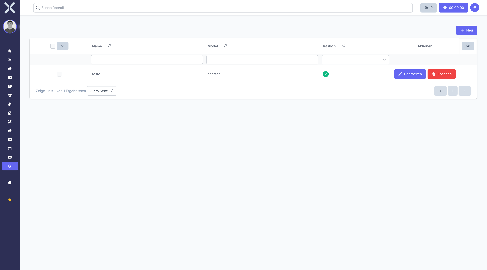

# Datenquellen

Unter **Einstellungen > Allgemein > Datenquellen** verwalten Sie die Herkunft Ihrer Kontakte und Leads. Datenquellen ermöglichen die Nachverfolgung, über welchen Kanal neue Geschäftskontakte gewonnen wurden, was wichtig für Marketing-Analysen und Lead-Tracking ist.

## Übersicht

1. Navigieren Sie zu **Einstellungen > Allgemein > Datenquellen**.

   

2. Die Tabelle zeigt alle Datenquellen mit folgenden Spalten:
   - **Name** - Bezeichnung der Datenquelle (z. B. "Website", "Messe", "Empfehlung")
   - **Modul** - Das Modul, dem die Datenquelle zugeordnet ist (Kontakte, Leads)
   - **Aktiv** - Status der Datenquelle

## Datenquelle anlegen

1. Klicken Sie auf **Neu**.
2. Füllen Sie die folgenden Felder aus:
   - **Name** - Bezeichnung der Datenquelle (z. B. "Google Ads", "LinkedIn", "Telefon")
   - **Modul** - Wählen Sie das Modul, für das die Datenquelle gelten soll (z. B. Kontakte, Leads)
   - **Aktiv** - Setzen Sie den Status der Datenquelle
3. Klicken Sie auf **Speichern**.

## Datenquelle bearbeiten

1. Klicken Sie auf eine Datenquelle in der Liste.
2. Ändern Sie die gewünschten Felder.
3. Klicken Sie auf **Speichern**.

## Datenquelle löschen

1. Klicken Sie auf eine Datenquelle in der Liste.
2. Klicken Sie auf **Löschen**.
3. Bestätigen Sie die Löschung.

## Typische Datenquellen

### Online-Kanäle
- **Website** - Kontaktformular auf der eigenen Website
- **Google Ads** - Bezahlte Suchmaschinenwerbung
- **LinkedIn** - Social Media Kontakte
- **Facebook** - Social Media Werbung
- **E-Mail-Kampagne** - Newsletter und E-Mail-Marketing

### Offline-Kanäle
- **Messe** - Messekontakte und Events
- **Telefon** - Telefonische Anfragen
- **Empfehlung** - Weiterempfehlungen bestehender Kunden
- **Kaltakquise** - Direktansprache
- **Partner** - Kooperationspartner

### Sonstige
- **Bestandskunde** - Bestehende Kundenbeziehung
- **Initiativbewerbung** - Unaufgeforderte Kontaktaufnahme
- **Sonstige** - Andere Quellen

## Verwendung in der Praxis

Bei der Anlage eines neuen Kontakts oder Leads können Sie die Datenquelle auswählen. Dies ermöglicht später:
- Auswertungen über erfolgreiche Akquisekanäle
- ROI-Berechnungen für Marketing-Kampagnen
- Segmentierung nach Herkunft
- Optimierung der Vertriebsstrategie

> **Hinweis:** Datenquellen, die bereits Kontakten oder Leads zugewiesen sind, können nicht gelöscht werden. Deaktivieren Sie die Datenquelle stattdessen, um sie aus den Auswahllisten zu entfernen. Die konsequente Erfassung von Datenquellen ist wichtig für aussagekräftige Marketing-Analysen.

## Weiterführende Themen

- [Einstellungen](0-index.md) - Zurück zur Einstellungsübersicht
- [Kontakte](../2-kontakte/0-index.md) - Kontakte mit Datenquellen
- [Leads](../4-leads/0-index.md) - Lead-Tracking mit Datenquellen
