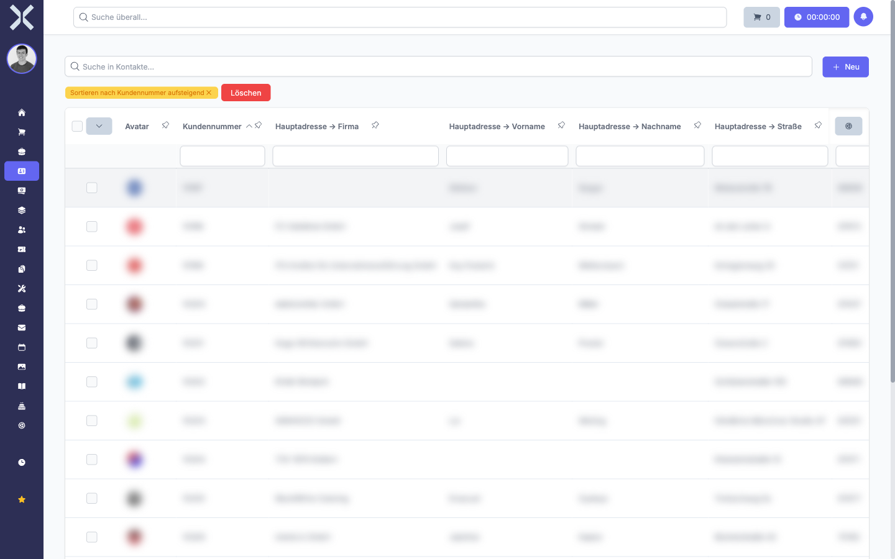
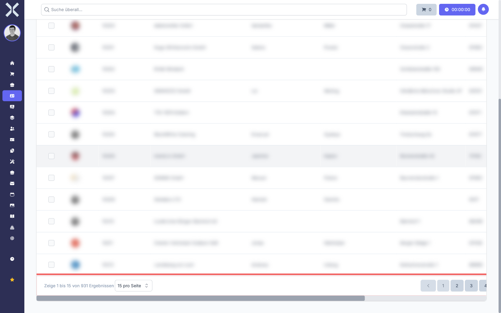

# Tabellen

Nuxbe verwendet an vielen Stellen interaktive Datentabellen, um große Datenmengen übersichtlich darzustellen. Diese Tabellen bieten umfangreiche Funktionen zum Suchen, Filtern, Sortieren, Gruppieren und Exportieren von Daten. Ob Kontaktliste, Auftragsliste oder Produktkatalog - die Bedienung ist überall identisch.

## Übersicht

Jede Datentabelle in Nuxbe besteht aus den folgenden Bereichen:

| Bereich | Beschreibung |
|---|---|
| **Suchleiste** | Volltextsuche über alle sichtbaren Spalten |
| **Spaltenüberschriften** | Klickbar zum Sortieren der Daten |
| **Filterzeile** | Eingabefelder unterhalb der Spaltenüberschriften zum gezielten Filtern einzelner Spalten |
| **Seitenleiste** | Ausklappbarer Bereich rechts mit erweiterten Funktionen für Filter, Spalten, Gruppierung und Export |
| **Tabelleninhalt** | Die eigentlichen Datenzeilen mit den Einträgen |
| **Paginierung** | Navigation zwischen Seiten am unteren Rand der Tabelle |

## Allgemeine Bedienung

Die Tabellen reagieren in Echtzeit auf Ihre Eingaben. Sobald Sie einen Suchbegriff eingeben, einen Filter setzen oder die Sortierung ändern, aktualisiert sich die Anzeige sofort. Es ist kein manuelles Neuladen der Seite nötig.

Alle Einstellungen wie Suchbegriffe, Filter, Sortierung und Spaltenauswahl werden pro Tabelle gespeichert. Wenn Sie die Seite verlassen und später zurückkehren, finden Sie Ihre letzte Konfiguration wieder vor.

## Paginierung

Am unteren Rand jeder Tabelle finden Sie die Seitennavigation.

Die Paginierung zeigt die aktuelle Seitennummer und die Gesamtanzahl der Seiten. Sie können:

- Mit den Pfeiltasten zwischen den Seiten blättern.
- Eine bestimmte Seitennummer direkt eingeben, um dorthin zu springen.
- Die Anzahl der angezeigten Einträge pro Seite über das Dropdown ändern.

> **Hinweis:** Filter, Suche und Sortierung wirken sich auf die Paginierung aus. Wenn Sie Filter setzen, verringert sich möglicherweise die Seitenanzahl, da weniger Einträge angezeigt werden.

## Seiten in diesem Kapitel

- [Suchen und Sortieren](1-suchen-und-sortieren.md) - Einträge über die Suchleiste finden und nach Spalten sortieren
- [Filtern](2-filtern.md) - Spaltenfilter und gespeicherte Filter verwenden
- [Spalten anpassen](3-spalten-anpassen.md) - Sichtbare Spalten konfigurieren und Relationsspalten hinzufügen
- [Zusammenfassen](4-zusammenfassen.md) - Summen, Durchschnitte und andere Auswertungen berechnen
- [Gruppieren](5-gruppieren.md) - Daten nach Spalten gruppieren
- [Exportieren](6-exportieren.md) - Tabelleninhalte als Datei exportieren
- [Zeilen auswählen](7-zeilen-auswaehlen.md) - Einzelne oder mehrere Zeilen für Aktionen markieren
- [Gelöschte Datensätze](8-geloeschte-datensaetze.md) - Gelöschte Einträge anzeigen und wiederherstellen

## Weiterführende Themen

- [Kontakte](../2-kontakte/0-index.md) - Kontaktliste als Beispiel für eine Datentabelle
- [Aufträge](../4-auftraege/0-index.md) - Auftragsliste mit Datentabelle
- [Produkte](../6-produkte/0-index.md) - Produktkatalog in Tabellenform
