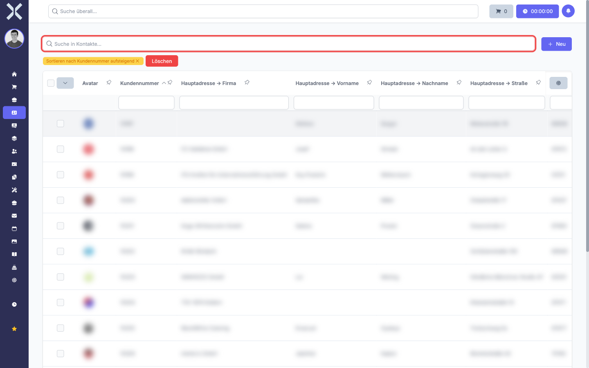
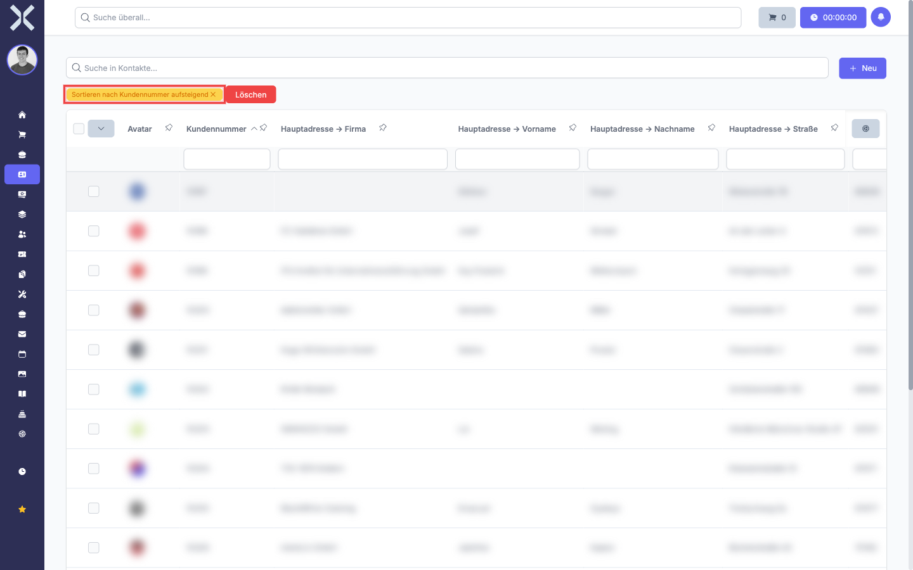

# Suchen und Sortieren

Mit der Suchfunktion finden Sie Einträge schnell über einen Suchbegriff. Die Sortierung ermöglicht es Ihnen, die Tabelle nach einer beliebigen Spalte auf- oder absteigend zu ordnen. Beide Funktionen lassen sich kombinieren.

## Suchleiste verwenden

Die Suchleiste befindet sich oberhalb der Tabelle auf der linken Seite.

1. Klicken Sie in das Suchfeld oberhalb der Tabelle.

   

2. Geben Sie den gewünschten Suchbegriff ein. Die Suche beginnt automatisch, während Sie tippen. Es ist kein Klick auf eine Schaltfläche nötig.

3. Die Tabelle zeigt sofort nur noch die Einträge, die den Suchbegriff in mindestens einer der sichtbaren Spalten enthalten.

   

4. Um die Suche zurückzusetzen, löschen Sie den Text im Suchfeld vollständig. Die Tabelle zeigt dann wieder alle Einträge an.

> **Hinweis:** Die Suche durchsucht alle aktuell sichtbaren Spalten gleichzeitig. Wenn Sie eine Spalte ausgeblendet haben, wird deren Inhalt bei der Suche nicht berücksichtigt. Informationen zum Ein- und Ausblenden von Spalten finden Sie im Kapitel [Spalten anpassen](3-spalten-anpassen.md).

## Spalten sortieren

Über die Spaltenüberschriften können Sie die Tabelle nach jeder beliebigen Spalte sortieren.

1. Klicken Sie auf die Überschrift der Spalte, nach der Sie sortieren möchten (z. B. **Kundennummer**, **Name** oder **Zahlungsziel**).

2. Beim ersten Klick wird die Tabelle **aufsteigend** sortiert:
   - Bei Text: A bis Z
   - Bei Zahlen: Kleinste Zahl zuerst
   - Bei Datum: Ältestes Datum zuerst

3. Klicken Sie erneut auf dieselbe Spaltenüberschrift, um die Sortierung auf **absteigend** umzuschalten:
   - Bei Text: Z bis A
   - Bei Zahlen: Größte Zahl zuerst
   - Bei Datum: Neuestes Datum zuerst

4. Die aktive Sortierung wird durch einen farbigen Hinweis oberhalb der Tabelle angezeigt. Dort steht z. B. **Sortieren nach Kundennummer aufsteigend**.

   

5. Um die Sortierung zu entfernen, klicken Sie auf das **X** neben dem Sortierhinweis.

> **Hinweis:** Es kann immer nur nach einer Spalte gleichzeitig sortiert werden. Wenn Sie auf eine andere Spaltenüberschrift klicken, wird die bisherige Sortierung durch die neue ersetzt.

## Suche und Sortierung kombinieren

Sie können Suche und Sortierung gleichzeitig verwenden. Geben Sie zuerst einen Suchbegriff ein, um die Ergebnismenge einzuschränken. Klicken Sie dann auf eine Spaltenüberschrift, um die gefilterten Ergebnisse zu sortieren. Beide Einstellungen bleiben aktiv, bis Sie sie manuell zurücksetzen.

## Weiterführende Themen

- [Filtern](2-filtern.md) - Daten gezielter über Spaltenfilter einschränken
- [Spalten anpassen](3-spalten-anpassen.md) - Welche Spalten durchsucht werden, hängt von den sichtbaren Spalten ab
