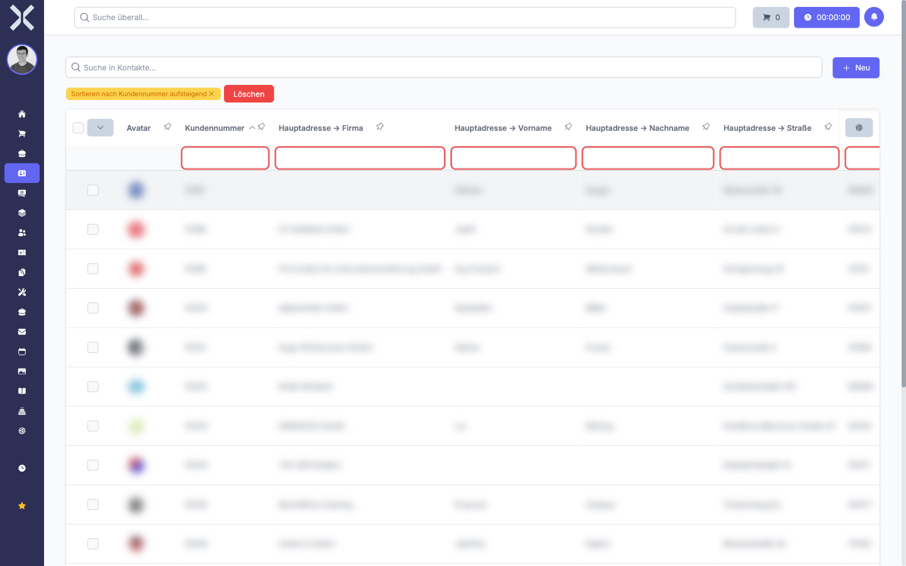
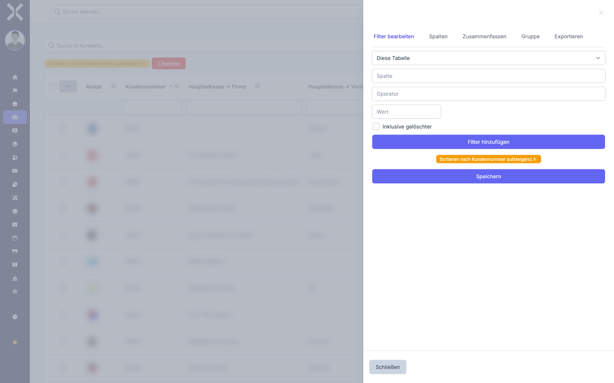

# Filtern

Mit Filtern schränken Sie die angezeigten Daten gezielt ein. Nuxbe bietet zwei Arten von Filtern: Spaltenfilter direkt in der Tabelle und erweiterte Filter in der Seitenleiste. Beide lassen sich kombinieren und mit der Suchfunktion zusammen verwenden.

## Spaltenfilter

Unterhalb jeder Spaltenüberschrift befindet sich ein Eingabefeld für den Spaltenfilter. Damit können Sie jede Spalte einzeln filtern.

1. Klicken Sie in das Eingabefeld unterhalb der gewünschten Spaltenüberschrift.

   

2. Geben Sie den Filterwert ein. Die Tabelle aktualisiert sich sofort und zeigt nur noch Einträge, die den eingegebenen Wert in dieser Spalte enthalten.

3. Sie können mehrere Spaltenfilter gleichzeitig setzen. Die Tabelle zeigt dann nur Einträge an, die **alle** gesetzten Filter gleichzeitig erfüllen.

4. Um einen Spaltenfilter zu entfernen, löschen Sie den Text im jeweiligen Eingabefeld vollständig.

> **Hinweis:** Spaltenfilter filtern exakt nach dem eingegebenen Text innerhalb der jeweiligen Spalte. Für eine spaltenübergreifende Suche verwenden Sie die Suchleiste oberhalb der Tabelle (siehe [Suchen und Sortieren](1-suchen-und-sortieren.md)).

## Erweiterte Filter in der Seitenleiste

Für komplexere Filterbedingungen steht die Seitenleiste mit dem Tab **Filter bearbeiten** zur Verfügung.

### Seitenleiste öffnen

1. Klicken Sie auf das Symbol am rechten Rand der Tabelle, um die Seitenleiste zu öffnen.

2. Wählen Sie den Tab **Filter bearbeiten**.

   

### Filter hinzufügen

1. In der Seitenleiste sehen Sie die verfügbaren Filteroptionen. Wählen Sie die Spalte, nach der Sie filtern möchten.

2. Legen Sie die Filterbedingung fest (z. B. „enthält", „gleich", „größer als").

3. Geben Sie den Filterwert ein.

4. Der Filter wird sofort angewendet. Die Tabelle aktualisiert sich in Echtzeit.

5. Um weitere Filter hinzuzufügen, wiederholen Sie die Schritte. Mehrere Filter werden mit **UND** verknüpft - es werden nur Einträge angezeigt, die alle Bedingungen erfüllen.

### Filter entfernen

1. Klicken Sie auf das **X** neben einem einzelnen Filter, um diesen zu entfernen.

2. Um alle Filter auf einmal zu entfernen, verwenden Sie die entsprechende Schaltfläche in der Seitenleiste.

## Spaltenfilter und Seitenleisten-Filter kombinieren

Spaltenfilter und die erweiterten Filter in der Seitenleiste können gleichzeitig aktiv sein. Die Tabelle zeigt dann nur Einträge an, die sowohl die Spaltenfilter als auch die Seitenleisten-Filter erfüllen.

## Weiterführende Themen

- [Suchen und Sortieren](1-suchen-und-sortieren.md) - Volltextsuche als Ergänzung zu Filtern
- [Spalten anpassen](3-spalten-anpassen.md) - Spalten ein- und ausblenden, die als Filter verfügbar sind
