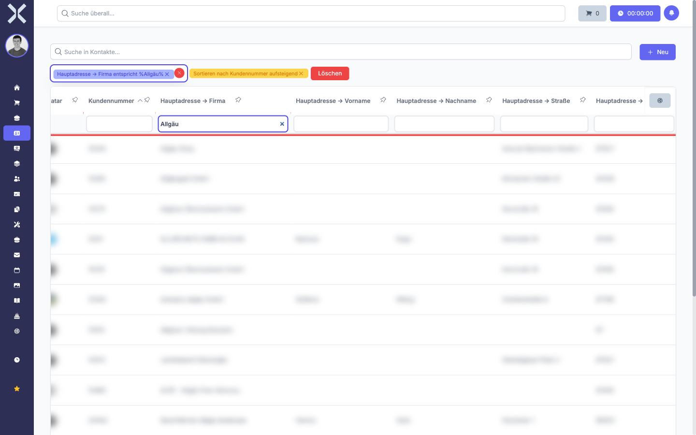

# Filtern

Mit Filtern schränken Sie die angezeigten Daten gezielt ein. Nuxbe bietet zwei Arten von Filtern: Spaltenfilter direkt in der Tabelle und erweiterte Filter in der Seitenleiste. Beide lassen sich kombinieren und mit der Suchfunktion zusammen verwenden.

## Spaltenfilter

Unterhalb jeder Spaltenüberschrift befindet sich ein Eingabefeld für den Spaltenfilter. Damit können Sie jede Spalte einzeln filtern.

1. Klicken Sie in das Eingabefeld unterhalb der gewünschten Spaltenüberschrift.

   

2. Geben Sie den Filterwert ein. Die Tabelle aktualisiert sich sofort und zeigt nur noch Einträge, die den eingegebenen Wert in dieser Spalte enthalten.

   

3. Sie können mehrere Spaltenfilter gleichzeitig setzen. Die Tabelle zeigt dann nur Einträge an, die **alle** gesetzten Filter gleichzeitig erfüllen.

4. Um einen Spaltenfilter zu entfernen, löschen Sie den Text im jeweiligen Eingabefeld vollständig.

> **Hinweis:** Spaltenfilter filtern exakt nach dem eingegebenen Text innerhalb der jeweiligen Spalte. Für eine spaltenübergreifende Suche verwenden Sie die Suchleiste oberhalb der Tabelle (siehe [Suchen und Sortieren](1-suchen-und-sortieren.md)).

### Platzhalter und Operatoren in Spaltenfiltern

In den Spaltenfiltern können Sie spezielle Zeichen und Operatoren verwenden, um die Suche zu verfeinern:

| Operator | Beschreibung | Beispiel |
|---|---|---|
| `%` | Platzhalter für beliebige Zeichen | `87%` findet alle Werte, die mit „87" beginnen (z. B. PLZ 87435, 87561) |
| `>=` | Größer oder gleich | `>=15.01.2026` findet alle Einträge ab dem 15.01.2026 |
| `<=` | Kleiner oder gleich | `<=31.12.2025` findet alle Einträge bis zum 31.12.2025 |
| `>` | Größer als | `>01.01.2026` findet alle Einträge nach dem 01.01.2026 |
| `<` | Kleiner als | `<01.01.2026` findet alle Einträge vor dem 01.01.2026 |

> **Hinweis:** Bei Datumsfiltern geben Sie das Datum im Format **TT.MM.JJJJ** ein (z. B. 15.01.2026). Bei reinen Jahreszahlen können Sie auch nur die Jahreszahl eingeben (z. B. `2026`), um alle Einträge aus diesem Jahr zu finden.

### Relationsspalten filtern

Wenn Sie Relationsspalten eingeblendet haben (z. B. **Kommentare → Erstellt am**), können Sie auch diese mit den oben genannten Operatoren filtern. So finden Sie beispielsweise alle Datensätze, deren letzter Kommentar in einem bestimmten Zeitraum liegt.

Weitere Informationen zum Einblenden von Relationsspalten finden Sie unter [Spalten anpassen](3-spalten-anpassen.md).

## Erweiterte Filter in der Seitenleiste

Für komplexere Filterbedingungen steht die Seitenleiste mit dem Tab **Filter bearbeiten** zur Verfügung.

### Seitenleiste öffnen

1. Klicken Sie auf das Symbol am rechten Rand der Tabelle, um die Seitenleiste zu öffnen.

2. Wählen Sie den Tab **Filter bearbeiten**.

   

### Filter hinzufügen

1. In der Seitenleiste sehen Sie die verfügbaren Filteroptionen. Wählen Sie die **Spalte**, nach der Sie filtern möchten.

2. Legen Sie den **Operator** fest:

   | Operator | Beschreibung |
   |---|---|
   | **ist** | Exakte Übereinstimmung |
   | **ist nicht** | Keine Übereinstimmung |
   | **enthält** | Wert ist im Text enthalten |
   | **enthält nicht** | Wert ist nicht im Text enthalten |
   | **beginnt mit** | Text beginnt mit dem Wert |
   | **endet mit** | Text endet mit dem Wert |
   | **größer als** | Numerischer oder Datumswert ist größer |
   | **kleiner als** | Numerischer oder Datumswert ist kleiner |
   | **größer oder gleich** | Numerischer oder Datumswert ist größer oder gleich |
   | **kleiner oder gleich** | Numerischer oder Datumswert ist kleiner oder gleich |
   | **like** | Mustervergleich mit Platzhalter `%` |
   | **ist leer** | Feld hat keinen Wert |
   | **ist nicht leer** | Feld hat einen Wert |

3. Geben Sie den **Filterwert** ein.

   

4. Klicken Sie auf **Filter hinzufügen**. Der Filter wird sofort angewendet und die Tabelle aktualisiert sich in Echtzeit.

5. Um weitere Filter hinzuzufügen, wiederholen Sie die Schritte. Mehrere Filter werden mit **UND** verknüpft -- es werden nur Einträge angezeigt, die alle Bedingungen erfüllen.

### Oder-Filter (mehrere Werte kombinieren)

Wenn Sie Einträge finden möchten, die eine von mehreren Bedingungen erfüllen, verwenden Sie Oder-Filter. Damit können Sie z. B. alle Adressen anzeigen, deren PLZ mit 87, 88 oder 89 beginnt.

1. Erstellen Sie den ersten Filter wie oben beschrieben (z. B. PLZ **like** `87%`).

2. Klicken Sie auf **Filter hinzufügen**.

3. Unterhalb des ersten Filters erscheint die Schaltfläche **Oder hinzufügen**.

4. Klicken Sie auf **Oder hinzufügen**.

5. Erstellen Sie den zweiten Filter (z. B. PLZ **like** `88%`).

6. Wiederholen Sie die Schritte für weitere Oder-Bedingungen (z. B. PLZ **like** `89%`).

Die einzelnen Oder-Gruppen werden mit grünen **oder**-Badges verbunden. Das Ergebnis zeigt alle Einträge, die **mindestens eine** der Oder-Bedingungen erfüllen.

> **Beispiel:** Sie möchten alle Kontakte im Allgäu finden (PLZ 87xxx, 88xxx, 89xxx):
> 1. Filter: PLZ **like** `87%` → **Filter hinzufügen**
> 2. **Oder hinzufügen** → PLZ **like** `88%` → **Filter hinzufügen**
> 3. **Oder hinzufügen** → PLZ **like** `89%` → **Filter hinzufügen**

### Und- und Oder-Filter kombinieren

Sie können Und- und Oder-Filter beliebig kombinieren. Innerhalb einer Oder-Gruppe werden die Filter mit **UND** verknüpft. Zwischen den Gruppen gilt **ODER**.

> **Beispiel:** Sie möchten alle aktiven Kontakte mit PLZ 87xxx **oder** alle Kontakte mit dem Tag „VIP" finden:
> - Gruppe 1: PLZ **like** `87%` **UND** Status **ist** `Aktiv`
> - **ODER**
> - Gruppe 2: Tag **enthält** `VIP`

### Filter entfernen

1. Klicken Sie auf das **X** neben einem einzelnen Filter, um diesen zu entfernen.

2. Um alle Filter auf einmal zu entfernen, verwenden Sie die entsprechende Schaltfläche in der Seitenleiste.

## Filter speichern und laden

Häufig verwendete Filterkombinationen können Sie als gespeicherte Filter anlegen, um sie mit einem Klick wiederzuverwenden.

### Filter speichern

1. Richten Sie die gewünschte Filterkombination ein (Spaltenfilter und/oder Seitenleisten-Filter).

2. Öffnen Sie die Seitenleiste und wechseln Sie zum Tab **Gespeicherte Filter**.

3. Geben Sie einen **Namen** für den Filter ein (z. B. „Allgäu PLZ" oder „Offene Aufträge 2026").

4. Klicken Sie auf **Speichern**.

Der gespeicherte Filter erscheint in der Liste und kann jederzeit geladen werden.

### Filter laden

1. Öffnen Sie die Seitenleiste und wechseln Sie zum Tab **Gespeicherte Filter**.

2. Klicken Sie auf den gewünschten gespeicherten Filter.

3. Die Tabelle wird sofort mit den gespeicherten Filtereinstellungen aktualisiert.

### Spaltenlayout bei gespeicherten Filtern

Beim Speichern eines Filters wird auch das aktuelle **Spaltenlayout** mit gespeichert. Das bedeutet: Wenn Sie einen Filter speichern, während bestimmte Spalten ausgeblendet sind, werden diese Spalten beim Laden des Filters ebenfalls ausgeblendet.

Falls ein gespeicherter Filter unerwünschte Spalteneinstellungen enthält (z. B. fehlende Spalten nach dem Laden), können Sie das gespeicherte Spaltenlayout zurücksetzen:

1. Öffnen Sie die Seitenleiste über das **Zahnrad-Symbol**.

2. Wechseln Sie zum Tab **Gespeicherte Filter**.

3. Klicken Sie auf **Spaltenlayout löschen** neben dem betroffenen Filter.

Das Spaltenlayout wird aus dem gespeicherten Filter entfernt. Beim nächsten Laden des Filters bleiben Ihre aktuellen Spalteneinstellungen erhalten und werden nicht mehr überschrieben.

> **Tipp:** Wenn nach dem Laden eines Filters Spalten fehlen, die vorher sichtbar waren, liegt das am mitgespeicherten Spaltenlayout. Setzen Sie das Layout wie oben beschrieben zurück.

### Gespeicherten Filter löschen

1. Öffnen Sie die Seitenleiste und wechseln Sie zum Tab **Gespeicherte Filter**.

2. Klicken Sie auf das **Löschen**-Symbol neben dem Filter, den Sie entfernen möchten.

## Spaltenfilter und Seitenleisten-Filter kombinieren

Spaltenfilter und die erweiterten Filter in der Seitenleiste können gleichzeitig aktiv sein. Die Tabelle zeigt dann nur Einträge an, die sowohl die Spaltenfilter als auch die Seitenleisten-Filter erfüllen.

## Häufige Filterbeispiele

| Aufgabe | Filter |
|---|---|
| Alle Kontakte mit PLZ, die mit „87" beginnt | Spaltenfilter PLZ: `87%` |
| Alle Kommentare ab einem bestimmten Datum | Relationsspalte Kommentare → Erstellt am: `>=15.01.2026` |
| Alle Kommentare aus dem Jahr 2025 | Relationsspalte Kommentare → Erstellt am: `2025` |
| Kontakte aus mehreren PLZ-Bereichen | Oder-Filter: PLZ like `87%` **oder** PLZ like `88%` **oder** PLZ like `89%` |
| Offene Aufträge eines bestimmten Kunden | Spaltenfilter Status: `Offen` **und** Spaltenfilter Kontakt: `Muster GmbH` |

## Weiterführende Themen

- [Suchen und Sortieren](1-suchen-und-sortieren.md) - Volltextsuche als Ergänzung zu Filtern
- [Spalten anpassen](3-spalten-anpassen.md) - Spalten ein- und ausblenden, Relationsspalten hinzufügen
